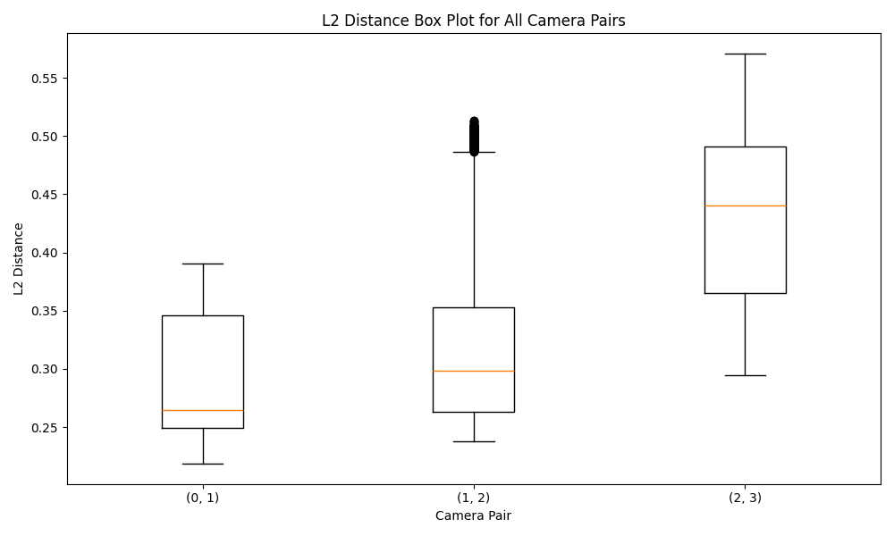
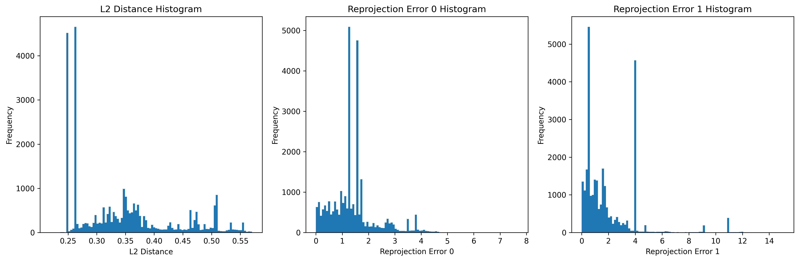
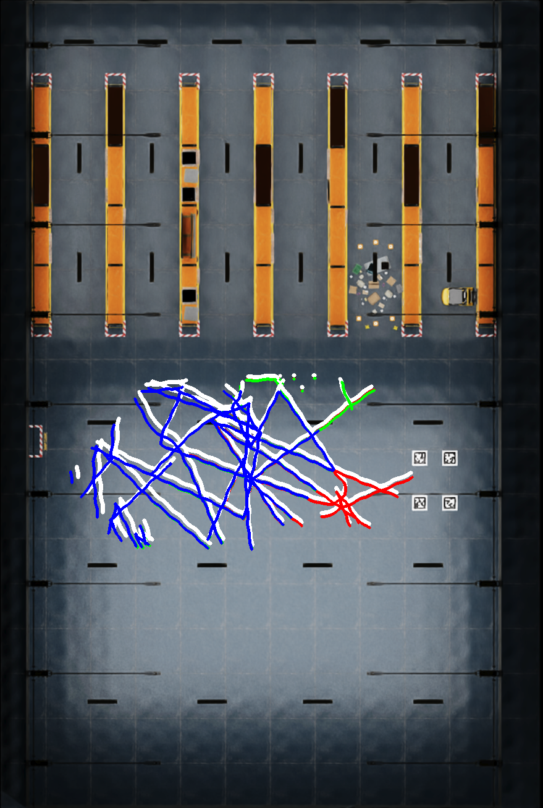
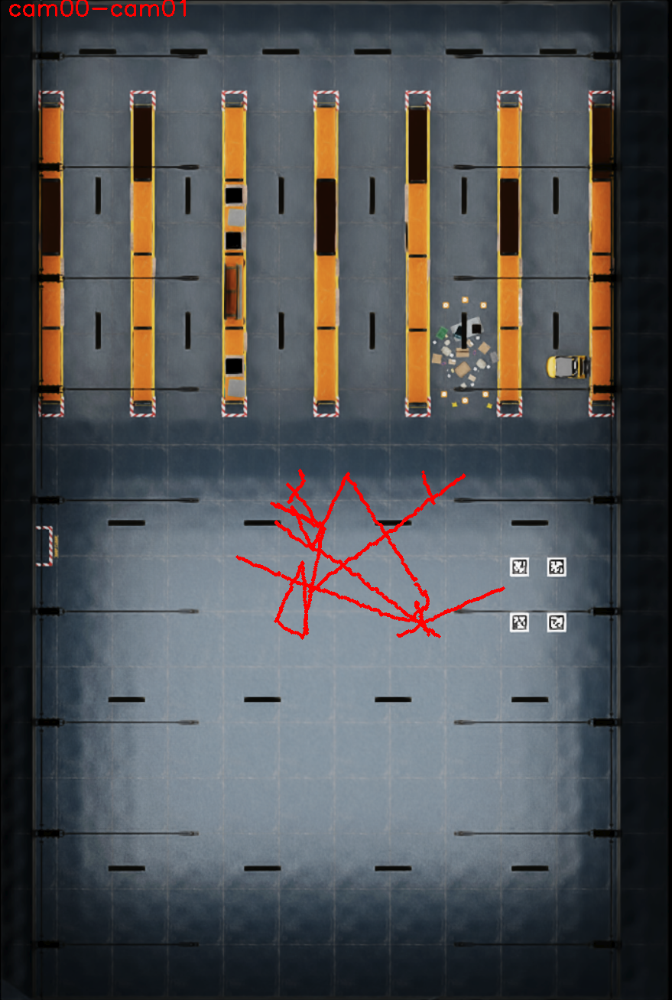
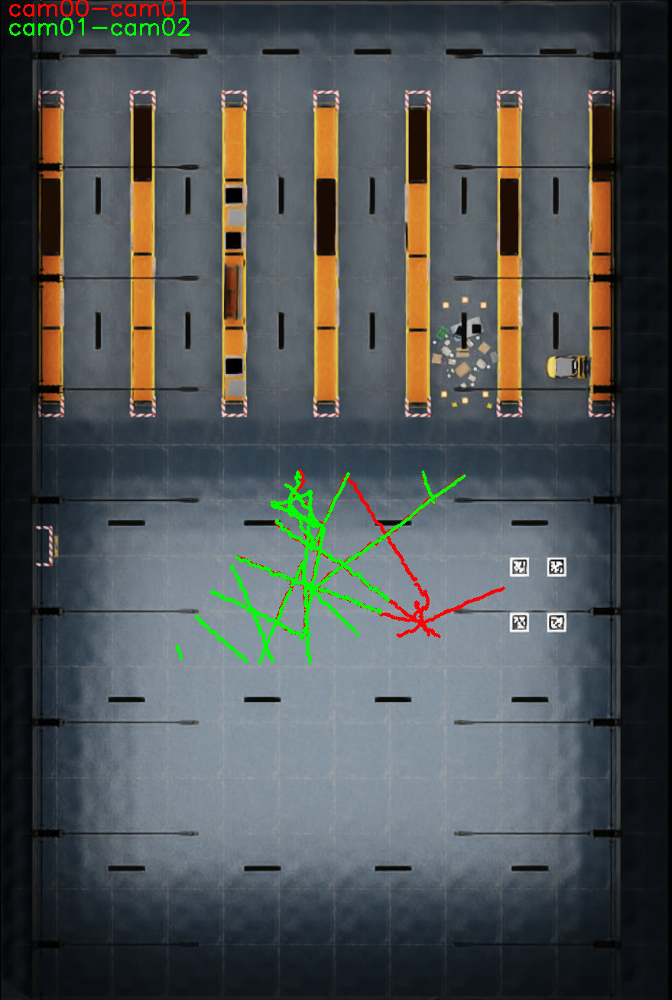
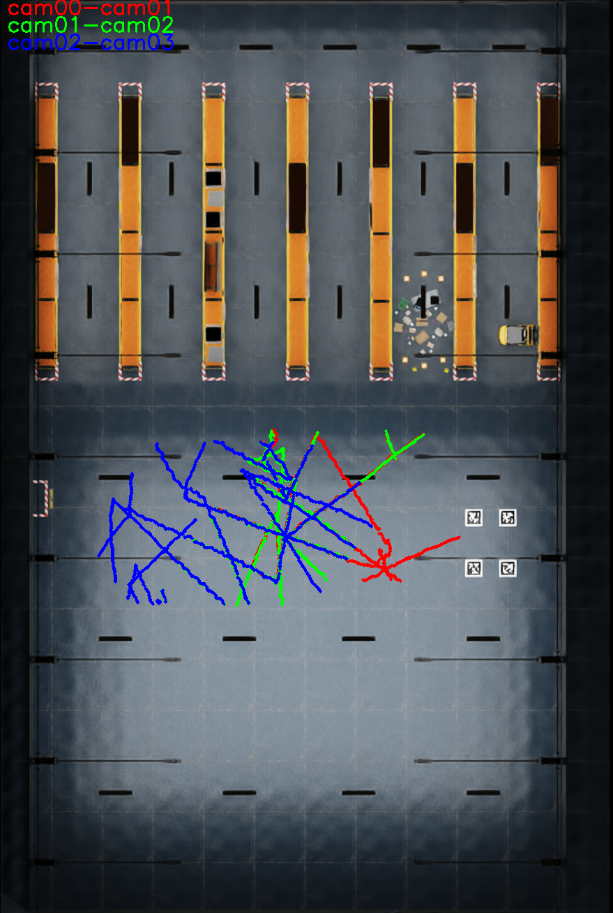
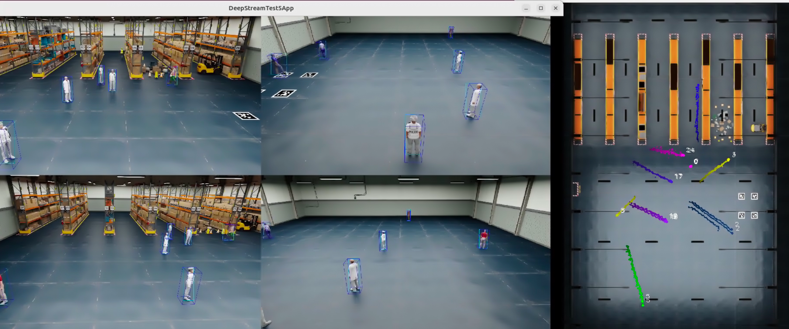
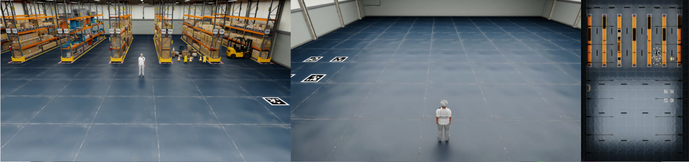

# AutoMagicCalib

AutoMagicCalib is a tool that estimates both intrinsic and extrinsic camera calibration parameters (e.g., camera projection matrix and lens distortion coefficients) for single- and multi-camera systems.

## Features
- Estimate camera lens distortion parameter (k1)
- Estimate 3x4 camera projection matrix (focal length, rotation, translation)
- **Ground truth focal length override**: Use known focal lengths while preserving GeoCalib rotation intelligence
- Output calibration results in YAML format
- Visualization tools:
  - Score metrics graphs of parameter estimation
  - Rectified video generation with estimated lens parameters
  - Visual overlay video generation (SV3DT) with estimated camera projection matrix
- Complete end-to-end pipeline for multi-camera calibration
- Bundle adjustment for improved accuracy
- Evaluation against ground truth data

## Table of Contents
- [Features](#features)
- [Quick Start](#quick-start)
  - [System Requirements](#system-requirements)
  - [NGC Setup](#ngc-setup)
  - [Scripts Setup](#scripts-setup)
  - [Sample Data Setup](#sample-data-setup)
- [Launch End-to-End Pipeline](#launch-end-to-end-pipeline)
  - [Use Case 1: Calibration with Ground Truth Data, with Quantitative/Qualitative Evaluation](#use-case-1-calibration-with-ground-truth-data-with-quantitativequalitative-evaluation)
  - [Use Case 2: Calibration without Ground Truth Data, with Qualitative Evaluation](#use-case-2-calibration-without-ground-truth-data-with-qualitative-evaluation)
  - [Processing Time](#processing-time)
  - [Command Line Arguments](#command-line-arguments)
- [Output Files](#output-files)
  - [Output Structure Example](#output-structure-example)
  - [Single-View (SV) Calibration Results](#single-view-sv-calibration-results)
  - [Multi-View (MV) Calibration Results](#multi-view-mv-calibration-results)
  - [Evaluation Results](#evaluation-results-evaluation---if-ground-truth-provided)
  - [Trajectory-Only Visualization Results](#trajectory-only-visualization-results)
  - [End-to-End (E2E) Pipeline Summary](#end-to-end-e2e-pipeline-summary)
- [Format Conversion for Downstream Applications: MV3DT Use Case](#format-conversion-for-downstream-applications-mv3dt-use-case)
  - [Why Format Conversion is Needed](#why-format-conversion-is-needed)
  - [MV3DT Format Conversion](#mv3dt-format-conversion)
  - [Step-by-step Guide to Run MV3DT with Converted Calibration Files](#step-by-step-guide-to-run-mv3dt-with-converted-calibration-files)
  - [Adapting for Other Applications](#adapting-for-other-applications)
- [Manual Alignment](#manual-alignment)
- [Assumptions](#assumptions)
  - [Input Video Naming Convention](#input-video-naming-convention)
  - [Input Video Resolution](#input-video-resolution)
  - [Ground Truth Directory Structure](#ground-truth-directory-structure)
  - [Layout and Alignment Files](#layout-and-alignment-files)
  - [Camera Configuration](#camera-configuration)
  - [File Structure Requirements](#file-structure-requirements)

<br><br>
# Quick Start

### System Requirements
- x86_64 system
- OS Ubuntu 24.04
- NVIDIA driver 570
- Docker (setup to run without sudo privilege)
- NVIDIA container toolkit (see [NVIDIA DeepStream Docker Prerequisites](https://docs.nvidia.com/metropolis/deepstream/dev-guide/text/DS_docker_containers.html#prerequisites))

### NGC Setup
This step is needed to pull AutoMagicCalib and DeepStream docker images.
1. Visit NGC sign in page, enter your email address and click Next, or Create an Account
2. Choose your organization as `nvdeepstream/deepstream-tools` when prompted for Organization/Team
3. Generate an API key following the instructions
4. Log in to the NGC docker registry:
```bash
docker login nvcr.io
Username: "$oauthtoken"
Password: "YOUR_NGC_API_KEY"
```

### Scripts Setup
Clone the repo to your local directory, then run the setup script to prepare required resources. Docker images will be pulled automatically.
```bash
# clone the repo
cd auto-magic-calib   # or auto-magic-calib-dev (if dev repo)
git submodule update --init --recursive
git lfs pull
cd scripts
bash setup.sh 
```

If the setup is successful, the sample directory structure should look like this:
```
~/auto-magic-calib
├── configs
│   ├── config_AutoMagicCalib
│   │   ├── camera_matrix_config.yaml
│   │   ├── eval_config.yaml
│   │   ├── mv_amc_config.yaml
│   │   ├── preprocess_config.yaml
│   │   ├── rectification_config.yaml
│   │   └── sv_amc_config.yaml
│   └── config_DeepStream
│       ├── config_3d.yaml
│       ├── config_deepstream_2d_resnet.txt
│       ├── config_deepstream_2d_transformer.txt
│       ├── config_deepstream_3d_resnet.txt
│       ├── config_deepstream_3d_transformer.txt
│       ├── config_pgie_resnet34.txt
│       ├── config_pgie_transformer.txt
│       ├── config_tracker_resnet34_3d.yaml
│       ├── config_tracker_resnet34.yaml
│       └── config_tracker_transformer.yaml
├── models
│   ├── custom_parser
│   │   ├── libnvds_infercustomparser_tao.so
│   │   ├── Makefile
│   │   └── nvdsinfer_custombboxparser_tao.cpp
│   ├── labels_peoplenet_resnet34.txt
│   ├── labels_peoplenet_transformer.txt
│   ├── peoplenet_transformer_v2.onnx
│   ├── resnet34_peoplenet_int8.etlt
│   ├── resnet34_peoplenet_int8.txt
│   └── resnet50_market1501_aicity156.onnx
├── ngc_download
│   └── peoplenet_deployable_quantized.zip
├── assets
│   └── sdg_08_2_sample_data_091025.zip
└── scripts
    ├── convert_det2kitti.sh
    ├── kittiDetect2mot_4_viz.sh
    ├── launch_AutoMagicCalib.sh
    ├── launch_ConvertToMv3dt.sh
    ├── launch_EndToEndCalib.sh
    ├── launch_Evaluation.sh
    ├── launch_MultiViewCalib.sh
    ├── launch_Visualization.sh
    ├── run_2d.sh
    ├── run_3d.sh
    └── setup.sh
```

Also verify docker images are available:
```bash
docker images 
# Should show:
# nvcr.io/nvidia/auto-magic-calib                                        0.2
# gitlab-master.nvidia.com:5005/deepstreamsdk/release_image/deepstream   8.0.0-triton-25.09.1-ma
```

### Sample Data Setup
Unzip the compressed sample data file under `auto-magic-calib/assets`. The sample folder includes 4 different types of data to help you run end-to-end calibration and evaluation.
1. Input video files
2. Ground truth data
3. BirdEyeView map image
4. Pre-calibrated transform for BirdEyeView map

```
~/auto-magic-calib/assets/sdg_08_2_sample_data_091025
├── cam_00.mp4                  # Input video files
├── cam_01.mp4                  
├── cam_02.mp4                  
├── cam_03.mp4                  
├── manual_adjustment/
│   ├── layout.png              # BirdEyeView map image required for visualization
│   └── alignment_data.json     # Pre-calibrated transform from `cam_00` reference frame to BirdEyeView map image 
├── _World_Cameras_Camera_00/   # Ground truth data (camera info, extrinsics, object trajectories)
│   ├── camera_params/
│   └── object_detection/
├── _World_Cameras_Camera_01/
│   ├── camera_params/
│   └── object_detection/
├── _World_Cameras_Camera_02/
│   ├── camera_params/
│   └── object_detection/
└── _World_Cameras_Camera_03/
    ├── camera_params/
    └── object_detection/
```

Now you're ready to start the calibration process.

In case you want to try your own dataset, please verify requirements (files, directories, formats) explained in [Assumptions](#assumptions) section.

<br><br>
#  Launch End-to-End Pipeline

This script runs a complete calibration pipeline that includes single-view calibration, multi-view calibration, and **optional** evaluation.
The pipeline supports two main use case scenarios:

### **Use Case 1: Calibration with Ground Truth Data, with Quantitative/Qualitative Evaluation**
Use when you have ground truth data and layout map for comprehensive evaluation.

> **Command:**
> ```bash
> bash launch_EndToEndCalib.sh -v <video_dir> -o <output_base_dir> -g <groundtruth_dir> -l <layout_image_path> -f <focal_lengths>
> ```
> 
> **Sample Command:**
> ```bash
> cd auto-magic-calib/scripts
> bash launch_EndToEndCalib.sh -v ~/auto-magic-calib/assets/sdg_08_2_sample_data_091025 -o ~/auto-magic-calib/assets/sdg_08_2_sample_data_091025/output -g ~/auto-magic-calib/assets/sdg_08_2_sample_data_091025 -l ~/auto-magic-calib/assets/sdg_08_2_sample_data_091025/manual_adjustment/layout.png -f "1269.01, 1099.50, 1099.50, 1099.50"
> ```
> 
> **Pipeline Steps:**
> 1. **Single-View Calibration** → Individual camera calibration
> 2. **Multi-View Calibration** → Bundle adjustment and global optimization across cameras
> 3. **Manual Alignment** → Layout alignment. Interactive GPU pops up only if `alignment_data.json` doesn’t exist under the specified -l <layout_image_path>.
> 4. **Evaluation and Visualization** → Accuracy metrics against ground truth. Trajectories overlay image onto BirdEyeView map.
> 
> **Key Output Files:**
> - Final refined camera parameters (most important): `multi_view_results/BA_output/results_ba/refined/camInfo_XX.yaml` - Complete intrinsic and extrinsic parameters after bundle adjustment
> - Single-view intrinsic parameters: `single_view_results/cam_XX/camInfo_hyper_XX.yaml` (original format)
> - Single-view intrinsic parameters (OpenCV): `single_view_results/cam_XX/camInfo_hyper_XX_opencv.yaml` (principal points at center)
> - Evaluation metrics and visualizations (`multi_view_results/evaluation/`)
> - ... (for complete output details, see the [Output Files](#output-files) section)
>
> **Why Manual Alignment?**
>
> Even when ground truth data is provided, manual alignment is still required because the ground truth coordinate system and the layout map coordinate system are different. The layout image is a 2D representation, and the transform calculated during manual alignment establishes a custom mapping between the estimated camera coordinate system (with cam_00 as reference) and the 2D layout map. This transform is essential for visualization and also some downstream applications (such as MV3DT) that need to relate camera views to the layout.
>
> *Note: The provided sample data already includes pre-calibrated alignment data (`alignment_data.json`), so manual alignment isn't necessary for the sample data. For more information about how to run the manual alignment with your own data, see [Manual Alignment](#manual-alignment).*
>
> You can verify calibration output in [Output Files](#output-files).
>
> Or, proceed to [Format Conversion for Downstream Applications: MV3DT Use Case](#format-conversion-for-downstream-applications-mv3dt-use-case) to see how AMC calibration can be used by downstream applications.

### **Processing Time** ### 
Total processing time varies based on hardware specifications, video resolution, file count, and scene complexity. For the provided sample data on an RTX6000 system, expect approximately:
- **Single-view calibration**: ~10 minutes per camera (40 minutes total for 4 cameras)
- **Multi-view calibration**: ~10 minutes for bundle adjustment and optimization

### **Use Case 2: Calibration without Ground Truth Data, with Qualitative Evaluation**
Use when you have layout map for visualization.

> **Command:**
> ```bash
> bash launch_EndToEndCalib.sh -v <video_dir> -o <output_base_dir> -f <focal_lengths>
> ```
> **Sample Command:**
> ```bash
> cd auto-magic-calib/scripts
> bash launch_EndToEndCalib.sh -v ~/auto-magic-calib/assets/sdg_08_2_sample_data_091025 -o ~/auto-magic-calib/assets/sdg_08_2_sample_data_091025/output -f "1269.01, 1099.50, 1099.50, 1099.50"
> ```
> 
> **Pipeline Steps:**
> 1. **Single-View Calibration** → Individual camera calibration
> 2. **Multi-View Calibration** → Bundle adjustment and global optimization across cameras
> 
> **Key Output Files:**
> - Calibration results (`camInfo_*.yaml` files)
> - 3D trajectory data (`trajDump_Stream_0_3d.txt`)
> - Bundle adjustment results (`BA_output/results_ba/refined/`)
> - ... (for complete output details, see the [Output Files](#output-files) section)
> 
> **Trajectory-Only Visualization (Optional):**
>
> User may still want trajectory visualization for sanity check even without ground truth. Then the user will need to provide a map, and an alginment transform to the map. The following launch script encapsulates both manual alignment and visualization. It'll pop up the interactive GUI to the user.
> 1. Set `anchor: "layout"` in `configs/config_AutoMagicCalib/eval_config.yaml`
> 2. Run `launch_Visualization.sh` as follows
> 
> ```bash
> bash launch_Visualization.sh -i ~/auto-magic-calib/assets/sdg_08_2_sample_data_091025/output/single_view_results -o ~/auto-magic-calib/assets/sdg_08_2_sample_data_091025/output -l ~/auto-magic-calib/assets/sdg_08_2_sample_data_091025/manual_adjustment/layout.png
> ```
> 
> Then the pair-wise trajectory overlay images are generated in same folder as `layout.png`.
> ```
> ~/auto-magic-calib/assets/sdg_08_2_sample_data_091025/output/multi_view_results/manual_adjustment/
> ├── alignment_data.json
> ├── layout.png
> ├── overlay_img_00.png
> ├── overlay_img_01.png
> └── overlay_img_02.png
> ```
>
> You can verify calibration output (including visualization examples) in [Output Files](#output-files).
>
> Or, proceed to [Format Conversion for Downstream Applications: MV3DT Use Case](#format-conversion-for-downstream-applications-mv3dt-use-case) to see how AMC calibration can be used by downstream applications.

### **Command Line Arguments**

> **Required:**
> - `-v <video_dir>`: Directory containing input video files (*.mp4)
> - `-o <output_base_dir>`: Base directory for all outputs
> 
> **Optional:**
> - `-g <groundtruth_dir>`: Ground truth directory for evaluation
> - `-l <layout_image_path>`: Path to layout image file for manual alignment
> - `-d <detector_type>`: Detector type: 'resnet' or 'transformer' (default: 'resnet')
> - `-f <focal_lengths>`: Ground truth focal lengths comma-separated (overrides GeoCalib estimates)
> - `--no-plot`: Disable plotting for bundle adjustment

<br><br>
# Output Files

### **Output Structure Example**
Here we show the output directory structure and some key output files after running the End-to-End script successfully on propvided data.

```
output_base_dir/
├── single_view_results/
│   ├── cam_00/                          # Results for first camera
│   │   ├── camInfo_hyper_00.yaml        # Camera parameters
│   │   ├── camInfo_hyper_00_opencv.yaml # Camera parameters with principal points at center
│   │   └── trajDump_Stream_0_3d.txt     # 3D trajectory data (required for Multi-View)
│   └── ...                              # Additional cameras: 01, 02, ...
└── multi_view_results/                  # Multi-view calibration results
    ├── cam0_cam1/                       # Pairwise calibration results
    ├── ...                              # Additional camera pairs: 1_2, 2_3, ...
    ├── BA_output/                       # Bundle adjustment results
    │   ├── results_ba/                  # Main bundle adjustment outputs
    │   │   ├── initial/                 # Initial camera parameters
    │   │   └── refined/                 # Refined camera parameters
    │   │   │   ├── camInfo_00.yaml      # Final camera parameters (K, R, T, projection) in {cam0} coordinate
    │   │   │   └── ...                  # Additional cameras: 01, 02, ...
    │   ├── results_ba_scaled/           # Scale-adjusted calibration results
    │   └── results_iterative_ba/        # Iterative refinement outputs
    ├── evaluation/                      # Evaluation results (if ground truth provided)
    │   ├── 0_1/                         # Camera pair evaluation
    │   ├── ...                          # Additional camera pairs: 1_2, 2_3, ...
    │   ├── est_camera_params_in_world/  # Coordinate-transformed camera parameters to align with the ground truth
    │   ├── statistics.txt               # L2 dist and error statistics
    │   ├── transform_cam0_to_map.json   # Transform from {cam0} to provided {map}
    │   ├── transform_world_to_map.json  # Transform from {world} to provided {map}
    │   └── <png files>                  # Statistics shown in graphs 
    └── manual_adjustment/               # Manual layout alignment data.
```

### Single-View (SV) Calibration Results
> Each camera produces results in its own directory (`cam_XX/`) with the following key outputs:
> 
> ### Camera Parameter Files
> - `camInfo_hyper_XX.yaml`: Camera projection matrix (3x4) with intrinsic and extrinsic parameters
> - `camInfo_hyper_XX_opencv.yaml`: Camera parameters with principal points located at the image center (OpenCV format)
> - `distortion.yaml`: Lens distortion parameters (k1 coefficient)
> - `rectified.mp4`: Video with lens distortion corrected
> - `background.jpg`: Extracted background image used for calibration
> - `config_sv_amc.yaml`: Single-view configuration used for this camera
> 
> ### 3D Tracking Results
> - `trajDump_Stream_0_3d.txt`: 3D trajectory data for tracked humans (required for Multi-View calibration)

### Multi-View (MV) Calibration Results
> ### Pairwise Calibration Results (`camX_camY/`)
> Each camera pair produces:
> - `calib_results.json`: Essential matrix estimation and relative pose parameters
> - `3d_point_alignment.png`: 3D alignment diagnostics
> - `3d_points_in_sv3dt.png`: 3D points visualization in single-view coordinate system
> 
> ### Bundle Adjustment Results (`BA_output/results_ba/`)
> - `initial/`: Initial camera parameters before optimization
>   - `camInfo_XX.yaml`: Initial camera parameters for each camera
> - `refined/`: **Refined camera parameters after optimization (primary output)**
>   - `camInfo_XX.yaml`: Optimized intrinsic and extrinsic parameters for each camera. Reference coordinate frame is `{cam_00}`.
>
> *Note: The values in `refined/camInfo_XX.yaml` is up-to-scale.*
>
> ### Scaled Bundle Adjustment Results (`BA_output/results_ba_scaled/`)
> - `camInfo_XX.yaml`: Bundle Adjustment Results converted into metric scale using the user-provided info
>
> ### Example Camera Parameter File Format
> The refined camera parameter files from provided sample data (`BA_output/results_ba/refined/camInfo_00.yaml`) contain:
> 
> ```yaml
> K:                         # 3x3 intrinsic matrix
> - - 1208.3875566209306
>   - 0.0
>   - 960.0
> - - 0.0
>   - 1208.3875566209306
>   - 540.0
> - - 0.0
>   - 0.0
>   - 1.0
> R:                        # 3x3 rotation matrix
> - - 1.0
>   - 0.0
>   - 0.0
> - - 0.0
>   - 1.0
>   - 0.0
> - - 0.0
>   - 0.0
>   - 1.0
> projectionMatrix_3x4:     # 3x4 projection matrix (K * [R|t])
> - - 1208.3875566209306
>   - 0.0
>   - 960.0
>   - 0.0
> - - 0.0
>   - 1208.3875566209306
>   - 540.0
>   - 0.0
> - - 0.0
>   - 0.0
>   - 1.0
>   - 0.0
> t:                        # 3x1 translation vector
> - - 0.0
> - - 0.0
> - - 0.0
> ```
> 
> **Note:** The actual numbers may look different from the optimization step is not deterministic.

### Evaluation Results (`evaluation/` - if ground truth provided)
> When ground truth data is available, AMC provides comprehensive evaluation capabilities to validate calibration quality:
> 
> ### Transformed Camera Parameters (`est_camera_params_in_world/`)
> 
> During evaluation, the system generates coordinate-transformed camera parameters to align with the ground truth coordinate system:
> - **`camInfo_XX.yaml`**: Camera parameters transformed to match ground truth coordinate frame
> - These files contain the same camera intrinsics but with extrinsics adjusted for proper comparison with ground truth data
> - Used internally for accurate evaluation metrics calculation
> 
> ### Understanding Evaluation Metrics
> 
> **Quantitative Metrics (`evaluation/statistics.txt`):**
> - **L2 Distance**: Measures 3D reconstruction accuracy in real-world units (meters). Lower values indicate better calibration accuracy.
> - **Reprojection Errors**: Measure how well 3D points project back to 2D images, reported in pixels. Lower pixel errors indicate more precise calibration.
> 
> **Example Statistics Output:**
> ```
> Average L2 distance: 0.34 (meters)
> Standard deviation of L2 distance: 0.09 (meters)
> Max L2 distance: 0.57 (meters)
> Min L2 distance: 0.22 (meters)
> Average reprojection error 0: 1.43 (pixels)
> Standard deviation of reprojection error 0: 0.92 (pixels)
> Max reprojection error 0: 7.68 (pixels)
> Min reprojection error 0: 0.00 (pixels)
> Average reprojection error 1: 1.95 (pixels)
> Standard deviation of reprojection error 1: 2.10 (pixels)
> Max reprojection error 1: 15.08 (pixels)
> Min reprojection error 1: 0.00 (pixels)
> ```
> 
> **Visual Analysis:**
> - **Box Plots**: Compare performance across different camera pairs, showing median accuracy and consistency. Consistent, low values across pairs indicate good overall calibration.
> - **Error Distribution Histograms**: Reveal the distribution of errors - good calibrations show narrow peaks near zero with few outliers.
> 
> **Example Evaluation Plots:**
> 
> <div align="center">
> 
> </div>
> 
> <div align="center">
> 
> </div>
> 
> *Top: L2 distance distribution showing 3D reconstruction accuracy across camera pairs. Bottom: Combined error histograms showing reprojection error distributions - narrow peaks near zero indicate good calibration quality.*
> 
> #### Per-Camera-Pair Evaluation (`X_Y/` directories)
> Each camera pair (e.g., `0_1/`, `1_2/`, `2_3/`) contains:
> - **`statistics.txt`**: Statistical summary of calibration accuracy for the camera pair
> - **`l2_dist.csv`**: L2 distance measurements between estimated and ground truth 3D points
> - **`reproj_error0.csv`**: Reprojection errors for the first camera in the pair
> - **`reproj_error1.csv`**: Reprojection errors for the second camera in the pair
> - **`3d_points.png`**: 3D point cloud visualization comparing estimated vs ground truth
> - **`combined_histograms.png`**: Error distribution histograms for the camera pair
> - **`res_imgs/`**: Directory containing detailed result visualization images
> 
> #### Aggregate Evaluation Results (cross-camera statistics)
> - **`all_results.csv`**: Combined calibration accuracy results across all camera pairs
> - **`statistics.txt`**: Overall statistical summary across all camera pair evaluations
> - **`all_results_l2_dist.png`**: Aggregated L2 distance distribution plot across all pairs
> - **`all_results_reproj_error0.png`**: Combined reprojection error plot for all first cameras
> - **`all_results_reproj_error1.png`**: Combined reprojection error plot for all second cameras
> - **`combined_histograms.png`**: Overall error distribution across all camera pairs
> - **`results_layout_3d_points.png`**: Layout visualization with all 3D points overlaid
> 
> #### Trajectory Visualization With Ground Truth
> 
> <div align="center">
> 
> </div>
> 
> *Bird's-eye view trajectory overlay showing ground truth (white dots) vs estimated positions (colored dots) from different camera pairs on the actual floor layout.*
> 
> The bird's-eye view trajectory overlay (`results_layout_3d_points.png`) provides immediate visual validation:
> - **White dots**: Ground truth positions where people actually walked
> - **Colored dots**: Estimated positions from different camera pairs (each color represents a different pair)
> - **Accuracy indicator**: The closer the colored dots are to the white reference points, the better your calibration accuracy
> 
> This visualization gives you an immediate visual sense of how well your camera network is performing in real-world scenarios.
> 
> **Interpreting Results:**
> This comprehensive evaluation suite helps you validate calibration quality and identify potential issues before deploying your system. Look for:
> - Low L2 distances (< 0.5 meters typically indicates good accuracy)
> - Low reprojection errors (< 5 pixels typically indicates good precision)  
> - Tight clustering in trajectory overlays
> - Consistent performance across all camera pairs

### Trajectory-Only Visualization Results
> When using `launch_Visualization.sh` for use case 2, the following visualization files are generated in the `manual_adjustment/` directory:
> 
> ### Trajectory Overlay Images
> - **`overlay_img_00.png`**: Trajectory reconstructed from the first camera pair
> - **`overlay_img_01.png`**: Trajectory reconstructed from the first and second camera pairs 
> - **`overlay_img_02.png`**: Trajectory reconstructed from the first, second, and third camera pairs
> - **`alignment_data.json`**: Manual alignment transformation data
> - **`layout.png`**: Original layout image used for visualization
> 
> <div align="center">
> 
> 
> 
> </div>
> 
> *Example trajectory overlay images showing detected human trajectories projected onto the bird's eye view layout map for visual sanity check.*
> 
> These visualizations help you:
> - Verify that calibration results make sense spatially
> - Understand coverage areas of each camera
> - Validate trajectory detection and projection accuracy
> - Assess overall system performance without ground truth data

### Additional Multi-View Files
- `manual_adjustment/`: Manual layout alignment data (if manual alignment performed)
- `tracklet_to_global.json`: Cross-camera tracklet ID correspondences
- `sorted_tracklet_matches.json`: Organized tracklet matching results for all camera pairs

## End-to-End (E2E) Pipeline Summary
The complete pipeline produces a hierarchical output structure:
1. **Single-View Stage**: Individual camera calibration and 3D tracking
2. **Multi-View Stage**: Pairwise calibration, bundle adjustment, and global optimization
3. **Evaluation Stage**: Accuracy assessment against ground truth (optional)

Key files for downstream applications:
- **Final refined camera parameters (most important)**: `multi_view_results/BA_output/results_ba/refined/camInfo_XX.yaml` - Complete intrinsic and extrinsic parameters after bundle adjustment
- **Single-view intrinsic parameters**: `single_view_results/cam_XX/camInfo_hyper_XX.yaml` (original format)
- **Single-view intrinsic parameters (OpenCV)**: `single_view_results/cam_XX/camInfo_hyper_XX_opencv.yaml` (principal points at center)


<br><br>
# Format Conversion for Downstream Applications: MV3DT Use Case

AutoMagicCalib results can be converted to formats compatible with various downstream applications. This section demonstrates format conversion using MV3DT (Multi-View 3D Tracking) as an example.

Depending on the downstream application requirements, the calibration output format may need modification. Here we present the specific conversion requirements for [MV3DT](https://github.com/NVIDIA-AI-IOT/deepstream_reference_apps/tree/master/deepstream-tracker-3d-multi-view).

MV3DT is a distributed, real-time multi-view multi-target 3D tracking framework built for large-scale, calibrated camera networks. With AMC, you can effortlessly tryout MV3DT on your own datasets. This section bridges the format differences, making the calibration files compatible with MV3DT

## Why Format Conversion is Needed
AMC produces comprehensive calibration results (see [Output Files](#output-files) section for details), but different applications expect different formats:

**AMC Output Format:**
- **Camera parameters**: 3x3 intrinsic matrix (K), 3x3 rotation matrix (R), 3x1 translation vector (t), and 3x4 projection matrix stored separately in YAML files
- **Coordinate system**: 3D world coordinates with full transformation matrices
- **File naming**: `camInfo_XX.yaml` format in the refined results directory

**MV3DT Requirements:**
- **Camera parameters**: Single vector containing projection matrix in row-major order format for ObjectModelProjector
- **Object modeling**: Cylinder parameters (height, radius) for human tracking - AMC doesn't include these by default
- **Layout map**: Expects `map.png` filename (AMC uses `layout.png`)  
- **Coordinate transform**: 2D-to-2D pixel transformation (AMC outputs 3D transformation matrices)
- **Transform file**: `transform_world_to_map.json` must be provided (generated by AMC [Use Case 1, evaluation step](#use-case-1-calibration-with-ground-truth-data-with-quantitativequalitative-evaluation))

## MV3DT Format Conversion
The `scripts/launch_ConvertToMv3dt.py` script converts AutoMagicCalib outputs to a format compatible with MV3DT (Multi-View 3D Tracking).

The following commands assume that you have followed the [Use Case 1: Calibration with Ground Truth Data, with Quantitative/Qualitative Evaluation](#use-case-1-calibration-with-ground-truth-data-with-quantitativequalitative-evaluation) section to run the end-to-end pipeline and generate the output files.

**Sample Command:**
```bash
# Usage:
#   bash launch_ConvertToMv3dt.sh -i /path/to/AMC/output -o /path/to/output

bash launch_ConvertToMv3dt.sh -i ~/auto-magic-calib/assets/sdg_08_2_sample_data_091025/output -o ~/auto-magic-calib/assets/sdg_08_2_sample_data_091025/mv3dt_output

# expected CLI output:
#   [done] Wrote camInfo/, map.png, transforms.yml to /auto-magic-calib/output
```

### Output Structure
The conversion generates MV3DT-compatible files:

```
output_directory/
├── camInfo/
│   ├── camInfo_00.yml          # Camera projection matrices in MV3DT format
│   ├── camInfo_01.yml
│   ├── camInfo_02.yml
│   └── camInfo_03.yml
├── map.png                     # Copy of layout.png
└── transforms.yml              # 2D coordinate transformation parameters
```

The output files from the conversion script is ready to be used in MV3DT. Please refer to the [MV3DT custom dataset guide](https://github.com/NVIDIA-AI-IOT/deepstream_reference_apps/tree/master/deepstream-tracker-3d-multi-view#running-mv3dt-on-custom-datasets) for custom dataset requirements.

*Note: Different downstream applications may require different conversion scripts depending on their specific input format requirements.*

## Step-by-step Guide to Run MV3DT with Converted Calibration Files
1. Follow the [MV3DT Prerequisites section](https://github.com/NVIDIA-AI-IOT/deepstream_reference_apps/tree/master/deepstream-tracker-3d-multi-view#prerequisites).
2. Create a new dataset directory named `amc_dataset`, and copy the video files and calibration files to the directory
  ```bash
  cd /path/to/deepstream_reference_apps/deepstream-tracker-3d-multi-view
  mkdir -p datasets/amc_dataset/videos
  cp ~/auto-magic-calib/assets/sdg_08_2_sample_data_091025/*.mp4 datasets/amc_dataset/videos
  cp -r ~/auto-magic-calib/assets/sdg_08_2_sample_data_091025/mv3dt_output/* datasets/amc_dataset/
  ```
3. Prepare a MV3DT launch script for the new dataset
  ```bash
  # Copy from a sample launch script
  cp scripts/test_12cam_ds.sh scripts/test_amc_ds.sh
  # Only update the dataset and experiment paths
  sed -i -e 's/mtmc_12cam/amc_dataset/g' -e 's|deepstream/12cam|deepstream/amc|g' scripts/test_amc_ds.sh
  # Optional, show raw tracking results from all cams in BEV, instead of the aggregated results
  sed -i -e '/--average-multi-cam/d' scripts/test_amc_ds.sh
  chmod +x scripts/test_amc_ds.sh
  ```
4. Run the MV3DT launch script
  ```bash
  ./scripts/test_amc_ds.sh
  ```

**Example: MV3DT Running with AMC Calibration Results**
<div align="center">

</div>

*MV3DT framework running in real-time using camera calibration parameters generated by AutoMagicCalib. The system performs multi-view 3D tracking across multiple camera feeds, demonstrating successful integration of AMC calibration results with downstream tracking applications.*

## Adapting for Other Applications
For different downstream applications, you may need to create similar conversion scripts that:

1. Read the refined camera parameters from `multi_view_results/BA_output/results_ba/refined/`
2. Transform coordinate systems if needed (using transform files from evaluation)
3. Reformat the data according to the target application's requirements
4. Generate any additional metadata or configuration files needed

The MV3DT conversion scripts serve as a template for creating converters for other applications.

<br><br>
# Manual Alignment 
Once calibration is complete, you might want to visualize the reconstruction 
results on a BEV(Bird Eye view) map by using the estimated camera parameters. 
In order to visualize the reconstruction results on the BEV map, we need a 
transform from the camera 0 coordinate frame to the map. 
If ground truth data is provided, then the transform is calculated automatically.
However, the transform should be calculated by a manual alignment step if 
the ground truth data doesn't exist.  

Basically, the manual alignment step is to make the following json file with 
image coordinates for camera 0 view and camera 1 view, and the BEV map. 

**alignment_data.json**: manual alignment data
```json
[
  [
    [u0_cam0, v0_cam0],
    [u0_cam1, v0_cam1],
    [u0_bev,  v0_bev],
  ],
  [
    [u1_cam0, v1_cam0],
    [u1_cam1, v1_cam1],
    [u1_bev,  v1_bev],
  ],
  [
    [u2_cam0, v2_cam0],
    [u2_cam1, v2_cam1],
    [u2_bev,  v2_bev],
  ],
  [
    [u3_cam0, v3_cam0],
    [u3_cam1, v3_cam1],
    [u3_bev,  v3_bev],
  ]
]
```
In this file, `[ui_cam0, vi_cam0], [ui_cam1, vi_cam1], [ui_bev, vi_bev]` are 
corresponding points in camera 0, camera 1, and BEV map(i=0, 1, 2, 3). 
If you save this file with 4 corresponding points in camera 0, camera 1, and 
BEV map under `multi_view_results/manual_adjustment` folder, then the transform 
from camera 0 to BEV map is calcuated and you can visualize the reconstruction 
points with the estimated camera parameters.  

For example, the following JSON file is for the sample data.
```json
[
  [
    [
      476,
      528
    ],
    [
      1806,
      802
    ],
    [
      363,
      651
    ]
  ],
  [
    [
      1268,
      532
    ],
    [
      414,
      794
    ],
    [
      581,
      654
    ]
  ],
  [
    [
      1892,
      828
    ],
    [
      380,
      416
    ],
    [
      654,
      796
    ]
  ],
  [
    [
      172,
      826
    ],
    [
      1452,
      422
    ],
    [
      363,
      796
    ]
  ]
]
```
You can add the corresponding points to `manual_alignment.json` file manually. 

Or you might use one simple manual alignment UI we provide. There are 2 ways to do this. 

- `launch_EndToEndCalib.sh` optionally run manual alignment UI and generate the file as a result (see example in [1. Complete End-to-End Pipeline](#1-complete-end-to-end-pipeline)). Make sure to remove any pre-generated `manual_alignment.json` file in the dataset folder.
- Or, developers with an access permission to the AMC repo may launch the python script as follows:

```bash
python core/camera_estimation/layout_alignment.py -c /path/to/mv_amc_config.yaml -o /path/to/output_base_dir -l /path/to/layout.png
```
Once the UI launches, you should see a window similar to this screenshot.


<div align="center">

</div>

In the window, the image on the left is the camera 0's view, one in the middle is 
the camera 1's view, and the last one is BEV map. 
You need to click the following order:
1. click one point in the camera 0's view.
2. click the corresponding point in the camera 1's view.
3. click the corresponding point in the BEV map.
4. repeat 1~3 for 4 corresponding points.
5. press 'q' key in your keyboard.

**Note**: In order to get accurate alignment data,
- The points should be on the ground plane.
- The area of the polygon made by the points should be as large as possible.

This figure is one example of the 4 corresponding points for the sample data.

<div align="center">

</div>


<br><br>
# Assumptions

AutoMagicCalib makes several assumptions about input data structure and naming conventions. Please ensure your data follows these requirements:

### Input Video Naming Convention:
Video files must follow the naming pattern `cam_XX.mp4` where XX matches the camera IDs in your configuration.
The camera numbers (XX) must correspond to the `cam_dir` entries in your configuration file (`mv_amc_config.yaml`).

```
input_video_directory/
├── cam_00.mp4
├── cam_01.mp4
├── cam_02.mp4
└── cam_03.mp4
```
 
## Input Video Contents:
There must be objects moving around the scene, because AMC relies on tracking results.
Cameras must be specified in order and have overlapping areas: `cam_00` overlaps with `cam_01`, and `cam_01` overlaps with `cam_02`, ...

### Input Video Resolution:
Video files' resolution should be 1920x1080. 

### Ground Truth Directory Structure:
When providing ground truth data for evaluation, the directory structure must follow this specific naming convention:
```
groundtruth_directory/
├── _World_Cameras_Camera_00/
│   ├── camera_params/
│   └── object_detection/
├── _World_Cameras_Camera_01/
│   ├── camera_params/
│   └── object_detection/
├── _World_Cameras_Camera_02/
│   └── ... (similar structure)
└── _World_Cameras_Camera_03/
    └── ... (similar structure)
```

### Layout and Alignment Files:
For visualization and evaluation features:
- **Layout image**: Must be named `layout.png` and placed in the `manual_adjustment/` directory
- **Alignment data**: Generated as `alignment_data.json` in the `manual_adjustment/` directory

### Camera Configuration:
The `mv_amc_config.yaml` file must contain:

- **Camera directories**: Listed in `cam_dir` array (e.g., `['cam_00', 'cam_01', 'cam_02', 'cam_03']`)
- **Camera pairing**: System automatically generates pairs from directory ordering: `[[0,1], [1,2], [2,3]]`
- **Camera numbers**: Extracted from directory names (e.g., 'cam_02' → camera 2)

### File Structure Requirements:
- Video files and ground truth directories should use consistent camera numbering
- All camera IDs must be zero-padded (e.g., `00`, `01`, `02` not `0`, `1`, `2`)
- Directory and file names are case-sensitive
- Ground truth camera parameter files follow specific internal naming conventions
