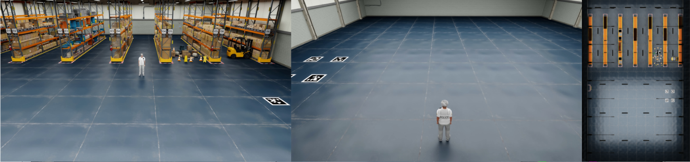
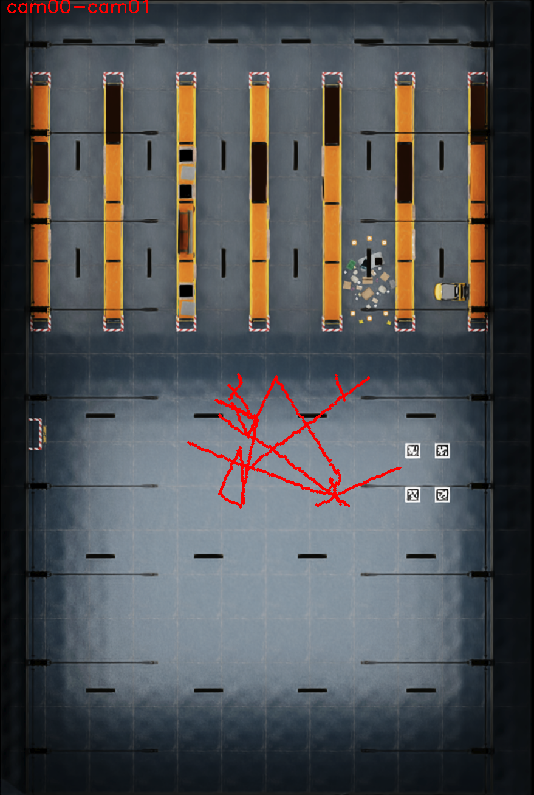
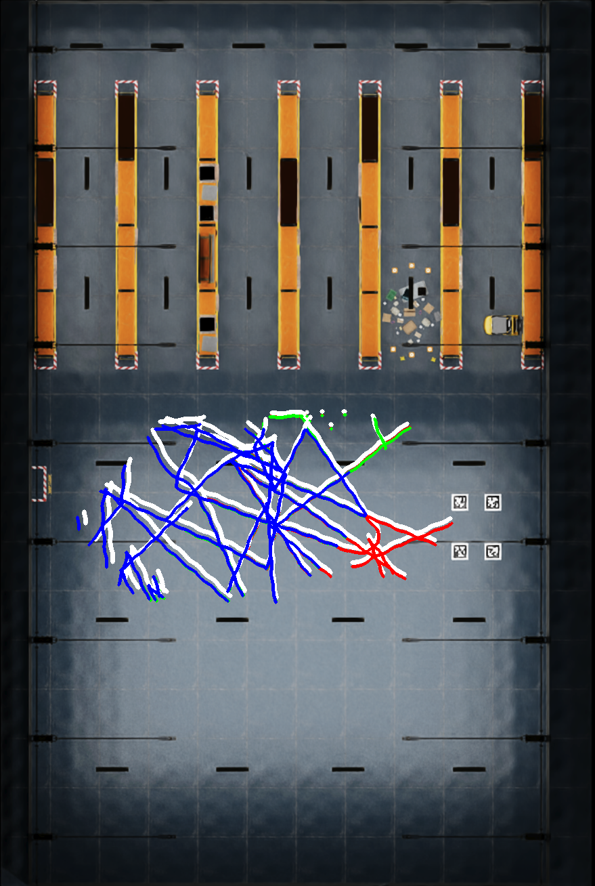

# AutoMagicCalib

AutoMagicCalib (AMC) is an automated calibration tool that estimates both intrinsic and extrinsic camera parameters for single-camera and multi-camera systems. It provides camera projection matrices and lens distortion coefficients essential for accurate 3D reconstruction and multi-view applications.

AMC eliminates the need for traditional calibration patterns (like checkerboards) by using tracked moving objects in the scene as natural features for calibration. It leverages DeepStream's object detection and tracking capabilities to identify and follow objects (particularly people) across frames, then analyzes these trajectories across camera views to automatically derive camera parameters from regular operational footage. This approach enables calibration without interrupting normal operations, allows retroactive calibration using archived footage, and performs calibration in the actual deployment environment.


## Features
- Estimate camera lens distortion parameter (k1)
- Estimate 3x4 camera projection matrix (focal length, rotation, translation)
- Ground truth focal length override: Use known focal lengths while preserving GeoCalib rotation intelligence
- Output calibration results in YAML format
- Visualization tools:
  - Score metrics graphs of parameter estimation
  - Rectified video generation with estimated lens parameters
  - Visual overlay video generation (SV3DT) with estimated camera projection matrix
- Complete end-to-end pipeline for multi-camera calibration
- Bundle adjustment for improved accuracy
- Evaluation against ground truth data

## Table of Contents
- [Features](#features)
- [Quick Start](#quick-start)
  - [System Requirements](#system-requirements)
  - [NGC Setup](#ngc-setup)
  - [Project Setup](#project-setup)
    - [Configure Environment Variables](#configure-environment-variables)
    - [Set Directory Permissions](#set-directory-permissions)
    - [Launch Services](#launch-services)
  - [Sample Data Setup](#sample-data-setup)
- [Calibration Workflow (UI)](#calibration-workflow-ui)
  - [Step 1: Project Setup](#step-1-project-setup)
  - [Step 2: Video Configuration](#step-2-video-configuration)
  - [Step 3: Parameters](#step-3-parameters)
  - [Step 4: Manual Alignment](#step-4-manual-alignment)
  - [Step 5: Execute Calibration](#step-5-execute-calibration)
  - [Step 6: Results](#step-6-results)
- [Assumptions](#assumptions)
  - [Input Video Contents](#input-video-contents)
  - [Input Video Resolution](#input-video-resolution)
  - [Time-synced Input Videos](#time-synced-input-videos)
  - [Ground Truth Directory Structure](#ground-truth-directory-structure)
- [License](#license)
  - [Repository Licenses](#repository-licenses)
  - [Proprietary Container Notices](#proprietary-container-notices-automagiccalib)

<br><br>
# Quick Start

### System Requirements
- x86_64 system
- OS Ubuntu 24.04
- NVIDIA GPU with hardware encoder (NVENC)
- NVIDIA driver 590
- NVIDIA container toolkit (see [NVIDIA DeepStream Docker Prerequisites](https://docs.nvidia.com/metropolis/deepstream/dev-guide/text/DS_docker_containers.html#prerequisites))

### NGC Setup
This step is needed to pull AutoMagicCalib docker images.
1. Visit NGC sign in page, enter your email address and click Next, or Create an Account
2. Choose your Organization/Team
3. Generate an API key following the instructions
4. Log in to the NGC docker registry:
```bash
docker login nvcr.io
Username: "$oauthtoken"
Password: "YOUR_NGC_API_KEY"
```

### Project Setup
Clone the repo to your local directory.
```bash
# clone the repo
git clone ssh://git@gitlab-master.nvidia.com:12051/DeepStreamSDK/auto-magic-calib.git
cd auto-magic-calib
```

#### Configure Environment Variables
Edit the `compose/.env` file to set the required environment variables.

| Variable | Required | Default | Description |
|---|---|---|---|
| `HOST_IP` | **Yes** | — | IP address of the host machine |
| `AUTO_MAGIC_CALIB_MS_PORT` | No | `8000` | Port for the microservice API |
| `AUTO_MAGIC_CALIB_UI_PORT` | No | `5000` | Port for the web UI |
| `PROJECT_DIR` | No | `../../projects` | Path to the projects directory |
| `MODEL_DIR` | No | `../../models` | Path to the models directory |

If you want to enable VGGT, VGGT model should be copied inside $MODEL_DIR/vggt/

```bash
# At minimum, set HOST_IP in compose/.env
HOST_IP=<your_host_ip>
```

#### Set Directory Permissions
The `projects` and `models` directories must be owned by UID/GID 1000 for the containers to read/write properly.
```bash
chown 1000:1000 -R projects
chown 1000:1000 -R models
```

#### Launch Services
Start all services using Docker Compose. Docker images will be pulled automatically on the first run.
```bash
cd compose
docker compose up -d
```
The microservice will be available at `http://<HOST_IP>:<AUTO_MAGIC_CALIB_MS_PORT>` (default port 8000) and the UI at `http://<HOST_IP>:<AUTO_MAGIC_CALIB_UI_PORT>` (default port 5000).

To stop the running containers,
```
docker compose down
```

### Sample Data Setup
Unzip the compressed sample data file under `auto-magic-calib/assets`. The sample folder includes 4 different types of data to help you run end-to-end calibration and evaluation.
1. Input video files
2. Ground truth data
3. BirdEyeView map image
4. Pre-calibrated transform for BirdEyeView map

```
~/auto-magic-calib/assets/sdg_08_2_sample_data_010926.zip
├── alignment_data
│   ├── alignment_data.json     # Pre-calibrated transform from `cam_00` reference frame to BirdEyeView map image 
│   └── layout.png              # BirdEyeView map image required for visualization
├── GT.zip                      # Ground truth data (camera info, extrinsics, object trajectories)
└── videos                      # Input video files
    ├── cam_00.mp4
    ├── cam_01.mp4
    ├── cam_02.mp4
    └── cam_03.mp4

```

Now you're ready to start the calibration process.

In case you want to try your own dataset, please verify requirements (files, directories, formats) explained in [Assumptions](#assumptions) section.


# Calibration Workflow (UI)

Once the microservice and UI containers are running, open your browser and navigate to `http://<HOST_IP>:<AUTO_MAGIC_CALIB_UI_PORT>` (default port `5000`).

The UI presents a **6-step stepper workflow**. Each step validates its inputs before allowing you to proceed to the next.

---

## Step 1: Project Setup

Create a new calibration project and select it before proceeding.

1. Enter a project name in the text field (3–50 characters, e.g., `warehouse_calibration`)
2. Click **Create** — the project appears in the "Existing Projects" list
3. Click **Select** on your project card; it highlights with a green border

**Project states** shown on each card:

| State | Color | Meaning |
|---|---|---|
| `INIT` | Gray | Project created, files not yet uploaded |
| `READY` | Green | All required files uploaded |
| `RUNNING` | Orange | Calibration pipeline executing |
| `COMPLETED` | Green | Calibration finished, results available |
| `ERROR` | Red | Calibration failed |

> **Tip:** Use the trash icon on a project card to permanently delete a project and all its data.

---

## Step 2: Video Configuration

Upload camera videos and the layout image. Ground truth and alignment data are optional here.

**Video files**
1. Click **Select Videos** and choose your video files (MP4, 1920×1080)
2. Drag to reorder videos so they match your camera order (`cam_00`, `cam_01`, …)
3. Click **Upload Videos** and wait for the progress bar to complete

**Layout image** (required)
1. Click **Upload Layout**
2. Select a PNG/JPG bird's-eye-view map of your scene
3. Confirm the success message

**Optional uploads**
- **Ground truth (ZIP)** — enables accuracy evaluation in Step 6
- **Alignment data (JSON)** — upload a pre-existing `alignment_data.json` instead of creating one interactively in Step 4

> At least 2 video files and a layout image are required before you can proceed.

---

## Step 3: Parameters

Configure optional per-camera annotations and focal lengths.

**Camera selection** — choose a camera from the dropdown; its first frame loads on the canvas.

**ROI drawing** (optional)
1. Click **Draw ROI**
2. Click on the frame to place polygon vertices (minimum 3 points)
3. Press `F` to finish — the ROI is saved automatically in green

**Tripwire drawing** (optional)
1. Click **Draw Tripwire** for a bidirectional line (red) or **Tripwire Direction** for a directional arrow (yellow)
2. Click once for the start point, once for the end point — saved automatically

**Focal length** (optional)
1. In the right panel, enter comma-separated values — one per camera (e.g., `1269.01, 1099.50, 1099.50, 1099.50`)
2. Click **Save Focal Length**

Canvas controls: scroll wheel to zoom, click-and-drag to pan.

> All annotations are auto-saved per camera and survive page refresh.

---

## Step 4: Manual Alignment

Provide correspondence points that map camera pixel coordinates to the layout map. This step is required for calibration.

**Option A — Upload existing alignment**
1. Click **Upload alignment_data.json**
2. Select your JSON file and confirm the upload

**Option B — Create alignment interactively**
1. Click **Open Alignment Tool**
2. The tool shows three images side-by-side: Camera 0 (left), Camera 1 (center), Layout Map (right)
3. Click the same physical ground-plane point on Camera 0, then Camera 1, then the Layout Map — this completes one point set
4. Repeat for at least **4 point sets** (6–8 recommended for better accuracy); each set uses a distinct color
5. Click **Save Alignment (N sets)** when done — the JSON is generated and uploaded automatically



**Point selection tips**
- Choose points on the **ground plane** that are visible in all three images
- Use **distinct features** (corners, floor markings, poles)
- Spread points across **different depths and quadrants**
- Use zoom controls (`🔍+` / `🔍-` or scroll wheel) for precision
- Avoid points on moving objects, walls, or elevated surfaces

> Use **Undo** to remove the last point, or **Reset All** to start over.

---

## Step 5: Execute Calibration

Verify the project and run the calibration pipeline.

**Pre-calibration checklist**

The system automatically checks:
- ✓ At least 2 videos uploaded
- ✓ Layout image uploaded
- ✓ Alignment data uploaded or created

1. Click **Verify Project** — the project state changes to `READY` on success
2. *(Optional)* Click the **Settings** icon (top-right) to upload a pre-configured settings file or adjust individual parameters before running
3. Click **Start Calibration** — the state changes to `RUNNING`

**During calibration**
- An elapsed-time counter and animated progress bar are shown
- Live AMC logs stream in real time
- Status auto-refreshes every 3 seconds
- You may close the page and return later — calibration continues on the server

**On completion**
- Success: "✅ AMC Calibration completed successfully!" — proceed to Results
- Failure: "❌ Calibration failed!" — click **Relaunch Calibration** to retry, or **Reset Project** to return to `INIT` and re-check uploaded files

**VGGT refinement (optional)**

If the VGGT model is installed, a second calibration section appears after AMC completes:
1. Scroll to **Calibration Control (VGGT)**
2. Click **Run VGGT Calibration** (typically 2–3 minutes)
3. On success, both AMC and VGGT results become available in Step 6

> Calibration typically takes 5–15 minutes depending on video length. Do not change settings while calibration is running.

---

## Step 6: Results

View, evaluate, and export the calibration output.

**Overlay image**
- The calibration result is projected onto the layout map; click **Download** to save it
- If VGGT was run, use the **AMC Result** / **VGGT Result** tabs to compare



**Evaluation metrics** *(only if ground truth was uploaded in Step 2)*
- L2 distance statistics (average, std dev, min, max) in meters
- 3D points plotted on the layout for visual accuracy inspection



**Camera parameters**
- Click a camera tab (e.g., "Camera 0") to view intrinsic/extrinsic parameters in YAML format
- Use **AMC** / **VGGT** tabs to compare per-camera values

**Export options**

| Button | Format | Contents |
|---|---|---|
| **Full Export AMC** | JSON | Complete calibration data with ROI/tripwire world coordinates (AMC matrix) |
| **Full Export VGGT** | JSON | Same as above using VGGT matrix *(if available)* |
| **MV3DT ZIP AMC** | ZIP | MV3DT-compatible archive for downstream verification |
| **MV3DT ZIP VGGT** | ZIP | Same as above using VGGT results *(if available)* |

For **Full Export**: the JSON opens in an in-browser editor — review or edit as needed, then click **Export AMC** / **Export VGGT** to download.
For **MV3DT ZIP** exports: the file downloads automatically to your browser's download folder.

**ROI & Tripwire Verification**

> **Prerequisite:** Click **Full Export AMC** (and **Full Export VGGT** if applicable) before opening this panel.

1. Click **Show ROI & Tripwire Verification**
2. Select a camera from the dropdown
3. Left panel shows annotated camera frame; right panel shows projections on the Bird's-Eye View map
4. Switch between AMC/VGGT tabs and use zoom controls for detailed inspection


# Assumptions

AutoMagicCalib makes several assumptions about input data structure. Please ensure your data follows these requirements:

## Input Video Contents:
There must be objects moving around the scene, because AMC relies on tracking results.
Cameras must be specified in order and have overlapping areas: `cam_00` overlaps with `cam_01`, and `cam_01` overlaps with `cam_02`, ...

## Input Video Resolution:
Video files' resolution should be 1920x1080. 

## Time-synced Input Videos:
Input video files from all cameras must be synchronized

## Ground Truth Directory Structure:
When providing ground truth data for evaluation, the it must follow this specific naming convention:


# License

## Repository Licenses
This repository contains materials released under different licenses:
- The scripts and code are licensed under the Apache License 2.0.
- The assets are licensed under the Creative Commons Attribution 4.0 International (CC-BY-4.0) license.

## Proprietary Container Notices (AutoMagicCalib)
The scripts in this repository interact with and pull the proprietary AutoMagicCalib Container. The use of this container, and any software, data, or intellectual property contained within it, is governed by a separate set of licenses and third-party notices.

The applicable End User License Agreement (EULA), 3rd-party notice, and reference information for the container can be found in [AutoMagicCalib page in NGC Catalog](https://catalog.ngc.nvidia.com/orgs/nvidia/containers/auto-magic-calib?version=1.0).
