# AutoMagicCalib

AutoMagicCalib (AMC) is an automated calibration tool that estimates both intrinsic and extrinsic camera parameters for single-camera and multi-camera systems. It provides camera projection matrices and lens distortion coefficients essential for accurate 3D reconstruction and multi-view applications.

AMC eliminates the need for traditional calibration patterns (like checkerboards) by using tracked moving objects in the scene as natural features for calibration. It leverages DeepStream's object detection and tracking capabilities to identify and follow objects (particularly people) across frames, then analyzes these trajectories across camera views to automatically derive camera parameters from regular operational footage. This approach enables calibration without interrupting normal operations, allows retroactive calibration using archived footage, and performs calibration in the actual deployment environment.


## Features
- Estimate camera lens distortion parameter (k1)
- Estimate 3x4 camera projection matrix (focal length, rotation, translation)
- Ground truth focal length override: Use known focal lengths while preserving GeoCalib rotation intelligence
- Output calibration results in YAML format
- Visualization tools:
  - Score metrics graphs of parameter estimation
  - Rectified video generation with estimated lens parameters
  - Visual overlay video generation (SV3DT) with estimated camera projection matrix
- Complete end-to-end pipeline for multi-camera calibration
- Bundle adjustment for improved accuracy
- Evaluation against ground truth data

## Table of Contents
- [Features](#features)
- [Quick Start](#quick-start)
  - [System Requirements](#system-requirements)
  - [NGC Setup](#ngc-setup)
  - [Project Setup](#project-setup)
    - [Configure Environment Variables](#configure-environment-variables)
    - [Set Directory Permissions](#set-directory-permissions)
    - [Launch Services](#launch-services)
  - [Sample Data Setup](#sample-data-setup)
- [Calibration Workflow (UI)](#calibration-workflow-ui)
  - [Step 1: Project Setup](#step-1-project-setup)
    - [Creating a New Project](#creating-a-new-project)
    - [Selecting a Project](#selecting-a-project)
    - [Managing Projects](#managing-projects)
  - [Step 2: Video Configuration](#step-2-video-configuration)
    - [Upload Status Overview](#upload-status-overview)
    - [Uploading Video Files](#uploading-video-files)
    - [Uploading Ground Truth Data](#uploading-ground-truth-data)
    - [Uploading Layout Image](#uploading-layout-image)
    - [Uploading Alignment Data](#uploading-alignment-data)
  - [Step 3: Parameters](#step-3-parameters)
    - [Camera Selection](#camera-selection)
    - [Drawing Tools](#drawing-tools)
    - [Drawing ROIs](#drawing-rois)
    - [Drawing Tripwire Lines](#drawing-tripwire-lines)
    - [Drawing Tripwire Directions](#drawing-tripwire-directions)
    - [Focal Length Configuration](#focal-length-configuration)
  - [Step 4: Manual Alignment](#step-4-manual-alignment)
    - [Two Options for Alignment](#two-options-for-alignment)
    - [Interactive Alignment Tool](#interactive-alignment-tool)
    - [Point Selection Process](#point-selection-process)
    - [Saving Alignment Data](#saving-alignment-data)
    - [Best Practices](#best-practices)
  - [Step 5: Execute Calibration](#step-5-execute-calibration)
    - [Verification Process](#verification-process)
    - [Running AMC Calibration](#running-amc-calibration)
    - [VGGT Calibration (Optional)](#vggt-calibration-optional)
    - [Troubleshooting](#troubleshooting)
  - [Step 6: Results](#step-6-results)
    - [Overlay Image](#overlay-image)
    - [Evaluation Metrics](#evaluation-metrics)
    - [Camera Parameters](#camera-parameters)
    - [Export Calibration Data](#export-calibration-data)
    - [ROI & Tripwire Verification](#roi--tripwire-verification)
    - [How to Interpret Calibration Outputs](#how-to-interpret-calibration-outputs)
- [Assumptions](#assumptions)
  - [Input Video Contents](#input-video-contents)
  - [Input Video Resolution](#input-video-resolution)
  - [Time-synced Input Videos](#time-synced-input-videos)
  - [Ground Truth Directory Structure](#ground-truth-directory-structure)
- [License](#license)
  - [Repository Licenses](#repository-licenses)
  - [Proprietary Container Notices](#proprietary-container-notices-automagiccalib)

<br><br>
# Quick Start

### System Requirements
- x86_64 system
- OS Ubuntu 24.04
- NVIDIA GPU with hardware encoder (NVENC)
- NVIDIA driver 590
- NVIDIA container toolkit (see [NVIDIA DeepStream Docker Prerequisites](https://docs.nvidia.com/metropolis/deepstream/dev-guide/text/DS_docker_containers.html#prerequisites))

### NGC Setup
This step is needed to pull AutoMagicCalib docker images.
1. Visit NGC sign in page, enter your email address and click Next, or Create an Account
2. Choose your Organization/Team
3. Generate an API key following the instructions
4. Log in to the NGC docker registry:
```bash
docker login nvcr.io
Username: "$oauthtoken"
Password: "YOUR_NGC_API_KEY"
```

### Project Setup
Clone the repo to your local directory.
```bash
# clone the repo
git clone ssh://git@gitlab-master.nvidia.com:12051/DeepStreamSDK/auto-magic-calib.git
cd auto-magic-calib
```

#### Configure Environment Variables
Edit the `compose/.env` file to set the required environment variables.

| Variable | Required | Default | Description |
|---|---|---|---|
| `HOST_IP` | **Yes** | — | IP address of the host machine |
| `AUTO_MAGIC_CALIB_MS_PORT` | No | `8000` | Port for the microservice API |
| `AUTO_MAGIC_CALIB_UI_PORT` | No | `5000` | Port for the web UI |
| `PROJECT_DIR` | No | `../../projects` | Path to the projects directory |
| `MODEL_DIR` | No | `../../models` | Path to the models directory |

If you want to enable VGGT, VGGT model should be copied inside $MODEL_DIR/vggt/

```bash
# At minimum, set HOST_IP in compose/.env
HOST_IP=<your_host_ip>
```

#### Set Directory Permissions
The `projects` and `models` directories must be owned by UID/GID 1000 for the containers to read/write properly.
```bash
chown 1000:1000 -R projects
chown 1000:1000 -R models
```

#### Launch Services
Start all services using Docker Compose. Docker images will be pulled automatically on the first run.
```bash
cd compose
docker compose up -d
```
The microservice will be available at `http://<HOST_IP>:<AUTO_MAGIC_CALIB_MS_PORT>` (default port 8000) and the UI at `http://<HOST_IP>:<AUTO_MAGIC_CALIB_UI_PORT>` (default port 5000).

To stop the running containers,
```
docker compose down
```

### Sample Data Setup
Unzip the compressed sample data file under `auto-magic-calib/assets`. The sample folder includes 4 different types of data to help you run end-to-end calibration and evaluation.
1. Input video files
2. Ground truth data
3. BirdEyeView map image
4. Pre-calibrated transform for BirdEyeView map

```
~/auto-magic-calib/assets/sdg_08_2_sample_data_010926.zip
├── alignment_data
│   ├── alignment_data.json     # Pre-calibrated transform from `cam_00` reference frame to BirdEyeView map image 
│   └── layout.png              # BirdEyeView map image required for visualization
├── GT.zip                      # Ground truth data (camera info, extrinsics, object trajectories)
└── videos                      # Input video files
    ├── cam_00.mp4
    ├── cam_01.mp4
    ├── cam_02.mp4
    └── cam_03.mp4

```

Now you're ready to start the calibration process.

In case you want to try your own dataset, please verify requirements (files, directories, formats) explained in [Assumptions](#assumptions) section.


# Calibration Workflow (UI)

Once the microservice and UI containers are running, open your browser and navigate to `http://<HOST_IP>:<AUTO_MAGIC_CALIB_UI_PORT>` (default port `5000`).

The UI presents a **6-step stepper workflow**. Each step validates its inputs before allowing you to proceed to the next.

---

## Step 1: Project Setup

The Project Setup step allows you to create and manage calibration projects.

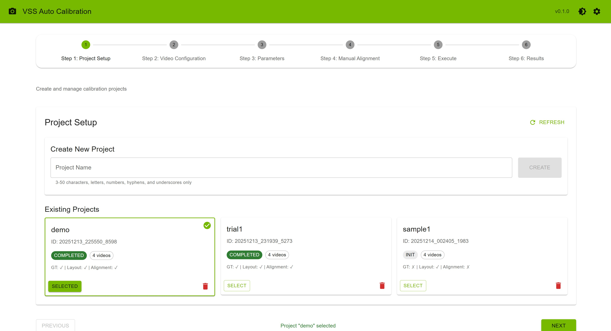

### Creating a New Project

1. Enter a project name in the text field
   - **Requirements**: 3–50 characters
   - **Example**: `warehouse_cam_2024`, `parking_lot_north`
2. Click the **Create** button
3. The new project appears in the "Existing Projects" list below

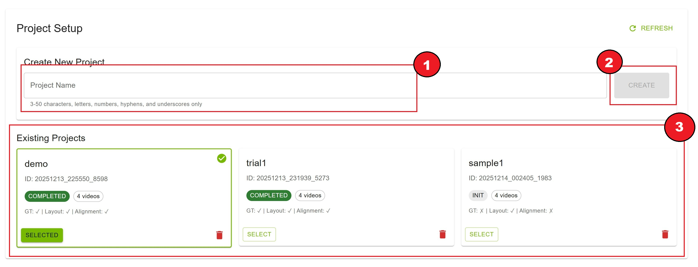

**Project Name Validation**
- ✓ Valid: `warehouse_calibration`, `site_01`, `parking-lot-A`
- ✗ Invalid: `ab` (too short)

### Selecting a Project

1. Browse the list of existing projects
2. Click the **Select** button on the desired project card
3. The selected project is highlighted with a green border and checkmark
4. Project information is displayed at the bottom: "Project 'name' selected"

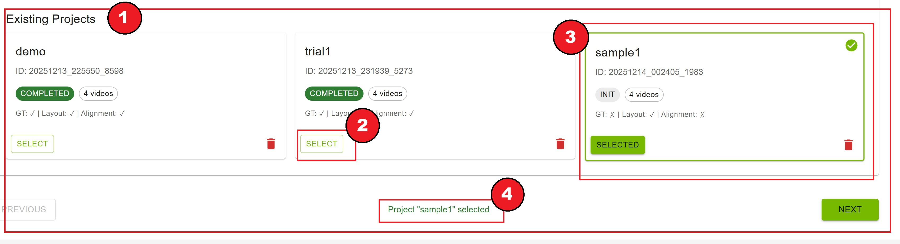

**Project Card Information**

Each project card displays:
- **Project Name**: The name you assigned
- **Project ID**: Unique identifier (UUID)
- **Project State**: Current status badge
  - `INIT` (gray): Initial state, files not yet uploaded
  - `READY` (green): Ready for calibration
  - `RUNNING` (orange): Calibration in progress
  - `COMPLETED` (green): Calibration finished successfully
  - `ERROR` (red): Calibration failed
- **Video Count**: Number of uploaded video files
- **File Status**: Checkmarks for uploaded files
  - GT (Ground Truth): ✓ or ✗
  - Layout: ✓ or ✗
  - Alignment: ✓ or ✗

### Managing Projects

**Refreshing the Project List**

Click the **Refresh** button in the top-right corner to reload the project list from the server.

**Deleting a Project**

1. Click the trash icon (🗑️) on the project card
2. Confirm deletion in the dialog that appears
3. The project and all associated data are permanently deleted

> **Warning:** Deleting a project cannot be undone. Export any important calibration results before deletion.

---

## Step 2: Video Configuration

Upload camera videos, layout image, ground truth data, and optional alignment file.

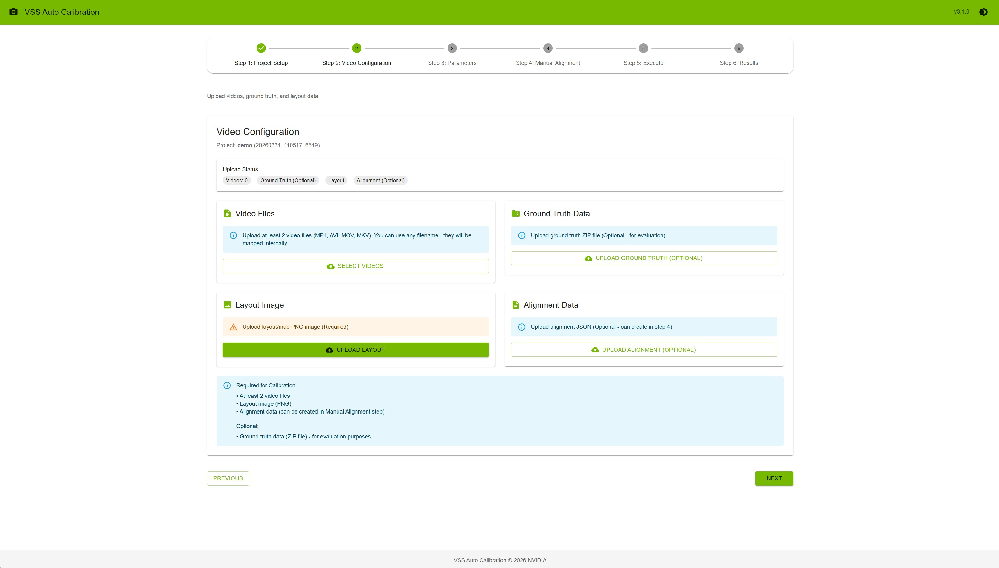

### Upload Status Overview

At the top of the page, you'll see a status summary showing:
- **Videos**: Count of uploaded videos (minimum 2 required)
- **Ground Truth (Optional)**: Upload status
- **Layout**: Upload status (required)
- **Alignment (Optional)**: Upload status

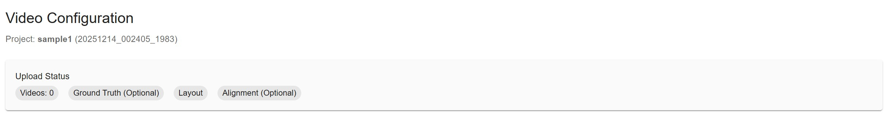

### Uploading Video Files

**Requirements**
- **Minimum**: 2 video files
- **Formats**: MP4
- **Required Video Resolution**: 1920×1080

**Upload Process**

1. Click the **Select Videos** button to choose video files from your computer
2. Selected videos appear in a list where you can reorder them by dragging
3. Reorder the videos to match your desired camera order (`cam_00`, `cam_01`, etc.)
4. Click the **Upload** button to upload all selected videos
5. Wait for the upload progress bar to complete

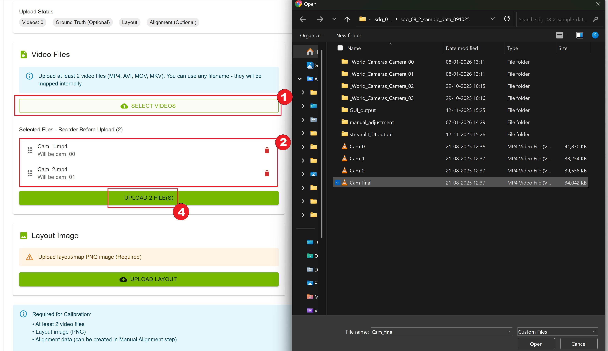

**Managing Video Files**
- **View List**: All selected videos are listed with their filenames
- **Reorder**: Drag and drop videos to change their order before uploading
- **Delete Video**: Click the trash icon (🗑️) next to a video to remove it
- **Re-upload**: Delete and upload again if needed

### Uploading Ground Truth Data

Ground truth data is optional and used for calibration evaluation.

**Requirements**
- **Format**: ZIP file
- **Content**: Ground truth calibration data

**Upload Process**

1. Click **Upload Ground Truth (Optional)** button
2. Select your ZIP file
3. Wait for upload confirmation
4. Status changes to "Ground truth uploaded ✓"

**Deleting Ground Truth**

If ground truth is already uploaded, the button changes to **Delete Ground Truth**. Click it to remove the file.

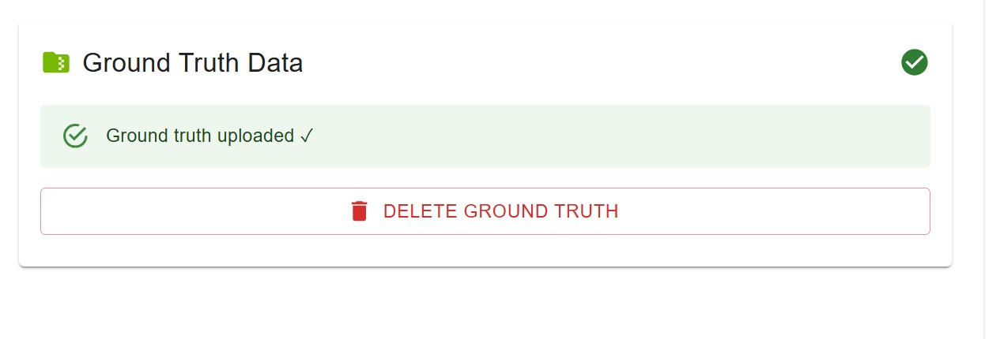

### Uploading Layout Image

The layout image is required and represents the top-down view or map of your surveillance area.

**Requirements**
- **Format**: PNG, JPG, or JPEG
- **Content**: Bird's eye view map or layout diagram
- **Recommended**: High resolution for better accuracy

**Upload Process**

1. Click **Upload Layout** button
2. Select your image file
3. Wait for upload confirmation
4. Status changes to "Layout image uploaded ✓"

**Deleting Layout**

If layout is already uploaded, the button changes to **Delete Layout**. Click it to remove the file.

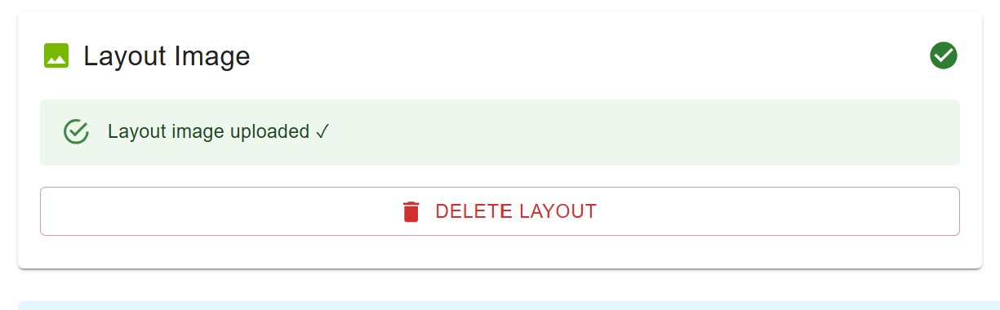

### Uploading Alignment Data

Alignment data is optional at this step. You can either upload a pre-existing alignment file here or create it interactively in Step 4.

**Requirements**
- **Format**: JSON file
- **Content**: Alignment point data (4+ point sets)

**Upload Process**

1. Click **Upload Alignment (Optional)** button
2. Select your JSON file
3. Wait for upload confirmation
4. Status changes to "Alignment file uploaded ✓"

**Deleting Alignment**

If alignment is already uploaded, the button changes to **Delete Alignment**. Click it to remove the file.

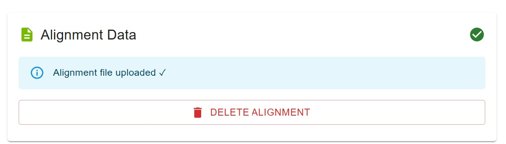

### Requirements Note

**Required for Calibration:**
- At least 2 video files
- Layout image (PNG)
- Alignment data (can be created in Manual Alignment step)

**Optional:**
- Ground truth data (ZIP file) — for evaluation purposes

> You can proceed to the next step even if ground truth and alignment are not uploaded. Alignment can be created interactively in Step 4.

---

## Step 3: Parameters

Configure camera parameters, draw ROIs (Regions of Interest), and define tripwires.

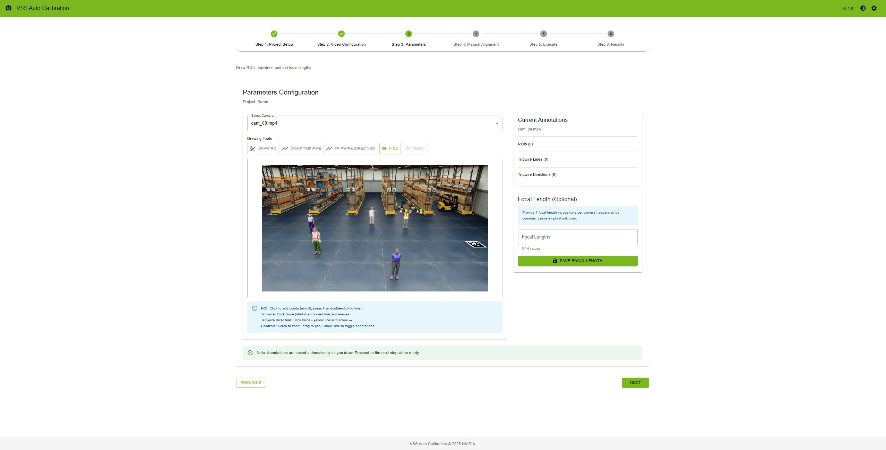

### Interface Layout

The Parameters step is divided into two main sections:

**Left Panel (Main Canvas)**
- Camera selection dropdown
- Drawing tools toolbar
- Video frame canvas with annotations
- Instructions and controls

**Right Panel (Sidebar)**
- Current annotations list
- ROI count and details
- Tripwire lines count
- Tripwire directions count
- Focal length configuration

### Camera Selection

1. Select a camera from the dropdown menu at the top
2. The first frame of the selected video loads on the canvas
3. Switch between cameras to annotate each one

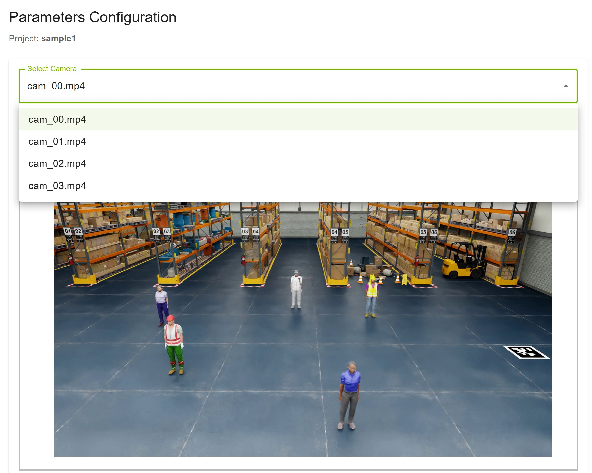

### Drawing Tools

**Available Tools**
- **Draw ROI**: Create polygonal regions of interest
- **Draw Tripwire**: Create tripwire lines for counting
- **Tripwire Direction**: Create directional tripwires with arrows
- **Show/Hide**: Toggle visibility of annotations
- **Reset**: Clear all annotations for current camera

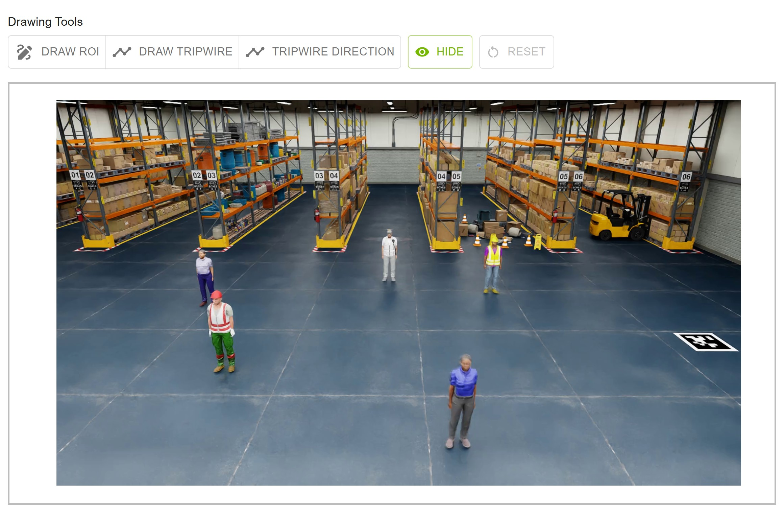

### Drawing ROIs

ROIs define areas of interest for detection and tracking.

**How to Draw**

1. Click the **Draw ROI** button (it becomes highlighted)
2. Click on the video frame to add points
3. Add at least 3 points to form a polygon
4. Finish the ROI by pressing the `F` key
5. The ROI is automatically saved with a green color

**ROI Features**
- **Color**: Green (#00ff00)
- **Minimum Points**: 3
- **Auto-save**: Saved immediately upon completion

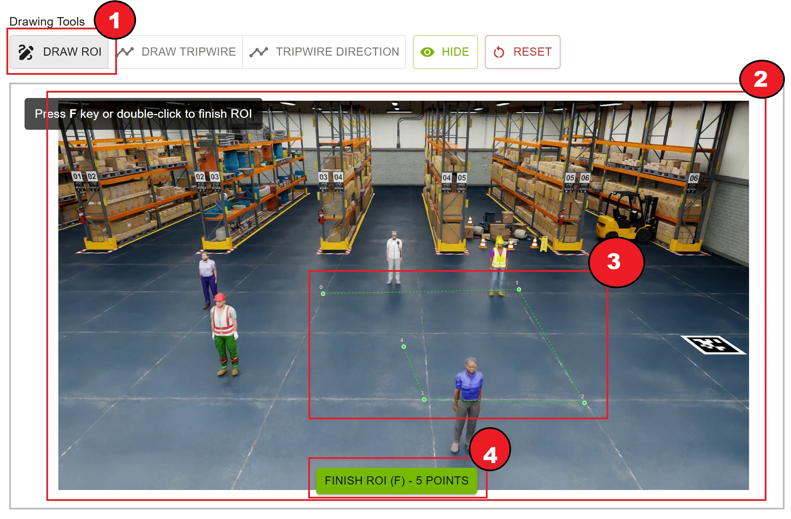

**Editing ROIs**
- **Delete**: Click the delete button next to the ROI in the right panel
- **Redraw**: Delete the existing ROI and draw a new one

### Drawing Tripwire Lines

Tripwire lines are used for counting objects crossing a line.

**How to Draw**

1. Click the **Draw Tripwire** button
2. Click once to set the start point
3. Click again to set the end point
4. The tripwire line is automatically saved with a red color

**Tripwire Line Features**
- **Color**: Red (#ff0000)
- **Points**: Exactly 2 (start and end)
- **Auto-save**: Saved immediately upon completion
- **Use Case**: Bidirectional counting

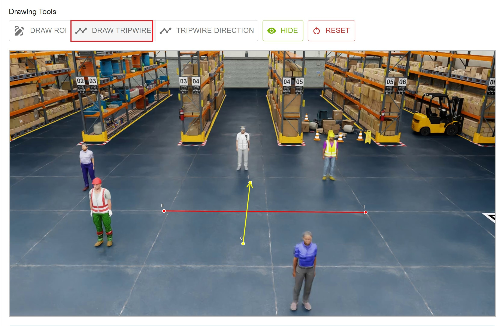

### Drawing Tripwire Directions

Tripwire directions are used for unidirectional counting with an arrow indicator.

**How to Draw**

1. Click the **Tripwire Direction** button
2. Click once to set the start point
3. Click again to set the end point (direction of arrow)
4. The tripwire direction is automatically saved with a yellow color and arrow

**Tripwire Direction Features**
- **Color**: Yellow (#ffff00)
- **Arrow**: Shows direction from start to end
- **Points**: Exactly 2 (start and end)
- **Auto-save**: Saved immediately upon completion
- **Use Case**: Unidirectional counting (e.g., entry/exit)

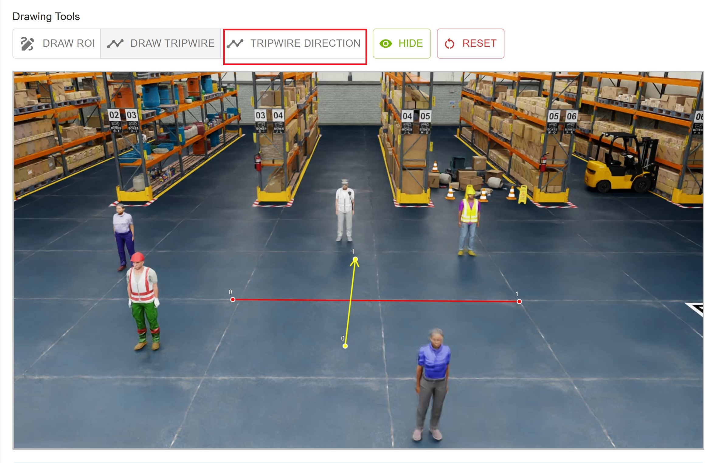

### Canvas Controls

**Zoom and Pan**
- **Scroll Wheel**: Zoom in/out on the canvas
- **Click + Drag**: Pan around when zoomed in
- **Show/Hide Button**: Toggle visibility of all annotations
- **Reset Button**: Clear all annotations for the current camera

**Visual Feedback**
- **Drawing Mode**: Active tool is highlighted in the toolbar
- **Cursor**: Changes to crosshair when in drawing mode
- **Completed Annotations**: Rendered with solid colors

### Annotation List (Right Panel)

The right panel shows all annotations for the currently selected camera.

- **ROIs Section**: Count of completed ROIs; each ROI shown as a green chip with point count; delete button for each
- **Tripwire Lines Section**: Count of completed tripwire lines; each line shown as a red chip; delete button for each
- **Tripwire Directions Section**: Count of completed tripwire directions; each direction shown as a yellow chip with arrow; delete button for each

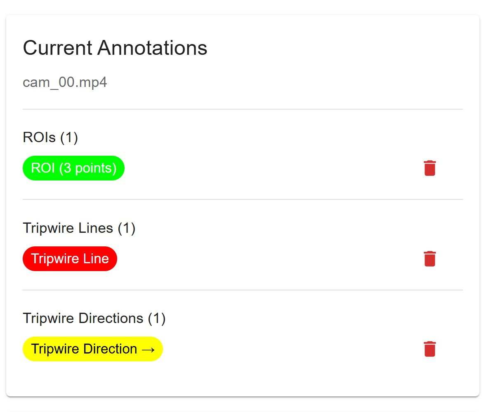

### Focal Length Configuration

Focal lengths are optional but can improve calibration accuracy.

**Requirements**
- One value per camera
- Comma-separated list
- Positive numbers only
- Count must match video count

**How to Configure**

1. In the right panel, find the **Focal Length (Optional)** card
2. Enter focal lengths separated by commas (e.g., `1269.01, 1099.50, 1099.50, 1099.50`)
3. Click **Save Focal Length** button
4. Confirmation message appears

**Clearing Focal Lengths**

1. Delete all text from the input field
2. Click **Save Focal Length**
3. Focal lengths are cleared from the project

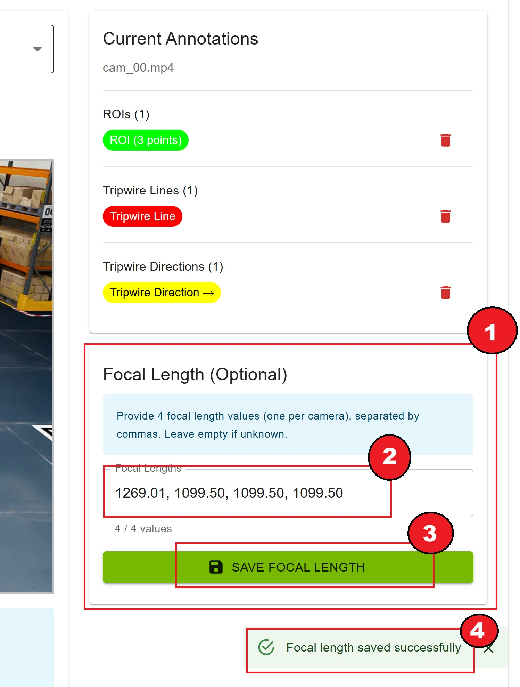

### Auto-Save Feature

All annotations (ROIs, tripwires, tripwire directions) are automatically saved to the server as you draw them.
- No manual save required
- Instant persistence
- Per-camera storage
- Survives page refresh

> The green success message "Annotations are saved automatically as you draw. Proceed to the next step when ready." confirms auto-save is active.

---

## Step 4: Manual Alignment

Create alignment data by selecting corresponding points across camera views and the layout map. This step is required for calibration.

### Two Options for Alignment

**Option 1: Upload Existing Alignment**

If you already have an `alignment_data.json` file:

1. Click **Upload alignment_data.json** button
2. Select your JSON file from your computer
3. Wait for upload confirmation
4. Proceed to the next step

**Option 2: Create Alignment Interactively**

Create alignment data by selecting corresponding points:

1. Click **Open Alignment Tool** button
2. The interactive alignment interface opens
3. Follow the point selection process

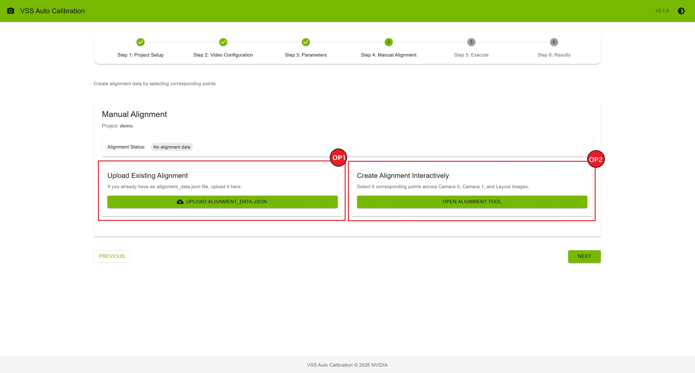

Create alignment data by selecting corresponding points across camera views and the layout map.

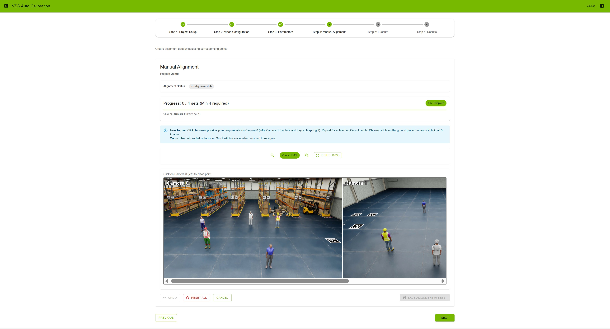

### Alignment Status

At the top of the page, you'll see the current alignment status:
- **Green Badge**: "Alignment data exists" — file already uploaded or created
- **Gray Badge**: "No alignment data" — need to upload or create alignment

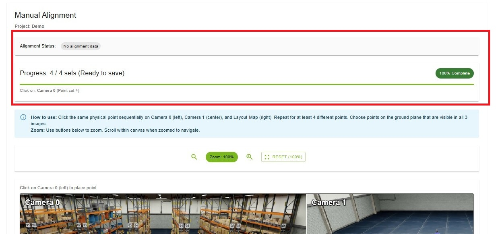

### Prerequisites Check

Before creating alignment interactively, the system checks:
- ✓ At least 2 videos uploaded
- ✓ Layout image uploaded

If prerequisites are not met, you'll see a warning message directing you to Step 2.

### Interactive Alignment Tool

**Interface Overview**

The alignment tool displays three images side-by-side in a single concatenated canvas:
- **Left**: Camera 0 (cam_00.mp4)
- **Center**: Camera 1 (cam_01.mp4)
- **Right**: Layout Map (BEV — Bird's Eye View)

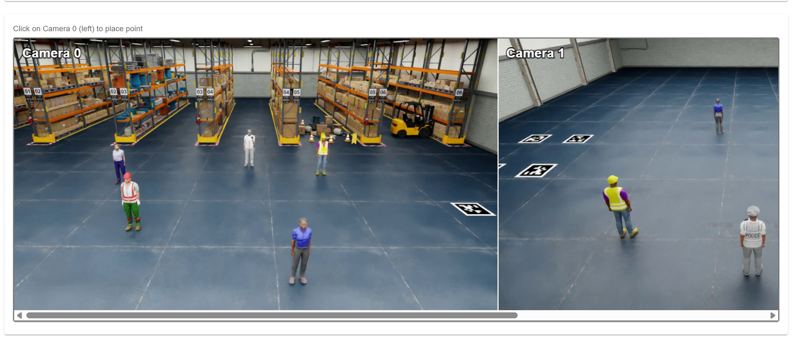

**Progress Indicator**

At the top, you'll see:
- **Progress Bar**: Visual progress (0–100%)
- **Completion Status**: "X / Y sets (Min 4 required)" or "(Ready to save)"
- **Current Action**: "Click on: Camera 0 / Camera 1 / Layout Map (Point set N)"

### Point Selection Process

1. **Select Point on Camera 0** — click on a distinct feature visible in Camera 0 (left section); a colored circle appears; system prompts "Click on: Camera 1"
2. **Select Corresponding Point on Camera 1** — click on the same physical location in Camera 1 (center section); system prompts "Click on: Layout Map"
3. **Select Corresponding Point on Layout** — click on the same physical location on the Layout Map (right section); **Point Set 1 Complete!**
4. **Repeat for Additional Points** — system automatically moves to Point Set 2; each set uses a different color (Green, Blue, Red, Yellow); repeat for at least 4 total point sets

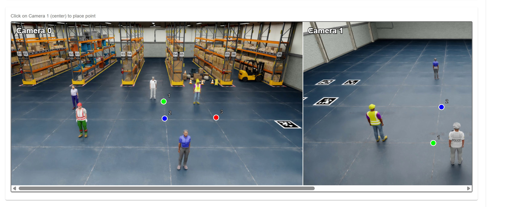

**Point Selection Tips**
- Choose points on the **ground plane**
- Select **distinct features** (corners, markings, poles)
- Ensure points are **visible in all three images**
- Distribute points across **different depths and locations**
- Avoid points on **moving objects**
- Use **zoom controls** for precision

### Zoom and Navigation

**Zoom Controls** (located above the canvas):
- **Zoom In** (🔍+): Increase zoom level
- **Zoom Out** (🔍-): Decrease zoom level
- **Reset (100%)**: Return to original zoom level
- **Current Zoom**: Displayed as percentage (e.g., "Zoom: 150%")

**Navigation**
- **Scroll Wheel**: Zoom in/out on the canvas
- **Click + Drag**: Pan around when zoomed in
- **Zoom Range**: 50% to 300%

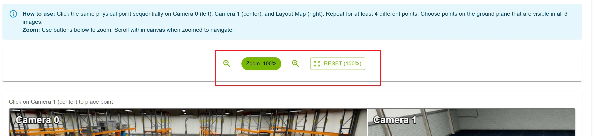

### Point Set Management

- **Undo Last Point**: Click the **Undo** button to remove the most recently placed point
- **Reset All Points**: Click the **Reset All** button to clear all points and start over
- **Add More Points**: After completing 4 point sets, click **Add More Points** to add additional sets for improved accuracy

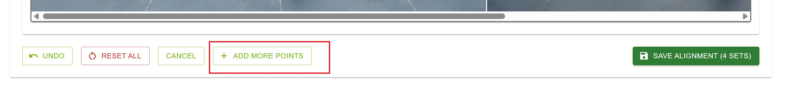

### Saving Alignment Data

**Requirements**
- Minimum 4 complete point sets
- Each set must have all 3 points (Camera 0, Camera 1, Layout)

**Save Process**

1. Complete at least 4 point sets
2. The **Save Alignment** button becomes enabled
3. Button shows: "Save Alignment (X sets)" where X is the count
4. Click **Save Alignment (X sets)**
5. System generates and uploads the alignment JSON file
6. Success message appears
7. Alignment tool closes automatically

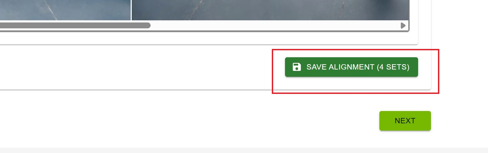

Click the **Cancel** button to exit the alignment tool without saving.

### Alignment Data Format

The generated alignment data is a JSON array with the following structure:

```json
[
  [
    [x0_cam0, y0_cam0],
    [x0_cam1, y0_cam1],
    [x0_layout, y0_layout]
  ],
  ...
]
```

Each outer array element represents one point set with 3 coordinate pairs `[x, y]` in pixel space.

### Deleting Alignment Data

If alignment data already exists and you want to recreate it:

1. The interface shows: "Alignment data already exists for this project"
2. Click **Delete Alignment Data** button
3. Confirm deletion
4. Create new alignment using either upload or interactive method

> **Warning:** Deleting alignment data cannot be undone. You'll need to recreate or re-upload it.

### Best Practices

**Point Selection Strategy**
- **Minimum 4 points**: Required for calibration
- **Recommended 6–8 points**: Better accuracy and robustness

**Point Distribution**
- Spread points across the entire area
- Include points at different depths (near and far)
- Cover all quadrants of the layout
- Avoid clustering points in one area

**Point Quality**
- Use sharp, distinct features
- Avoid ambiguous or blurry areas
- Prefer corners and intersections
- Ensure good contrast

**Common Mistakes to Avoid**
- ✗ Selecting points on walls or elevated surfaces
- ✗ Choosing points only in the center
- ✗ Using points on moving objects
- ✗ Clicking too quickly without precision
- ✗ Forgetting to zoom in for accuracy

---

## Step 5: Execute Calibration

Verify project requirements and run the calibration pipeline with live monitoring.

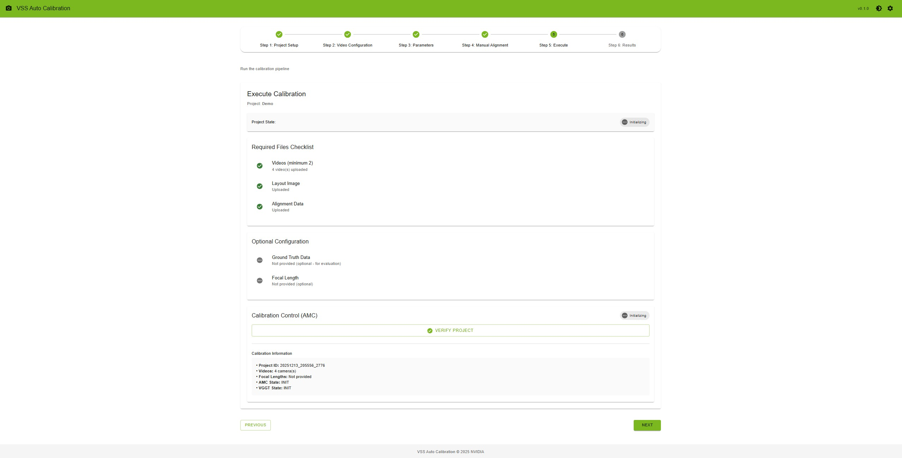

### Project State Overview

At the top of the page, you'll see the current project state:
- **INIT** (gray): Initial state
- **READY** (blue): Ready to run calibration
- **RUNNING** (orange): Calibration in progress
- **COMPLETED** (green): Calibration finished
- **ERROR** (red): Calibration failed

When RUNNING, an elapsed time counter and progress bar are displayed.

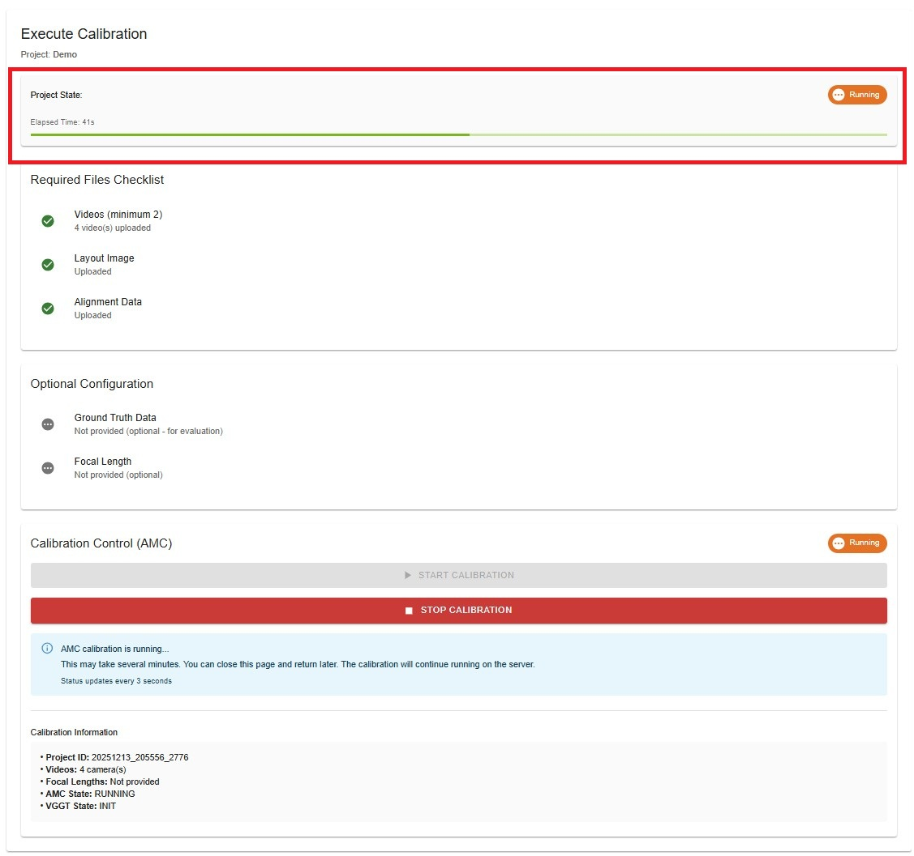

### Requirements Checklist

The system validates all required files before allowing calibration:

- ✓ **Videos (minimum 2)**: Shows count of uploaded videos
- ✓ **Layout Image**: Confirms layout is uploaded
- ✓ **Alignment Data**: Confirms alignment is uploaded or created

If any requirement is not met, you'll see a warning message: "Please complete all requirements before verification. Go back to previous steps to upload missing files."

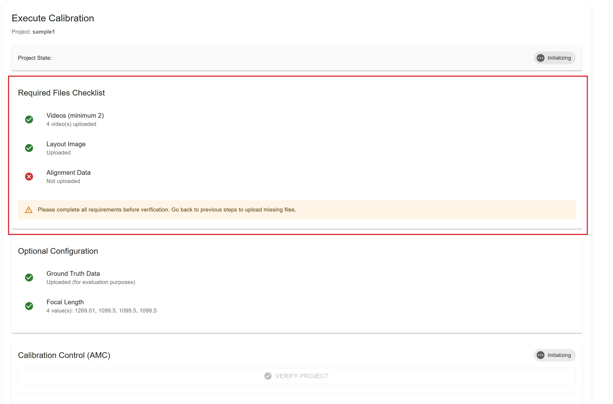

### Optional Configuration

The system also displays optional configuration status:

- **Ground Truth Data**: ✓ Uploaded (for evaluation purposes) or ⊙ Not provided (optional)
- **Focal Length**: ✓ X value(s) shown, or ⊙ Not provided (optional)

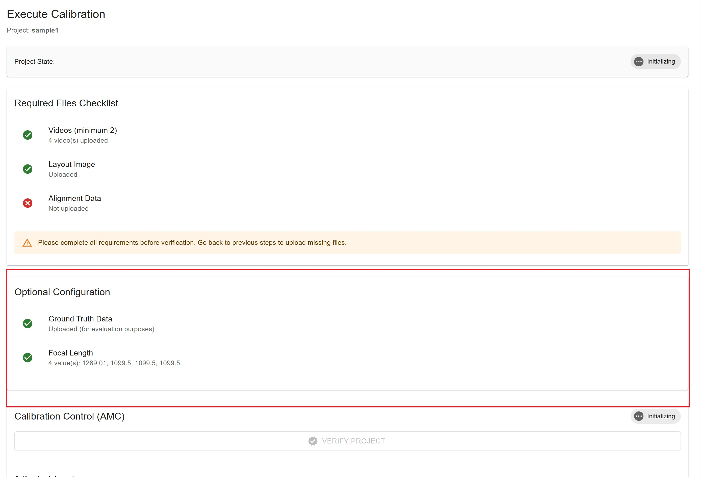

### Verification Process

Before running calibration, you must verify the project.

**How to Verify**

1. Ensure all requirements are met (green checkmarks)
2. Click the **Verify Project** button
3. System validates all files and configurations
4. Success message appears: "Project verified successfully"
5. Project state changes to "READY"
6. **Start Calibration** button becomes enabled

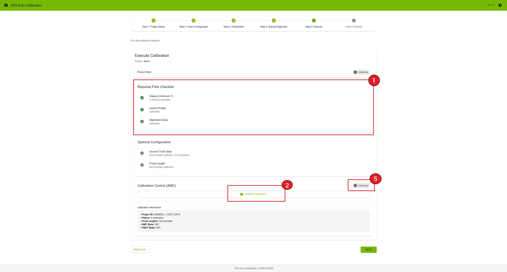

### Configuring Settings

Before running calibration, you can customize the settings parameters.

Click the settings icon in the top-right corner to access application settings.

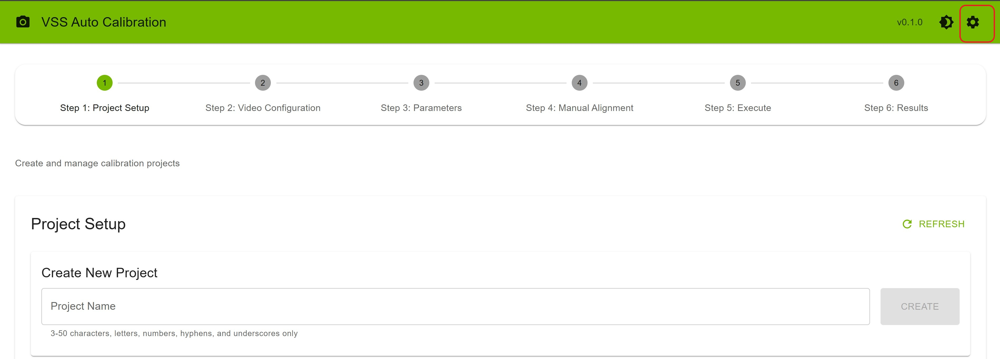

**Configuration Options**
- **Option 1: Upload** — upload a pre-configured settings file to apply all parameters at once
- **Option 2: Manual Configuration** — modify each parameter individually through the settings interface

**Additional Actions**
- **Download**: Export the current settings configuration to a file
- **Reset to Defaults**: Restore all settings to their default values
- **Save Settings**: Save your changes

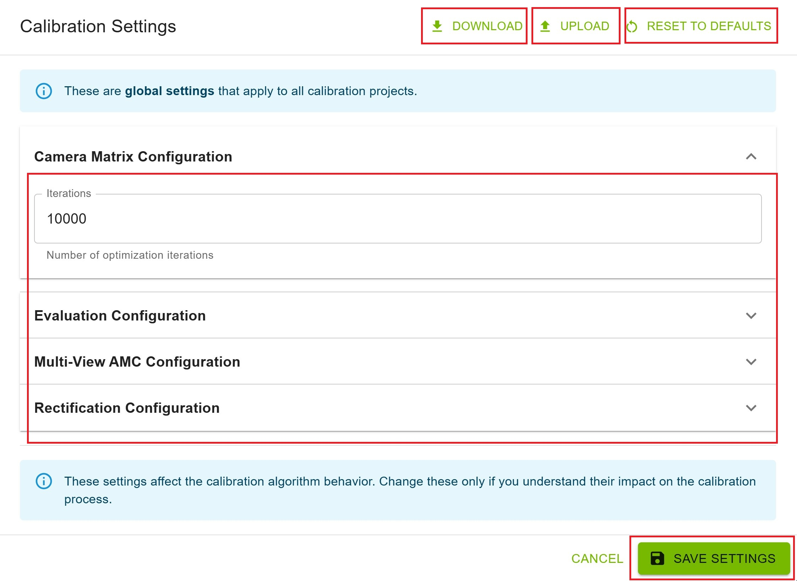

> **Warning:** Do not attempt to change the settings while AMC calibration is running. Make all configuration changes before starting the calibration process.

### Running AMC Calibration

AMC (Auto Magic Calibration) is the primary calibration method.

**How to Start**

1. After verification, click **Start Calibration** button
2. Calibration pipeline begins immediately
3. Project state changes to "RUNNING"
4. Progress indicators appear

**During Calibration**
- **Elapsed Time**: Updates every second
- **Progress Bar**: Animated progress indicator
- **Status Message**: "AMC calibration is running..."
- **Info Alert**: "This may take several minutes. You can close this page and return later."
- **AMC Live Logs**: Real-time calibration logs displayed during execution
- **Auto-refresh**: Status updates every 3 seconds

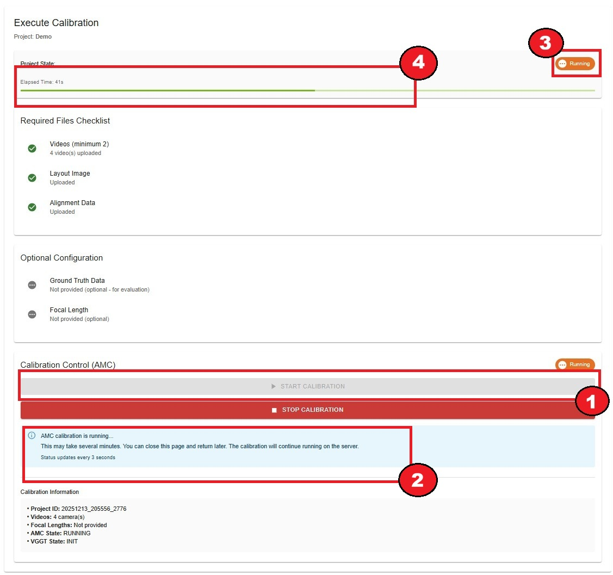

**Stopping Calibration**

If needed, click **Stop Calibration** (appears when RUNNING). The calibration process terminates and the project state changes back to "READY".

> **Warning:** Stopping calibration will discard partial results. You'll need to start over.

### Calibration Completion

When AMC calibration finishes successfully:
- **Success Alert**: "✅ AMC Calibration completed successfully!"
- **Message**: "You can now run VGGT calibration or proceed to view results."
- **Project State**: Changes to "COMPLETED"

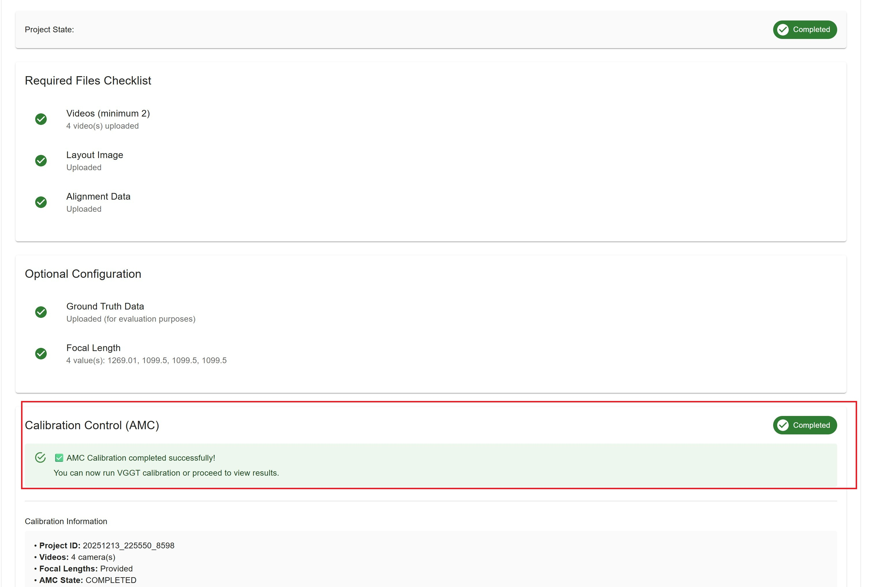

### Calibration Failure

If calibration fails:
- **Error Alert**: "❌ Calibration failed!"
- **Message**: "Please check your input files and try again."
- **Project State**: Changes to "ERROR"

**How to Recover**

*Option 1: Relaunch Calibration*

1. Click **Relaunch Calibration** button
2. The project is re-verified automatically
3. If verification passes, project state returns to "READY"
4. You can then start calibration again

*Option 2: Reset Project*

1. Click **Reset Project** button
2. Project state returns to "INIT"
3. Go back to previous steps
4. Check and re-upload files if needed
5. Try calibration again

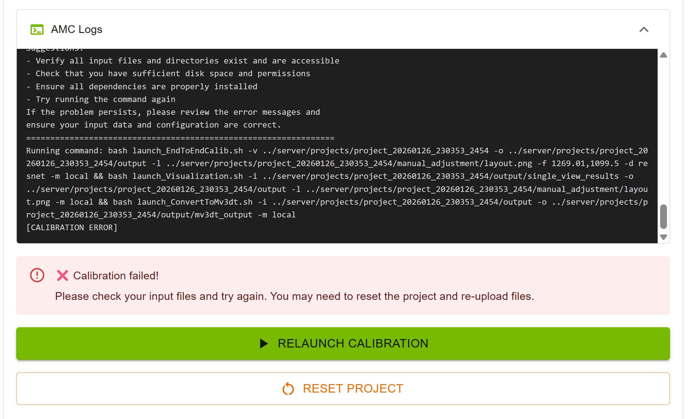

### VGGT Calibration (Optional)

VGGT (Vision-Geometry Graph Transformer) is an optional refinement method available after AMC completes.

> VGGT is only available if the backend server has VGGT support installed.

**When Available**
- AMC calibration must be completed first
- VGGT section appears below AMC section
- VGGT state shows "READY"

**How to Run VGGT**

1. After AMC completes, scroll to **Calibration Control (VGGT)** section
2. Click **Run VGGT Calibration** button
3. VGGT pipeline begins; progress indicators appear (similar to AMC)

**VGGT Features**
- **Refinement**: Improves AMC results using graph transformer
- **Duration**: Typically 2–3 minutes
- **Independent**: Can be run multiple times
- **Optional**: AMC results are valid without VGGT

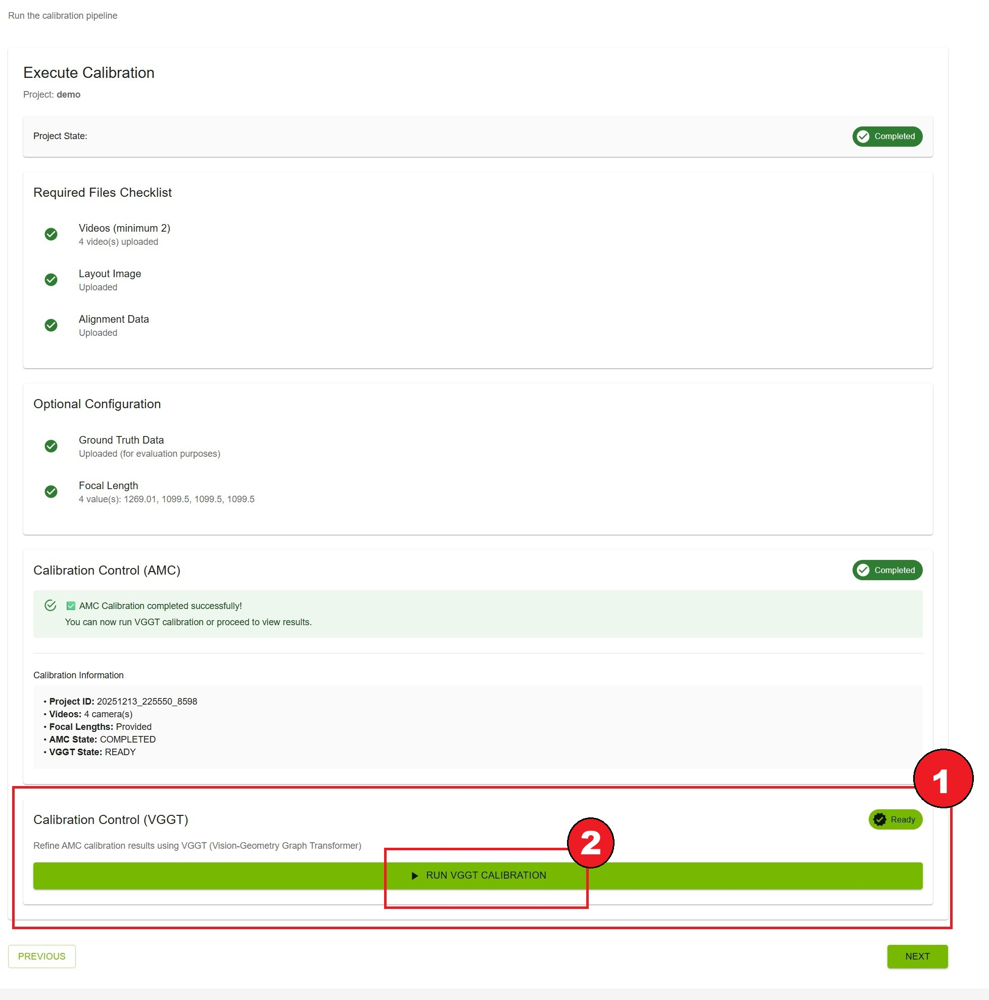

**VGGT Completion**

When VGGT finishes:
- **Success Alert**: "✅ VGGT calibration completed successfully!"
- **VGGT State**: Shows "COMPLETED" badge
- Both AMC and VGGT results available in the next step

**VGGT Not Available**

If VGGT is not installed on the backend:
- **Info Alert**: "VGGT Calibration Not Available"
- **Message**: "VGGT (Vision-Geometry Graph Transformer) is not installed on this system."
- Proceed with AMC results only

### Calibration Information

At the bottom of the page, you'll see a summary of calibration information:
- **Project ID**: Unique identifier
- **Videos**: Number of cameras
- **Focal Lengths**: Provided or Not provided
- **AMC State**: Current AMC state
- **VGGT State**: Current VGGT state

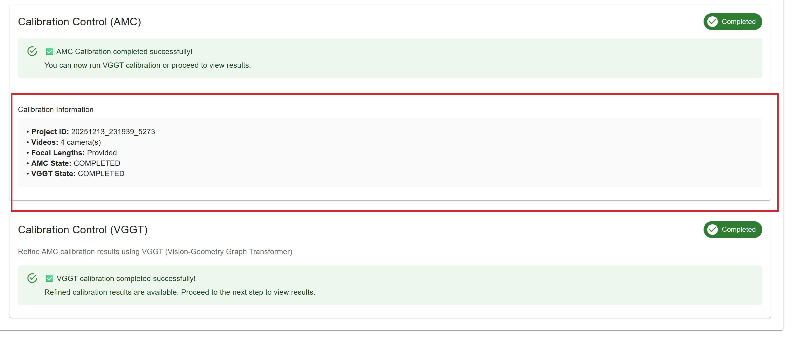

### Resetting the Project

If you need to start over:

1. Click **Reset Project** button (available in ERROR state)
2. Confirm the action
3. Project state returns to "INIT"
4. All calibration results are cleared
5. Files remain uploaded

> **Warning:** Resetting clears all calibration results. Export results before resetting if needed.

### Troubleshooting

**Verification Fails**
- Check that all required files are uploaded
- Ensure video files are not corrupted
- Verify alignment data has at least 4 point sets
- Try re-uploading files

**Calibration Takes Too Long**
- Normal duration: 5–15 minutes depending on video length
- Check server resources (CPU, GPU, memory)
- Contact administrator if it exceeds 30 minutes

**Calibration Fails**
- Check video file formats and quality
- Verify alignment points are on the ground plane
- Ensure layout image matches physical space
- Review server logs for detailed errors

---

## Step 6: Results

View calibration results, evaluate accuracy, and export calibration data.

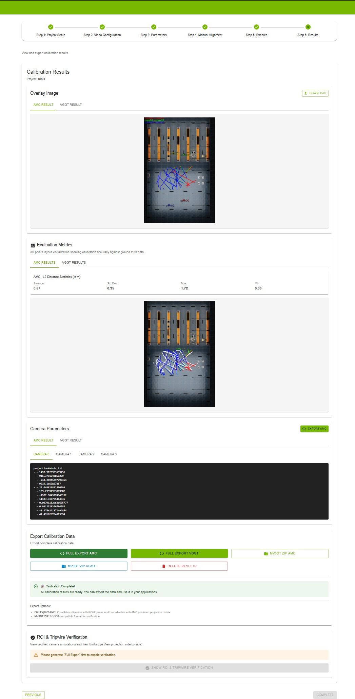

### Results Availability

The Results step is only accessible after calibration completes successfully.

**If Calibration Not Complete**
- **Running**: "Calibration is still running — Please wait for calibration to complete."
- **Error**: "Calibration failed — Please check your input files and try again."
- **Init/Ready**: "Please run calibration in the Execute step"

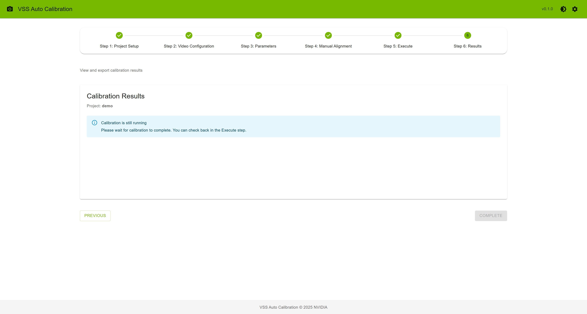

### Overlay Image

The overlay image shows the calibration results projected onto the layout map.

**Features**
- **View**: Displays cameras' fields of view on the layout
- **Download**: Save the overlay image to your computer
- **Result Type Tabs**: Switch between AMC and VGGT results (if available)
  - **AMC Result** tab: Shows AMC calibration overlay
  - **VGGT Result** tab: Shows VGGT calibration overlay (if available); disabled if VGGT was not run

**How to View**
1. The overlay image loads automatically
2. Use the tabs to switch between AMC and VGGT results
3. Click **Download** button to save the image

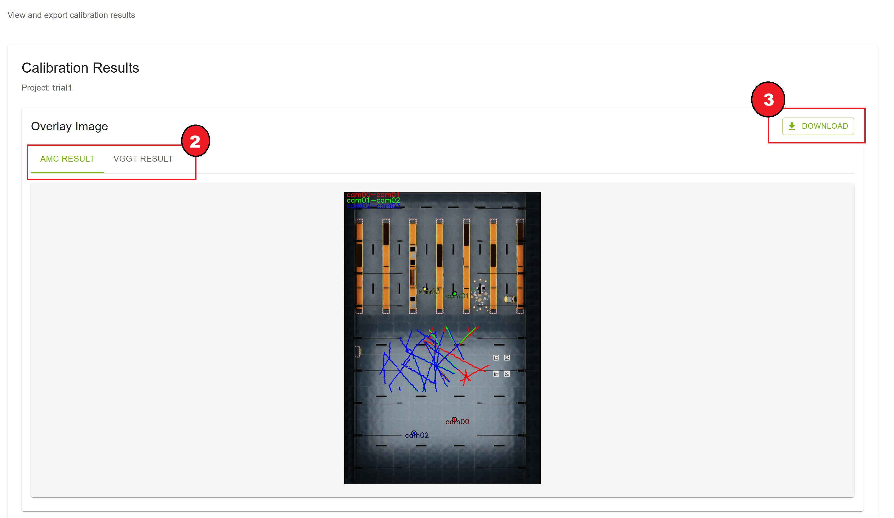

### Evaluation Metrics

If ground truth data was uploaded, evaluation metrics are available.

**Metrics Display**
- **Layout Visualization**: 3D points plotted on layout showing accuracy
- **Statistics Card**: L2 distance statistics in meters
  - Average L2 distance
  - Standard deviation
  - Maximum distance
  - Minimum distance
- **Result Type Tabs**: Switch between AMC and VGGT evaluation

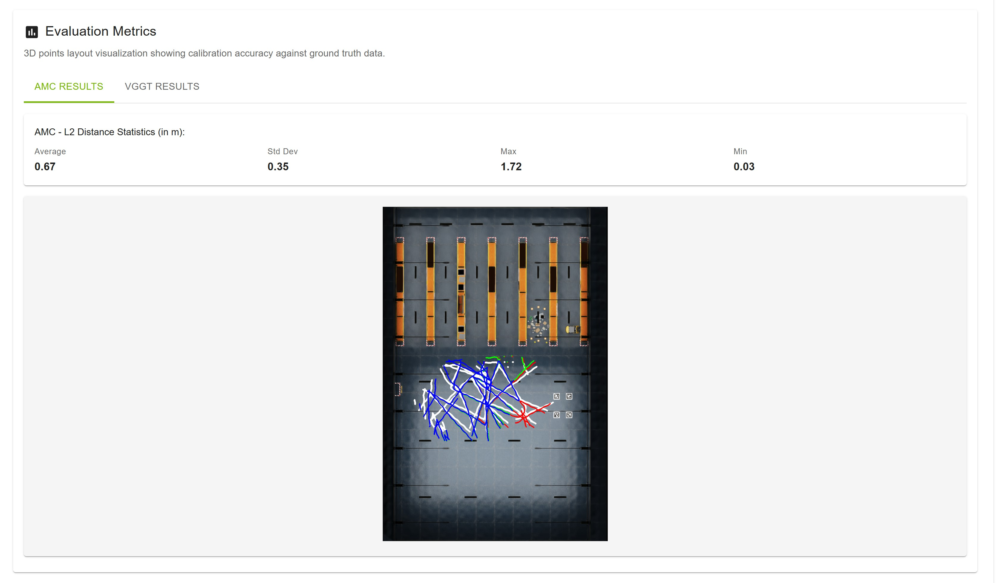

**Interpreting Metrics**
- **Lower Average**: Better calibration accuracy
- **Lower Std Dev**: More consistent calibration
- **Compare AMC vs VGGT**: VGGT typically shows improvement

> Evaluation metrics are only available if ground truth data was uploaded in Step 2.

### Camera Parameters

View detailed calibration parameters for each camera.

**Features**
- **Camera Tabs**: Switch between cameras (Camera 0, Camera 1, etc.)
- **Result Type Tabs**: Switch between AMC and VGGT parameters
- **YAML Format**: Parameters displayed in YAML format
- **Export Button**: Export all camera parameters

**How to View**
1. Click on a camera tab (e.g., "Camera 0")
2. Parameters load and display in a code block
3. Switch between AMC and VGGT tabs to compare
4. Click **Export AMC** or **Export VGGT** to download all parameters

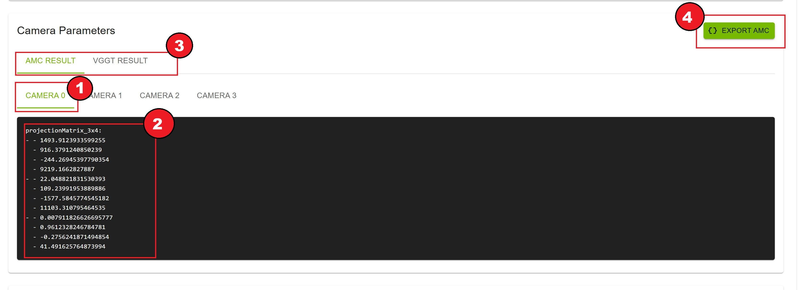

**Parameter Contents**

The YAML file contains:
- **Camera Projection Matrix (3×4)**: Camera projection matrix
- **Additional Metadata**: Project ID, timestamp, etc.

### Export Calibration Data

Export complete calibration data in various formats.

**Export Options**

1. **Full Export AMC** — complete calibration data with ROI/tripwire world coordinates; uses AMC projection matrix; JSON format; filename: `{project_name}_exported.json`
2. **Full Export VGGT** *(if available)* — same as above using VGGT projection matrix; filename: `{project_name}_exported_vggt.json`
3. **MV3DT ZIP AMC** — MV3DT-compatible format for verification; ZIP archive; filename: `{project_name}_mv3dt.zip`
4. **MV3DT ZIP VGGT** *(if available)* — MV3DT-compatible format with VGGT results; ZIP archive; filename: `{project_name}_vggt_mv3dt.zip`
5. **Delete Results** — removes all calibration results; project returns to READY state; allows re-running calibration

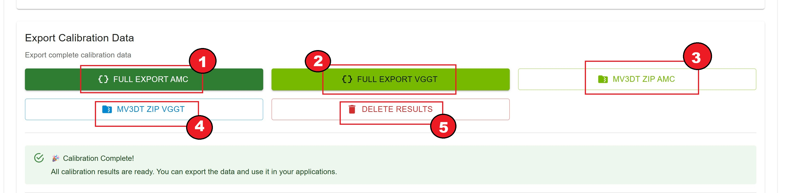

**How to Export**

- **Full Export AMC** and **Full Export VGGT**: The JSON is loaded in an editor where you can view and edit the calibration data. Once you are done editing, click **Export AMC** or **Export VGGT** to download the file automatically to your browser's download folder.

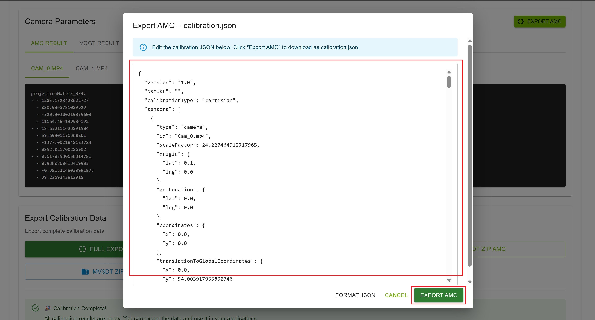

> This is an advanced user feature. Edit the JSON only if you understand the calibration schema; any changes should be made carefully to avoid invalid or incorrect calibration output.

- **Other exports (MV3DT ZIP)**: Click the desired export button, wait for processing (may take a few seconds), and the file downloads automatically to your browser's download folder.

### ROI & Tripwire Verification

Verify that ROIs and tripwires are correctly projected onto the layout.

**Features**
- **Side-by-Side View**: Camera view and Bird's Eye View (BEV) simultaneously
- **Camera Selection**: Choose which camera to verify
- **Result Type Tabs**: Switch between AMC and VGGT projections
- **Zoom Controls**: Zoom in/out on BEV for detailed inspection
- **Pan Support**: Drag to pan around zoomed BEV

**How to Use**

> **Prerequisite**: You must click **Full Export AMC** (and **Full Export VGGT** if VGGT results are available) before using this verification feature.

1. Click **Show ROI & Tripwire Verification**

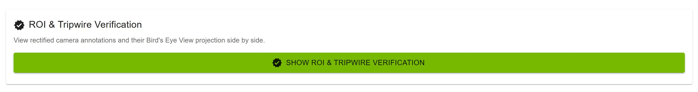

2. Select a camera from the dropdown
3. View annotations on the camera frame (left panel)
4. View projected annotations on BEV (right panel)
5. Switch between AMC and VGGT tabs to compare
6. Use zoom controls for detailed inspection

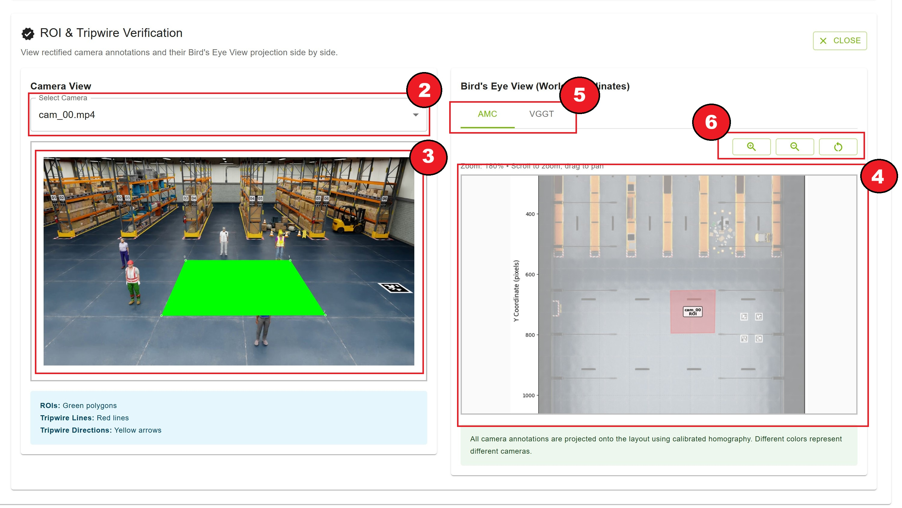

**Camera View (Left Panel)**
- Shows rectified camera frame
- ROIs displayed as green polygons
- Tripwire lines displayed as red lines
- Tripwire directions displayed as yellow arrows

**Bird's Eye View (Right Panel)**
- Shows layout map with projected annotations
- All cameras' annotations shown with different colors
- Zoom: 50% to 500%
- Pan: Click and drag when zoomed

**Zoom Controls**
- **Zoom In** (🔍+): Increase zoom level
- **Zoom Out** (🔍-): Decrease zoom level
- **Reset** (↻): Return to 100% zoom
- **Current Zoom**: Displayed as percentage

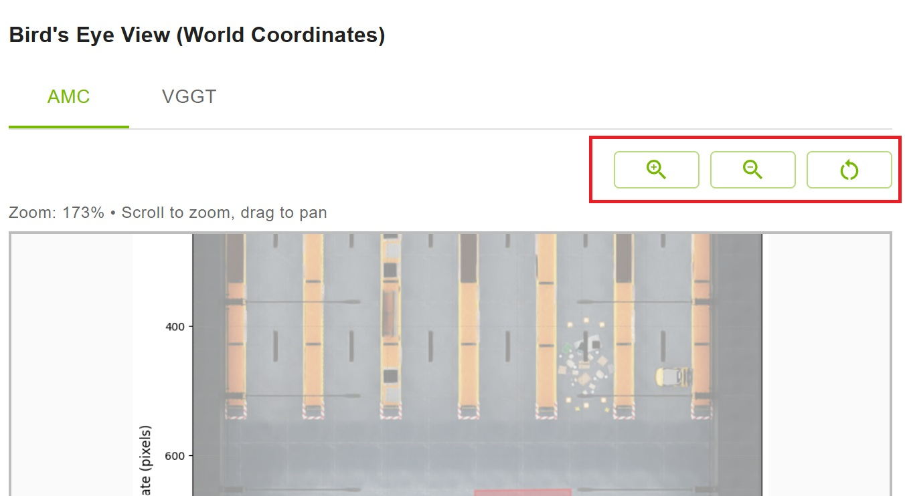

### Deleting Results

If you need to re-run calibration with different parameters:

1. Click **Delete Results** button
2. Confirm deletion in the dialog
3. All calibration results are removed
4. Project state returns to "READY"
5. Files (videos, layout, alignment) remain uploaded

> **Warning:** Deleting results cannot be undone. Export important data before deletion.

### Completion Message

At the bottom of the page, a success message confirms calibration is complete.

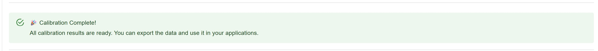

### How to Interpret Calibration Outputs

Upon completion, the UI presents overlay images and metric numbers depending on whether ground truth data was provided.

**Case 1: Ground Truth Data Exists**

If ground truth data was uploaded, the tool calculates the **L2 distance** as the primary evaluation metric — the Euclidean distance between the 3D ground truth object location and the estimated location determined by triangulation.

Statistics displayed:
- **Average**: Mean L2 distance across all points
- **Standard Deviation**: Measure of consistency
- **Maximum**: Worst-case error
- **Minimum**: Best-case error

Since a lower L2 distance indicates better accuracy, compare these metrics between AMC and VGGT results to select the superior calibration.

Additionally, calibration results from the two methods can be compared visually using the overlay visualization. Object trajectories reconstructed using the camera matrices are shown as colored lines; ground truth trajectories are displayed in white. A close alignment of the colored trajectories with the white lines signifies accurate camera parameters.

> When comparing AMC and VGGT results: look for lower L2 distance values (better accuracy), compare overlay images for trajectory alignment, and check consistency of colored lines with white ground truth lines.

**Case 2: No Ground Truth Data**

When ground truth data is unavailable, calibration results can be compared qualitatively using overlay images, which display:
- **Reconstructed object trajectories**: Shown as colored lines
- **Estimated camera locations**: Shown as colored dots with corresponding camera IDs

**Qualitative Evaluation Tips:**
- Camera positions should match expected physical locations
- Object trajectories should follow logical paths on the floor map
- FOV (Field of View) boundaries should align with physical constraints
- Compare AMC and VGGT overlays to identify which better matches the layout


# Assumptions

AutoMagicCalib makes several assumptions about input data structure. Please ensure your data follows these requirements:

## Input Video Contents:
There must be objects moving around the scene, because AMC relies on tracking results.
Cameras must be specified in order and have overlapping areas: `cam_00` overlaps with `cam_01`, and `cam_01` overlaps with `cam_02`, ...

## Input Video Resolution:
Video files' resolution should be 1920x1080. 

## Time-synced Input Videos:
Input video files from all cameras must be synchronized

## Ground Truth Directory Structure:
When providing ground truth data for evaluation, the it must follow this specific naming convention:


# License

## Repository Licenses
This repository contains materials released under different licenses:
- The scripts and code are licensed under the Apache License 2.0.
- The assets are licensed under the Creative Commons Attribution 4.0 International (CC-BY-4.0) license.

## Proprietary Container Notices (AutoMagicCalib)
The scripts in this repository interact with and pull the proprietary AutoMagicCalib Container. The use of this container, and any software, data, or intellectual property contained within it, is governed by a separate set of licenses and third-party notices.

The applicable End User License Agreement (EULA), 3rd-party notice, and reference information for the container can be found in [AutoMagicCalib page in NGC Catalog](https://catalog.ngc.nvidia.com/orgs/nvidia/containers/auto-magic-calib?version=1.0).
