# AutoMagicCalib

AutoMagicCalib (AMC) is an automated calibration tool that estimates both intrinsic and extrinsic camera parameters for multi-camera and single-camera systems. It provides camera projection matrices and lens distortion coefficients essential for accurate 3D reconstruction and multi-view applications.

AMC eliminates the need for traditional calibration patterns (like checkerboards) by using tracked moving objects in the scene as natural features for calibration. It leverages DeepStream's object detection and tracking capabilities to identify and follow objects (particularly people) across frames, then analyzes these trajectories across camera views to automatically derive camera parameters from regular operational footage. This approach enables calibration without interrupting normal operations, allows retroactive calibration using archived footage, and performs calibration in the actual deployment environment.

The service supports both a geometry-based approach (AMC) using object trajectories and geometric relationships, and a model-based approach (VGGT) that leverages learned models for higher accuracy and robustness.

## Features
- Estimate camera lens distortion parameter (k1)
- Estimate 3x4 camera projection matrix (focal length, rotation, translation)
- Ground truth focal length override: Use known focal lengths while preserving GeoCalib rotation intelligence
- Output calibration results in YAML format
- Visualization tools:
  - Score metrics graphs of parameter estimation
  - Rectified video generation with estimated lens parameters
  - Visual overlay video generation (SV3DT) with estimated camera projection matrix
- Complete end-to-end pipeline for single-camera and multi-camera calibration
- Bundle adjustment for improved accuracy
- Evaluation against ground truth data
- **Web UI workflow**: 6-step guided calibration with project management, RTSP URLs as Input (VIOS), per-camera and global (layout-map) ROI/tripwire drawing, manual alignment, AMC and optional VGGT calibration, and export/verification tools

## Table of Contents
- [Features](#features)
- [Quick Start](#quick-start)
  - [System Requirements](#system-requirements)
  - [NGC Setup](#ngc-setup)
  - [Project Setup](#project-setup)
  - [Sample Data Setup](#sample-data-setup)
- [Calibration Workflow (UI)](#calibration-workflow-ui)
  - [Step 1: Project Setup](#step-1-project-setup)
  - [Step 2: Video Configuration](#step-2-video-configuration)
  - [Step 3: Parameters](#step-3-parameters)
  - [Step 4: Manual Alignment](#step-4-manual-alignment)
  - [Step 5: Execute Calibration](#step-5-execute-calibration)
  - [Step 6: Results](#step-6-results)
- [Assumptions](#assumptions)
  - [Tracklet-Based Calibration: Input Video Requirements](#tracklet-based-calibration-input-video-requirements)
  - [Lens Distortion Output (`distortion.yaml`)](#lens-distortion-output-distortionyaml)
- [Custom Dataset](#custom-dataset)
  - [Input Requirements](#input-requirements)
  - [Alignment Data (alignment_data.json)](#alignment-data-alignment_datajson)
  - [Guidelines for Input Videos](#guidelines-for-input-videos-to-achieve-optimal-calibration-results)
  - [Ground Truth Data Format](#ground-truth-data-format)
    - [calibration.json](#calibrationjson)
    - [ground\_truth.json](#ground_truthjson)
- [Troubleshooting](#troubleshooting)
- [License](#license)
  - [Repository Licenses](#repository-licenses)
  - [Proprietary Container Notices](#proprietary-container-notices-automagiccalib-and-automagiccalibui)

<br><br>
# Quick Start

### Agent Skills
This repository includes AutoMagicCalib agent skills under `skills/`. Start with `skills/README.md` to install or select the setup, sample, video, or RTSP calibration skill. Full calibration runs require the runtime prerequisites below and are not expected to complete in restricted or no-GPU sandboxes; in those environments, agents should limit work to planning, configuration review, and command preparation.

Quick install:

```bash
# Claude Code
mkdir -p ~/.claude/skills
cp -r skills/amc-* ~/.claude/skills/

# Codex
mkdir -p ~/.codex/skills
cp -r skills/amc-* ~/.codex/skills/
```

Restart or reopen the coding assistant after copying the skills. See `skills/README.md` for the full skill catalog and example prompts.

Expected runtime varies by host, image/model downloads, video length, and detector choice. The bundled sample can take several minutes up to about 30 minutes, custom video calibration can take 10-60+ minutes, and optional VGGT refinement usually adds a few minutes.

### System Requirements
- x86_64 system
- OS Ubuntu 24.04
- NVIDIA GPU with hardware encoder (NVENC)
- NVIDIA driver 590
- Docker (setup to run without sudo privilege)
- NVIDIA container toolkit (see [NVIDIA DeepStream Docker Prerequisites](https://docs.nvidia.com/metropolis/deepstream/dev-guide/text/DS_docker_containers.html#prerequisites))

### NGC Setup
This step is needed to pull AutoMagicCalib docker images.
1. Visit NGC sign in page, enter your email address and click Next, or Create an Account
2. Choose your Organization/Team
3. Generate an API key following the instructions
4. Log in to the NGC docker registry:
```bash
docker login nvcr.io
Username: "$oauthtoken"
Password: "YOUR_NGC_API_KEY"
```

### Project Setup
Clone the repository or initialize it as a submodule, then run the commands below
from the AutoMagicCalib root directory. This is the directory that contains this
README along with `compose/`, `assets/`, `models/`, and `projects/`.

If you cloned AutoMagicCalib directly, the AutoMagicCalib root is the clone
directory. If you are using it from the DeepStream repository, the AutoMagicCalib
root is the `tools/auto-magic-calib` submodule directory.
All paths in the rest of this guide are relative to the AutoMagicCalib root,
except for `PROJECT_DIR` and `MODEL_DIR` in `compose/.env`, which Docker Compose
resolves relative to the `compose/ms/` directory (hence the `../../` prefix in
their defaults).

#### Download and set up VGGT model
Optionally you can download VGGT model for model based calibration

Download the VGGT commercial model from [HuggingFace](https://huggingface.co/facebook/VGGT-1B-Commercial). Downloaded model must be copied to appropriate model directory as mentioned below.

> **Note:** You need to sign up for a HuggingFace account and accept the model licenv_warehouse_071026.zip#### Optional VIOS Setup for RTSP Capture
RTSP support requires `VIOS_BASE_URL`. If a VIOS server is already reachable from the AMC host, verify it before setting `VIOS_BASE_URL` in `compose/.env`. Without VIOS, the rest of the calibration workflow can run, but RTSP support remains disabled.

If VIOS is not deployed yet, use the VIOS deployment assets from the VSS repository:

```text
https://github.com/NVIDIA-AI-Blueprints/video-search-and-summarization/tree/main/services/vios/deployment
```

Follow `1click_README.md` in that directory. A typical development deployment command is:

```bash
sudo python3 oneclick_dc_deployment_for_dev.py --auto
```

Verify VIOS before enabling it:

```bash
curl http://<vios-host>:30888/vst/api/v1/sensor/list
```

#### Configure Environment Variables
Edit the `compose/.env` file to set the required environment variables.

| Variable | Required | Default | Description |
|---|---|---|---|
| `HOST_IP` | **Yes** | — | IP address of the host machine |
| `AUTO_MAGIC_CALIB_MS_PORT` | No | `8000` | Port for the microservice API |
| `AUTO_MAGIC_CALIB_UI_PORT` | No | `5000` | Port for the web UI |
| `PROJECT_DIR` | No | `../../projects` | Path to the projects directory |
| `MODEL_DIR` | No | `../../models` | Path to the models directory |
| `VIOS_BASE_URL` | No | — | VIOS server URL for RTSP capture APIs |

If you want to enable VGGT, VGGT model should be copied inside `$MODEL_DIR/vggt/`.

```dotenv
AUTO_MAGIC_CALIB_MS_PORT=8000
AUTO_MAGIC_CALIB_UI_PORT=5000
PROJECT_DIR=../../projects
MODEL_DIR=../../models
HOST_IP=<your_host_ip>
# VIOS_BASE_URL=http://<VIOS_HOST_IP>:30888  # Uncomment and update this to support RTSP Stream
```

`HOST_IP` must not be empty. If it is empty, the UI API URL renders as `http://:<port>/v1`. 

Leave `VIOS_BASE_URL` unset to keep RTSP capture disabled.

#### Set Directory Permissions
The `projects` and `models` directories must be owned by UID/GID 1000 for the containers to read/write properly.
```bash
sudo chown 1000:1000 -R projects
sudo chown 1000:1000 -R models
```

#### Launch Services
Start all services using Docker Compose. Container images will be pulled automatically on the first run.
```bash
cd compose
docker compose up -d
```
The microservice will be available at `http://<HOST_IP>:<AUTO_MAGIC_CALIB_MS_PORT>` (default port 8000) and the UI at `http://<HOST_IP>:<AUTO_MAGIC_CALIB_UI_PORT>` (default port 5000).

To stop the running containers,
```
docker compose down
```

### Sample Data Setup
From the AutoMagicCalib directory, unzip the compressed sample data file `assets/sdg_08_2_sample_data_010926.zip`. The sample folder includes 4 different types of data to help you run end-to-end calibration and evaluation.
1. Input video files
2. Ground truth data
3. BirdEyeView map image
4. Pre-calibrated transform for BirdEyeView map

```
assets/sdg_08_2_sample_data_010926.zip
├── alignment_data
│   ├── alignment_data.json     # Pre-calibrated transform from `cam_00` reference frame to BirdEyeView map image 
│   └── layout.png              # BirdEyeView map image required for visualization
├── GT.zip                      # Ground truth data (camera info, extrinsics, object trajectories)
└── videos                      # Input video files
    ├── cam_00.mp4
    ├── cam_01.mp4
    ├── cam_02.mp4
    └── cam_03.mp4

```

Now you're ready to start the calibration process.

To try real world case, we have another sample data file [nv_warehouse_071026.zip](https://catalog.ngc.nvidia.com/orgs/nvidia/resources/amc-nv-warehouse). The sample folder includes 4 different files. It does not have ground-truth data. Additionally it has `nv_warehouse_config.json`, which should be uploaded in the [config param step](#configuring-settings). For AMC calibration in the Execute step set the `Detector Type` as `Transformer`.

To download the dataset use the following command:
```bash
ngc registry resource download-version "nvidia/amc-nv-warehouse"

```

In case you want to try your own dataset, please verify requirements (files, directories, formats) explained in [Assumptions](#assumptions) section.


# Calibration Workflow (UI)

Once the microservice and UI containers are running, open your browser and navigate to `http://<HOST_IP>:<AUTO_MAGIC_CALIB_UI_PORT>` (default port `5000`).

The UI presents a **6-step stepper workflow**. Each step validates its inputs before allowing you to proceed to the next.

---

## Step 1: Project Setup

The Project Setup step allows you to create and manage calibration projects.

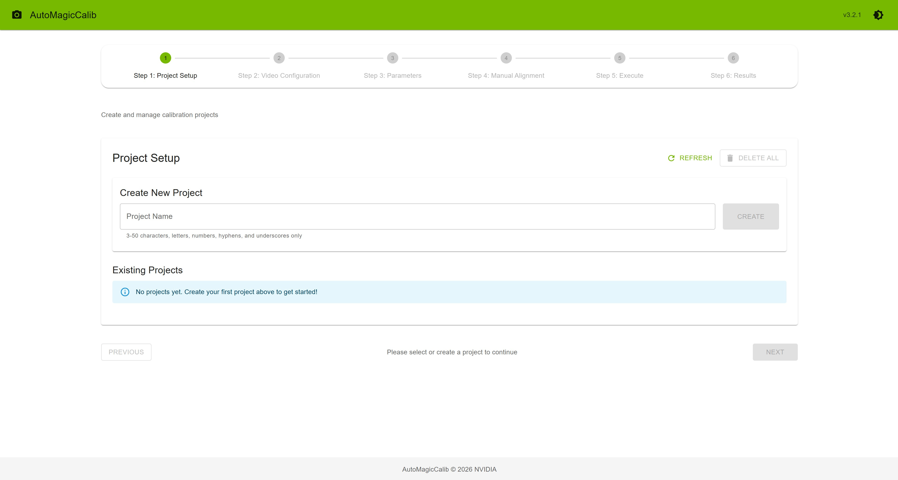

### Creating a New Project

1. Enter a project name in the text field
   - **Requirements**: 3–50 characters
   - **Example**: `warehouse_cam_2024`, `parking_lot_north`
2. Click the **Create** button
3. The new project appears in the "Existing Projects" list below


**Project Name Validation**
- ✓ Valid: `warehouse_calibration`, `site_01`, `parking-lot-A`
- ✗ Invalid: `ab` (too short)

### Selecting a Project

1. Browse the list of existing projects
2. Click the **Select** button on the desired project card
3. The selected project is highlighted with a green border and checkmark
4. Project information is displayed at the bottom: "Project 'name' selected"

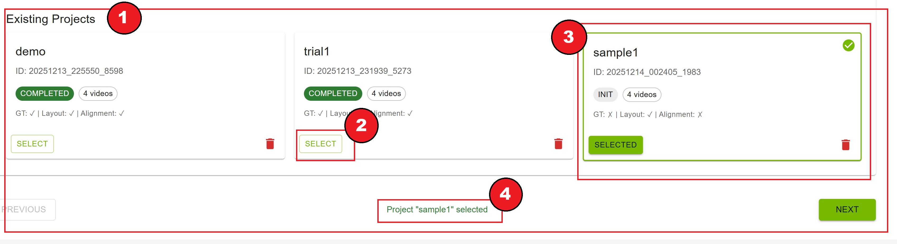

**Project Card Information**

Each project card displays:
- **Project Name**: The name you assigned
- **Project ID**: Unique identifier (UUID)
- **Project State**: Current status badge
  - `INIT` (gray): Initial state, files not yet uploaded
  - `READY` (green): Ready for calibration
  - `RUNNING` (orange): Calibration in progress
  - `COMPLETED` (green): Calibration finished successfully
  - `ERROR` (red): Calibration failed
- **Video Count**: Number of uploaded video files
- **File Status**: Checkmarks for uploaded files
  - GT (Ground Truth): ✓ or ✗
  - Layout: ✓ or ✗
  - Alignment: ✓ or ✗

### Managing Projects

**Refreshing the Project List**

Click the **Refresh** button in the top-right corner to reload the project list from the server.

**Deleting a Project**

1. Click the trash icon (🗑️) on the project card
2. Confirm deletion in the dialog that appears
3. The project and all associated data are permanently deleted

**Deleting All Projects**

1. In the Project Setup header (next to **Refresh**), click **Delete all**
2. Confirm in the **Delete all projects?** dialog
3. Every removable project is permanently deleted; the project list reloads afterward

The button is disabled when there are no projects. Projects with calibration **running** or **RTSP capture in progress** are skipped and not removed.

> **Warning:** Deleting a project (or using **Delete all**) cannot be undone. Export any important calibration results before deletion.

---

## Step 2: Video Configuration

Upload camera videos, layout image, ground truth data, and optional alignment file.

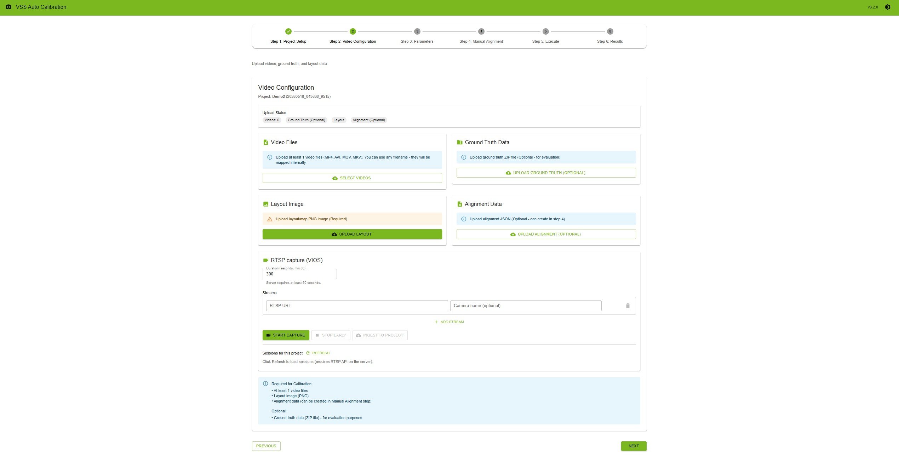

### Upload Status Overview

At the top of the page, you'll see a status summary showing:
- **Videos**: Count of uploaded videos (minimum 1 required)
- **Ground Truth (Optional)**: Upload status
- **Layout**: Upload status (required)
- **Alignment (Optional)**: Upload status


### Uploading Video Files

**Requirements**
- **Minimum**: 1 video file (2 or more for multi-camera calibration)
- **Formats**: MP4
- **Required Video Resolution**: 1920×1080
- **Input assumptions**: See [Assumptions](#assumptions) for video content and recording requirements

Provide camera inputs using **either** file upload **or** RTSP URLs (one camera for single-camera calibration, two or more for multi-camera). **RTSP URLs as Input is available only when VIOS is configured on the Auto Calibration server**; otherwise use file upload. The UI does not allow an active file-upload queue and RTSP capture at the same time; remove file-uploaded clips before switching to RTSP, and vice versa.

**Option A: Upload video files**

1. Click the **Select Videos** button to choose video files from your computer (MP4)
2. Selected videos appear in a list where you can reorder them by dragging
3. Reorder videos to match your desired camera order (`cam_00`, `cam_01`, etc.)—maintain **order of overlapping field of view (FOV)**
4. Click **Upload N File(s)** to upload all selected videos
5. Wait for the upload progress bar to complete

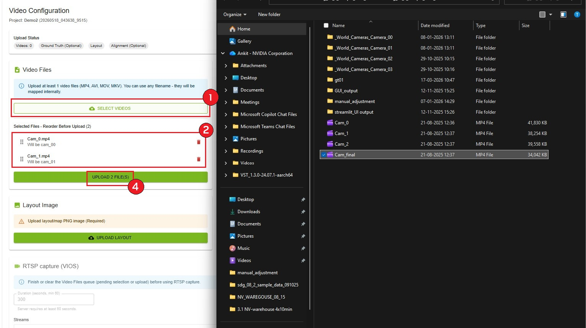

**Managing Video Files**
- **View List**: All selected or uploaded videos are listed with their filenames
- **Reorder**: Drag and drop videos to change their order before uploading
- **Delete Video**: Click the trash icon (🗑️) next to a video to remove it
- **Re-upload**: Delete and upload again if needed

**Option B: RTSP URLs as Input (VIOS)**

*(Shown only when VIOS is configured on the server side.)*

1. Finish or clear any pending **Video Files** selection or upload before starting RTSP; if the project already has clips from file upload, remove them under **Video Files** first
2. In the **RTSP capture** card, set **Duration (seconds)** (minimum **60** seconds, per server requirement)
3. Under **Streams**, enter **all** **RTSP URLs** for the project before capturing. Use **Add stream** for additional cameras. Optionally set **Camera name**
4. Click **Start capture** **once** for the full stream list (all cameras record together). Do not add streams later or run separate captures at different times—that breaks time synchronization
5. Wait for the status chip and progress bar (**STARTING** → **RECORDING** → **STOPPING** / **INGESTING** as applicable)
6. Optionally click **Stop early** after at least **60** seconds of active recording
7. When the session reaches **COMPLETED** or **CANCELLED**, click **Ingest to project** to add captured clips to the project's video list

While RTSP capture or ingest is running, **Video Files** upload is disabled until the pipeline completes.

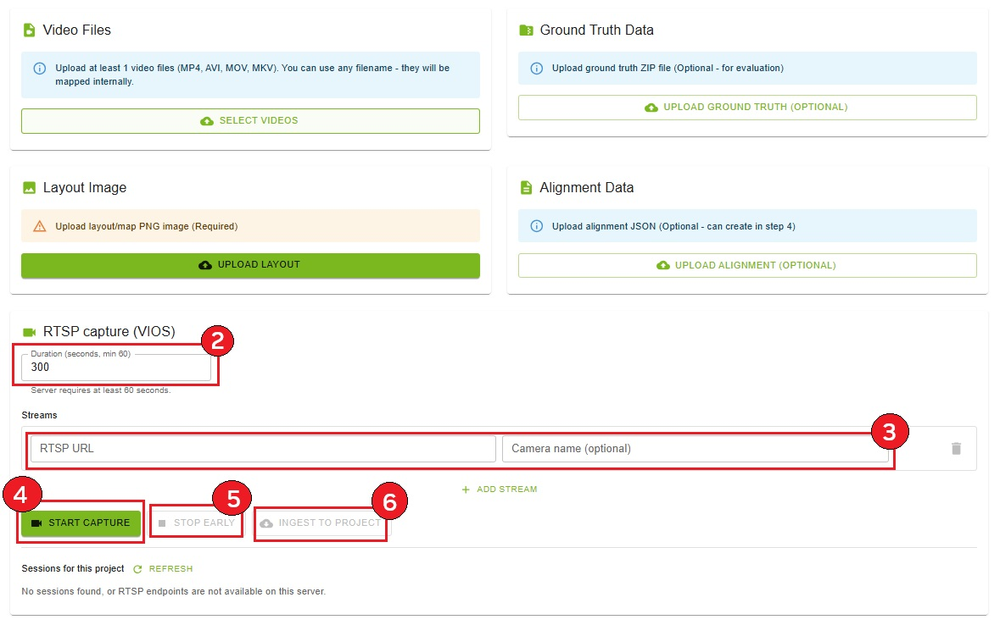

> RTSP streams must be **time-synchronized**: one **Start capture** with every stream configured together—no staggered captures or later ingest of additional streams. List each **RTSP URL** under **Streams** in **order of overlapping FOV** (first stream = first camera in the overlap chain).

> For **VIOS pre-registered RTSP streams**, use the **source URL** (for example, the **NVStreamer** URL if the stream originates from NVStreamer) rather than the VIOS-proxied URL.

### Uploading Ground Truth Data

Ground truth data is optional and used for calibration evaluation.

**Requirements**
- **Format**: ZIP file
- **Content**: Ground truth calibration data

**Upload Process**

1. Click **Upload Ground Truth (Optional)** button
2. Select your ZIP file
3. Wait for upload confirmation
4. Status changes to "Ground truth uploaded ✓"

**Deleting Ground Truth**

If ground truth is already uploaded, the button changes to **Delete Ground Truth**. Click it to remove the file.

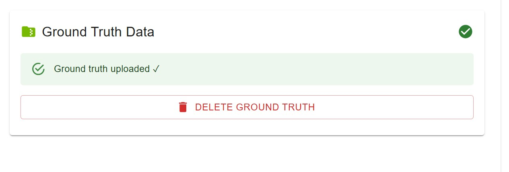

### Uploading Layout Image

The layout image is required and represents the top-down view or map of your surveillance area.

**Requirements**
- **Format**: PNG
- **Content**: Bird's eye view map or layout diagram
- **Recommended**: High resolution for better accuracy

**Upload Process**

1. Click **Upload Layout** button
2. Select your image file
3. Wait for upload confirmation
4. Status changes to "Layout image uploaded ✓"

**Deleting Layout**

If layout is already uploaded, the button changes to **Delete Layout**. Click it to remove the file.

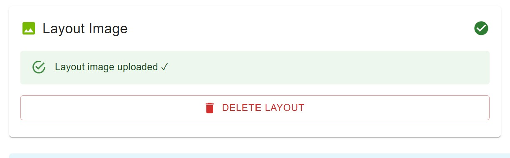

### Uploading Alignment Data

Alignment data is optional at this step. You can either upload a pre-existing alignment file here or create it interactively in Step 4.

**Requirements**
- **Format**: JSON file
- **Content**: Alignment point data (4+ point sets)

**Upload Process**

1. Click **Upload Alignment (Optional)** button
2. Select your JSON file
3. Wait for upload confirmation
4. Status changes to "Alignment file uploaded ✓"

**Deleting Alignment**

If alignment is already uploaded, the button changes to **Delete Alignment**. Click it to remove the file.


### Requirements Note

**Required for Calibration:**
- At least 1 video file (2 or more for multi-camera calibration)
- Layout image (PNG)
- Alignment data (can be created in Manual Alignment step)

**Optional:**
- Ground truth data (ZIP file) — for evaluation purposes

> You can proceed to the next step even if ground truth and alignment are not uploaded. Alignment can be created interactively in Step 4.

---

## Step 3: Parameters

Configure camera parameters, draw per-camera or global ROIs (Regions of Interest) and tripwires, optionally export image-mode JSON, and set focal lengths.

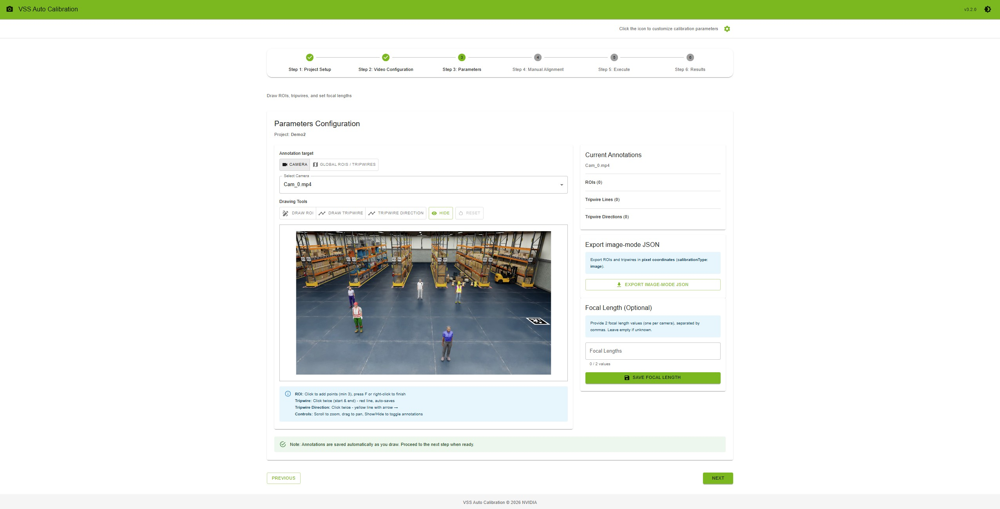

### Interface Layout

The Parameters step is divided into two main sections:

**Left Panel (Main Canvas)**
- **Annotation target** toggle: **Camera** or **Global ROIs / tripwires**
- Camera selection dropdown (when **Camera** is selected)
- Drawing tools toolbar
- Canvas: video frame (per-camera) or layout map (global)
- Instructions and controls

**Right Panel (Sidebar)**
- Current annotations list (per-camera or **Global (layout map)**)
- ROI, tripwire line, and tripwire direction counts
- **Export image-mode JSON** — download ROIs and tripwires in pixel coordinates
- Focal length configuration (optional)

### Annotation Target

Choose **Camera** or **Global ROIs / tripwires** at the top of the left panel before drawing.

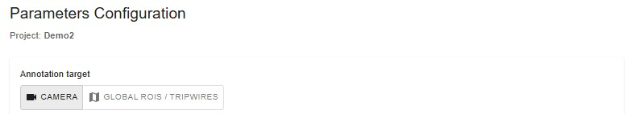

**Camera (per-stream annotations)**

1. Select **Camera** in the annotation target toggle
2. Choose a stream from the **Select Camera** dropdown
3. The first frame of the selected video loads on the canvas
4. Switch between cameras to draw ROIs, tripwire lines, and tripwire directions on each one

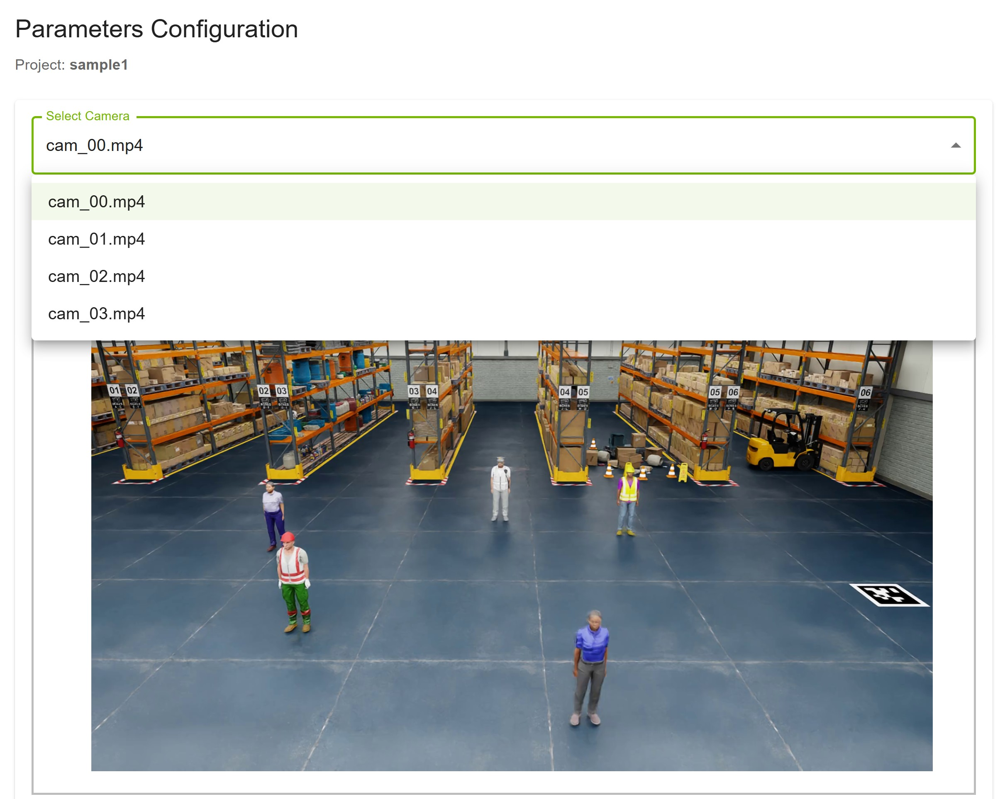

**Global ROIs / tripwires (layout-map annotations)**

1. Upload a layout image in Step 2 (required for this mode)
2. Select **Global ROIs / tripwires** in the annotation target toggle (disabled until a layout is uploaded)
3. The layout map loads on the canvas instead of a video frame
4. Use the same drawing tools as for camera mode; global shapes are stored separately and listed as **Global (layout map)** in the right panel

> Global and per-camera annotations use the same tools and auto-save behavior.

### Drawing Tools

**Available Tools**
- **Draw ROI**: Create polygonal regions of interest
- **Draw Tripwire**: Create tripwire lines for counting
- **Tripwire Direction**: Create directional tripwires with arrows
- **Show/Hide**: Toggle visibility of annotations
- **Reset**: Clear all annotations for the active target (current camera or global layout map)


### Drawing ROIs

ROIs define areas of interest for detection and tracking.

**How to Draw**

1. Click the **Draw ROI** button (it becomes highlighted)
2. Click on the video frame to add points
3. Add at least 3 points to form a polygon
4. Finish the ROI by pressing the `F` key or right-clicking on the canvas
5. The ROI is automatically saved with a green color

**ROI Features**
- **Color**: Green (#00ff00)
- **Minimum Points**: 3
- **Maximum Points**: Unlimited
- **Auto-save**: Saved immediately upon completion

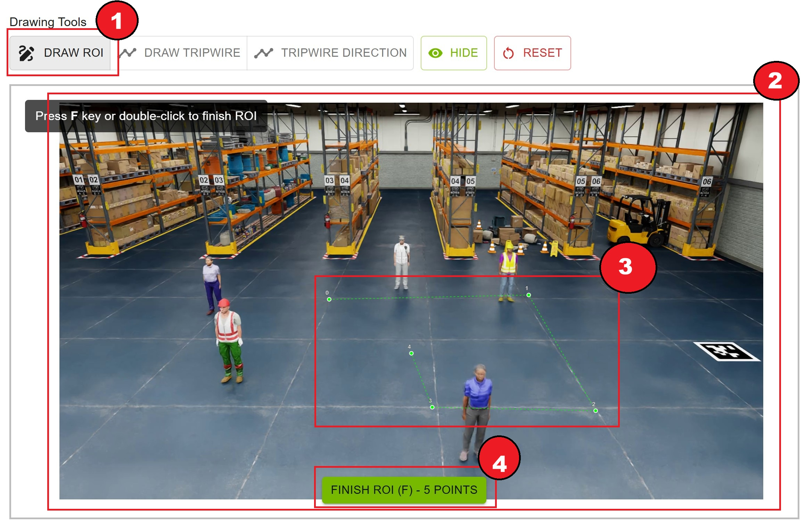

**Editing ROIs**
- **Delete**: Click the delete button next to the ROI in the right panel
- **Redraw**: Delete the existing ROI and draw a new one

### Drawing Tripwire Lines

Tripwire lines are used for counting objects crossing a line.

**How to Draw**

1. Click the **Draw Tripwire** button
2. Click once to set the start point
3. Click again to set the end point
4. The tripwire line is automatically saved with a red color

**Tripwire Line Features**
- **Color**: Red (#ff0000)
- **Points**: Exactly 2 (start and end)
- **Auto-save**: Saved immediately upon completion
- **Use Case**: Bidirectional counting


### Drawing Tripwire Directions

Tripwire directions are used for unidirectional counting with an arrow indicator.

**How to Draw**

1. Click the **Tripwire Direction** button
2. Click once to set the start point
3. Click again to set the end point (direction of arrow)
4. The tripwire direction is automatically saved with a yellow color and arrow

**Tripwire Direction Features**
- **Color**: Yellow (#ffff00)
- **Arrow**: Shows direction from start to end
- **Points**: Exactly 2 (start and end)
- **Auto-save**: Saved immediately upon completion
- **Use Case**: Unidirectional counting (e.g., entry/exit)

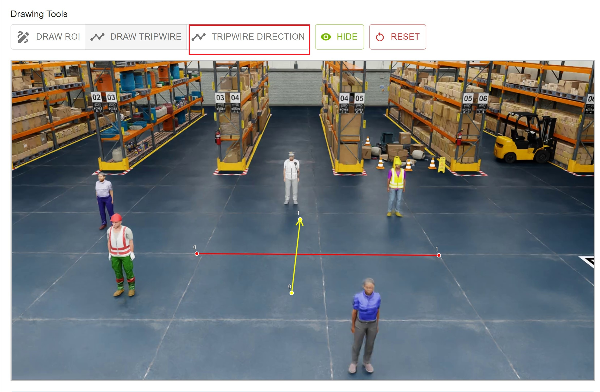

### Canvas Controls

**Zoom and Pan**
- **Scroll Wheel**: Zoom in/out on the canvas
- **Click + Drag**: Pan around when zoomed in
- **Show/Hide Button**: Toggle visibility of all annotations
- **Reset Button**: Clear all annotations for the active annotation target

**Visual Feedback**
- **Drawing Mode**: Active tool is highlighted in the toolbar
- **Cursor**: Changes to crosshair when in drawing mode
- **Point Markers**: Visible while drawing
- **Completed Annotations**: Rendered with solid colors

### Annotation List (Right Panel)

The right panel shows all annotations for the active target—the selected **Camera** or **Global (layout map)**.

- **ROIs Section**: Count of completed ROIs; each ROI shown as a green chip with point count; delete button for each
- **Tripwire Lines Section**: Count of completed tripwire lines; each line shown as a red chip; delete button for each
- **Tripwire Directions Section**: Count of completed tripwire directions; each direction shown as a yellow chip with arrow; delete button for each

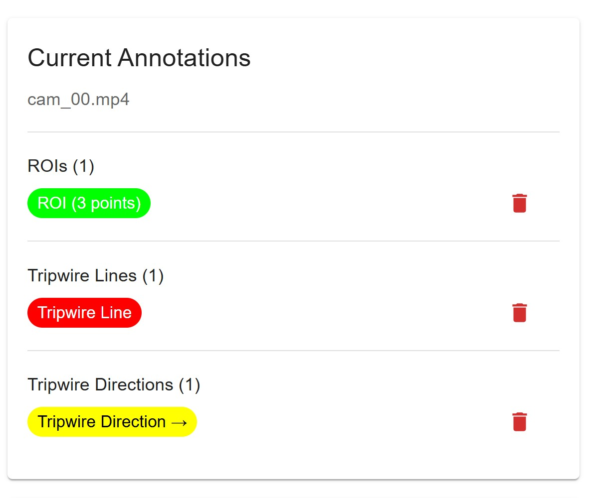

### Export Image-Mode JSON

Use this when you need ROIs and tripwires in **pixel coordinates** without running bundle adjustment.

**How to Export**

1. In the right panel, open the **Export image-mode JSON** card
2. Click **Export image-mode JSON**
3. The browser downloads `<project_name>_image_mode_exported.json`

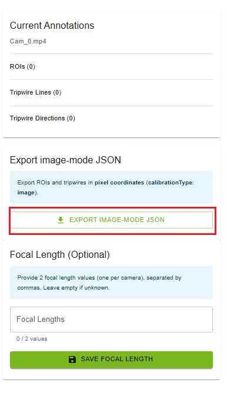

**What Is Exported**

- ROIs and tripwires from all cameras plus any **global** layout annotations, in **pixel space**
- `calibrationType` is **image** (same JSON shape as cartesian export)
- Does not require AMC calibration to have completed

### Focal Length Configuration

Focal lengths are optional but can improve calibration accuracy.

**Requirements**
- One value per camera
- Comma-separated list
- Positive numbers only
- Count must match video count

**How to Configure**

1. In the right panel, find the **Focal Length (Optional)** card
2. Enter focal lengths separated by commas (e.g., `1269.01, 1099.50, 1099.50, 1099.50`)
3. Click **Save Focal Length** button
4. Confirmation message appears

**Clearing Focal Lengths**

1. Delete all text from the input field
2. Click **Save Focal Length**
3. Focal lengths are cleared from the project

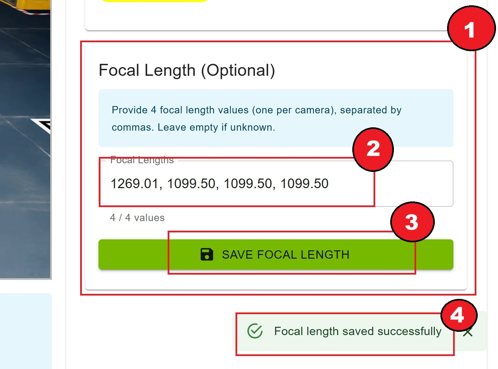

### Auto-Save Feature

All annotations (ROIs, tripwires, tripwire directions) are automatically saved to the server as you draw them.
- No manual save required
- Instant persistence
- Per-camera and global storage
- Survives page refresh

> The green success message "Note: Annotations are saved automatically as you draw. Proceed to the next step when ready." confirms auto-save is active.

### Configuring Settings

On the Parameters step, you can customize calibration settings before running the pipeline. The settings icon in the top-right corner of the header is **only visible on this step**.

Click the settings icon in the top-right corner to access application settings.

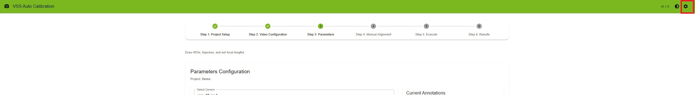

**Configuration Options**
- **Option 1: Upload** — upload a pre-configured settings file to apply all parameters at once
- **Option 2: Manual Configuration** — modify each parameter individually through the settings interface

**Additional Actions**
- **Download**: Export the current settings configuration to a file
- **Reset to Defaults**: Restore all settings to their default values
- **Save Settings**: Save your changes

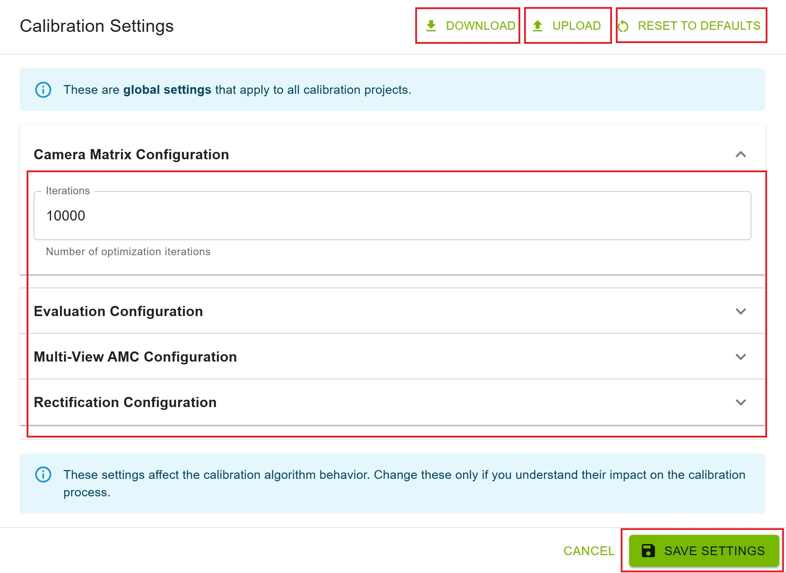

> **Warning:** Do not attempt to change the settings while AMC calibration is running. Make all configuration changes before starting the calibration process (in Step 5: Execute).

---

## Step 4: Manual Alignment

Create alignment data by selecting corresponding points across camera views and the layout map. This step is required for calibration.

### Two Options for Alignment

**Option 1: Upload Existing Alignment**

If you already have an `alignment_data.json` file:

1. Click **Upload alignment_data.json** button
2. Select your JSON file from your computer
3. Wait for upload confirmation
4. Proceed to the next step

**Option 2: Create Alignment Interactively**

Create alignment data by selecting corresponding points:

1. Click **Open Alignment Tool** button
2. The interactive alignment interface opens
3. Follow the point selection process

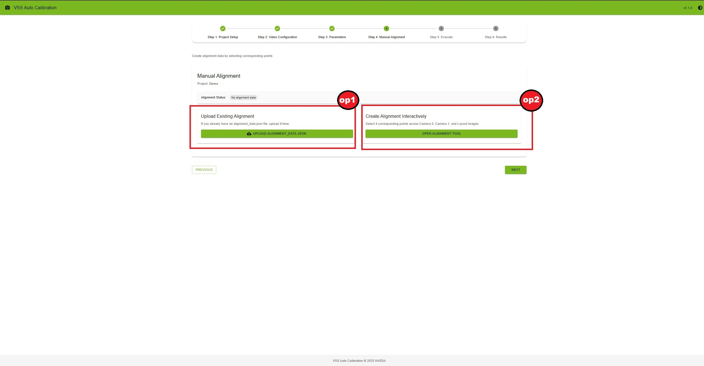

Create alignment data by selecting corresponding points across camera views and the layout map.

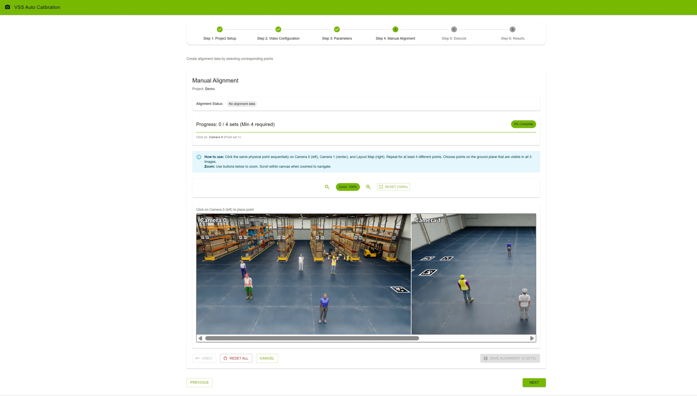

### Alignment Status

At the top of the page, you'll see the current alignment status:
- **Green Badge**: "Alignment data exists" — file already uploaded or created
- **Gray Badge**: "No alignment data" — need to upload or create alignment


### Prerequisites Check

Before creating alignment interactively, the system checks:
- ✓ At least 1 video uploaded
- ✓ Layout image uploaded

If prerequisites are not met, you'll see a warning message directing you to Step 2.

### Interactive Alignment Tool

**Interface Overview**

The alignment tool shows one concatenated canvas. The layout depends on how many videos are in the project:

**Multi-camera (2 or more videos)**
- **Left**: Camera 0 (cam_00.mp4)
- **Center**: Camera 1 (cam_01.mp4)
- **Right**: Layout map (BEV — bird's eye view)

**Single-camera (1 video)**
- **Left**: Camera (cam_00.mp4)
- **Right**: Layout map (BEV)

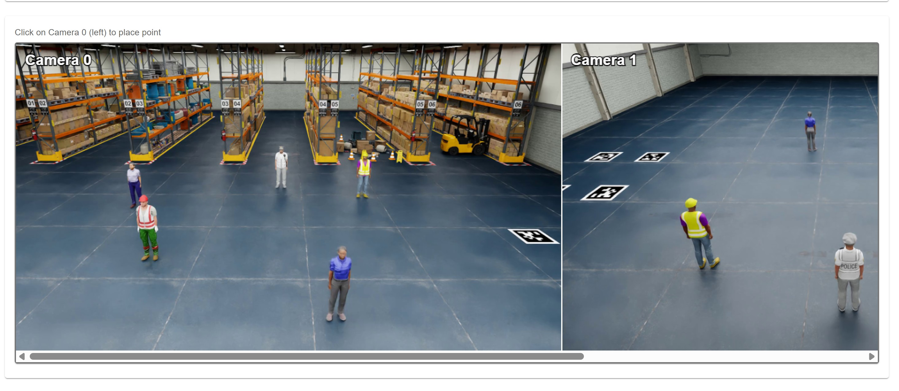

**Progress Indicator**

At the top, you'll see:
- **Progress Bar**: Visual progress (0–100%)
- **Completion Status**: "X / Y sets (Min 4 required)" or "(Ready to save)"
- **Current Action**: Prompt shows the next panel to click—for example **Camera 0**, **Camera 1**, **Layout Map**, or **Camera** (single-camera)

### Point Selection Process

**Multi-camera (3 clicks per point set)**

1. **Select Point on Camera 0** — click on a distinct feature in Camera 0 (left section); a colored circle with number "1" appears; system prompts "Click on: Camera 1"
2. **Select Corresponding Point on Camera 1** — click on the same physical location in Camera 1 (center section); system prompts "Click on: Layout Map"
3. **Select Corresponding Point on Layout** — click on the same physical location on the layout map (right section); **Point Set 1 complete**
4. **Repeat for Additional Points** — repeat for at least **4** total point sets; each set uses a different color (green, blue, red, yellow)

**Single-camera (2 clicks per point set)**

1. **Select Point on Camera** — click on a distinct feature in the camera view (left section); system prompts "Click on: Layout Map"
2. **Select Corresponding Point on Layout** — click on the same physical location on the layout map (right section); **Point Set 1 complete**
3. **Repeat for Additional Points** — repeat for at least **4** total point sets (same minimum as multi-camera)


**Point Selection Tips**
- Choose points on the **ground plane**
- Select **distinct features** (corners, markings, poles)
- Ensure each point is **visible in every panel** for that project (all cameras and the layout map, or camera + layout for single-camera)
- Distribute points across **different depths and locations**
- Avoid points on **moving objects**
- Use **zoom controls** for precision

### Zoom and Navigation

**Zoom Controls** (located above the canvas):
- **Zoom In** (🔍+): Increase zoom level
- **Zoom Out** (🔍-): Decrease zoom level
- **Reset (100%)**: Return to original zoom level
- **Current Zoom**: Displayed as percentage (e.g., "Zoom: 150%")

**Navigation**
- **Scroll Wheel**: Zoom in/out on the canvas
- **Click + Drag**: Pan around when zoomed in
- **Zoom Range**: 50% to 300%

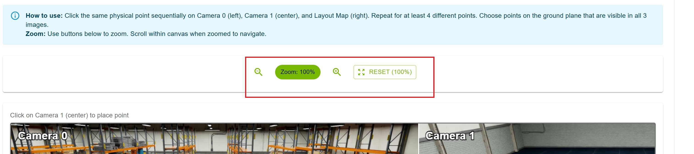

### Point Set Management

- **Undo Last Point**: Click the **Undo** button to remove the most recently placed point
- **Reset All Points**: Click the **Reset All** button to clear all points and start over
- **Add More Points**: After completing 4 point sets, click **Add More Points** to add additional sets for improved accuracy


### Saving Alignment Data

**Requirements**
- Minimum **4** complete point sets
- **Multi-camera**: each set must include Camera 0, Camera 1, and layout map points
- **Single-camera**: each set must include camera and layout map points (2 points per set)

**Save Process**

1. Complete at least 4 point sets
2. The **Save Alignment** button becomes enabled
3. Button shows: "Save Alignment (X sets)" where X is the count
4. Click **Save Alignment (X sets)**
5. System generates and uploads the alignment JSON file
6. Success message appears
7. Alignment tool closes automatically


Click the **Cancel** button to exit the alignment tool without saving.

### Alignment Data Format

The generated alignment data is a JSON array. Each outer element is one point set; coordinates are in pixel space of the original images.

**Multi-camera** — three `[x, y]` pairs per set (camera 0, camera 1, layout):

```json
[
  [[x0_cam0, y0_cam0], [x0_cam1, y0_cam1], [x0_layout, y0_layout]],
  [[x1_cam0, y1_cam0], [x1_cam1, y1_cam1], [x1_layout, y1_layout]],
  ...
]
```

**Single-camera** — two `[x, y]` pairs per set (camera, layout):

```json
[
  [[x0_cam, y0_cam], [x0_layout, y0_layout]],
  [[x1_cam, y1_cam], [x1_layout, y1_layout]],
  ...
]
```

### Deleting Alignment Data

If alignment data already exists and you want to recreate it:

1. The interface shows: "Alignment data already exists for this project"
2. Click **Delete Alignment Data** button
3. Confirm deletion
4. Create new alignment using either upload or interactive method

> **Warning:** Deleting alignment data cannot be undone. You'll need to recreate or re-upload it.

### Best Practices

**Point Selection Strategy**
- **Minimum 4 points**: Required for calibration
- **Recommended 6–8 points**: Better accuracy and robustness

**Point Distribution**
- Spread points across the entire area
- Include points at different depths (near and far)
- Cover all quadrants of the layout
- Avoid clustering points in one area

**Point Quality**
- Use sharp, distinct features
- Avoid ambiguous or blurry areas
- Prefer corners and intersections
- Ensure good contrast

**Common Mistakes to Avoid**
- ✗ Selecting points on walls or elevated surfaces
- ✗ Choosing points only in the center
- ✗ Using points on moving objects
- ✗ Clicking too quickly without precision
- ✗ Forgetting to zoom in for accuracy

---

## Step 5: Execute Calibration

Verify project requirements and run the calibration pipeline with live monitoring.

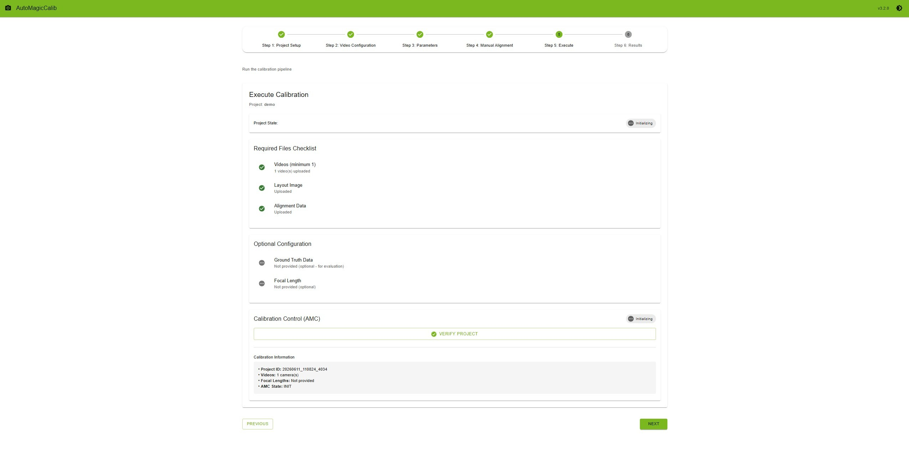

### Project State Overview

At the top of the page, you'll see the current project state:
- **INIT** (gray): Initial state
- **READY** (blue): Ready to run calibration
- **RUNNING** (orange): Calibration in progress
- **COMPLETED** (green): Calibration finished
- **ERROR** (red): Calibration failed

When RUNNING, an elapsed time counter and progress bar are displayed.

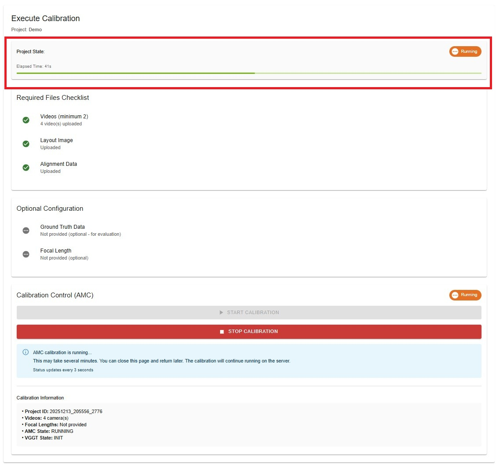

### Requirements Checklist

The system validates all required files before allowing calibration:

- ✓ **Videos (minimum 1)**: Shows count of uploaded videos
- ✓ **Layout Image**: Confirms layout is uploaded
- ✓ **Alignment Data**: Confirms alignment is uploaded or created

If any requirement is not met, you'll see a warning message: "Please complete all requirements before verification. Go back to previous steps to upload missing files."

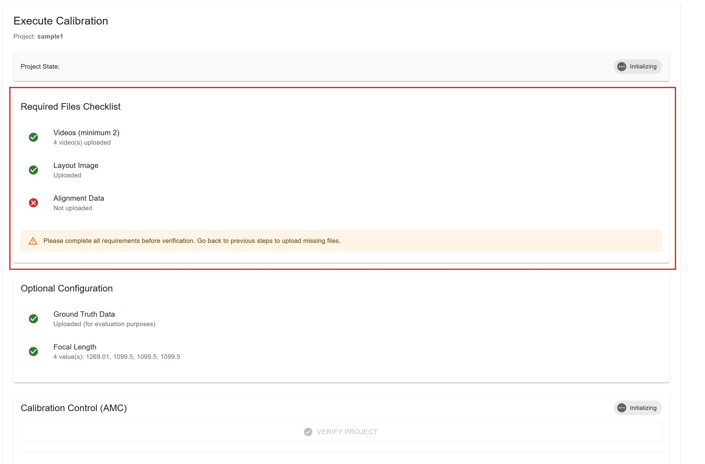

### Optional Configuration

The system also displays optional configuration status:

- **Ground Truth Data**: ✓ Uploaded (for evaluation purposes) or ⊙ Not provided (optional)
- **Focal Length**: ✓ X value(s) shown, or ⊙ Not provided (optional)

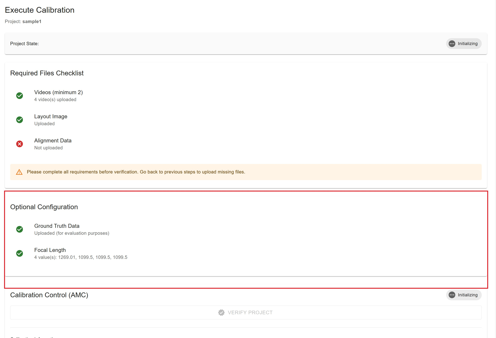

### Verification Process

Before running calibration, you must verify the project.

**How to Verify**

1. Ensure all requirements are met (green checkmarks)
2. Click the **Verify Project** button
3. System validates all files and configurations
4. Success message appears: "Project verified successfully"
5. Project state changes to "READY"
6. **Start Calibration** button becomes enabled

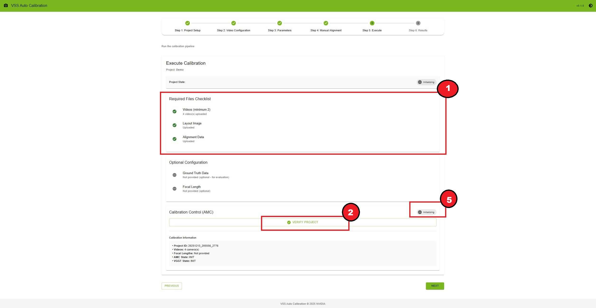

### Running AMC Calibration

AMC (Auto Magic Calibration) is the primary calibration method.

**How to Start**

1. After verification, click **Start Calibration** button
2. Calibration pipeline begins immediately
3. Project state changes to "RUNNING"
4. Progress indicators appear

**During Calibration**
- **Elapsed Time**: Updates every second
- **Progress Bar**: Animated progress indicator
- **Status Message**: "AMC calibration is running..."
- **Info Alert**: "This may take several minutes. You can close this page and return later."
- **AMC Live Logs**: Real-time calibration logs displayed during execution
- **Auto-refresh**: Status updates every 3 seconds

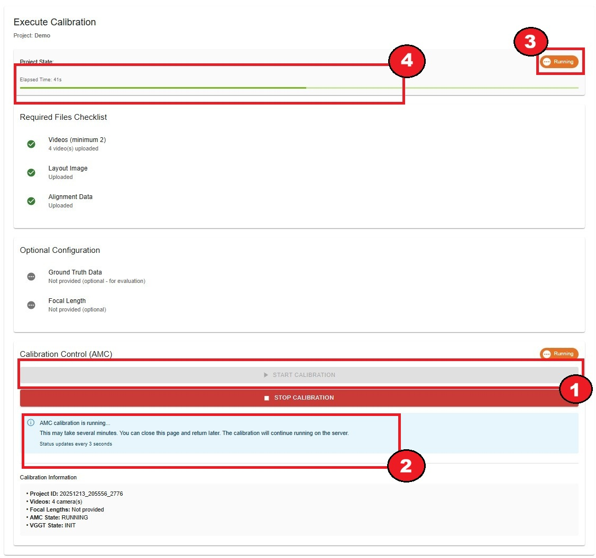

**Stopping Calibration**

If needed, you can stop the calibration:

1. Click **Stop Calibration** button (appears when RUNNING)
2. Calibration process terminates
3. Project state changes back to "READY"
4. Elapsed time resets

> **Warning:** Stopping calibration will discard partial results. You'll need to start over.

### Calibration Completion

When AMC calibration finishes successfully:
- **Success Alert**: "✅ AMC Calibration completed successfully!"
- **Message**: "You can now run VGGT calibration or proceed to view results."
- **Project State**: Changes to "COMPLETED"
- **AMC State**: Shows "COMPLETED" badge
- **Next Steps**: Proceed to Results or run VGGT (if available)

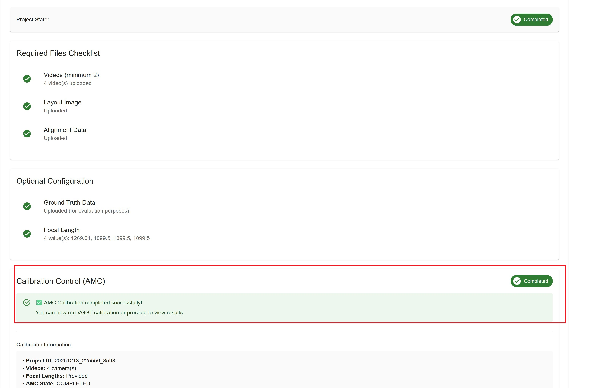

### Calibration Failure

If AMC calibration fails (for example during multi-view **tracklet matching**):
- **Error Alert**: "❌ Calibration failed!"
- **Message**: "Please check your input files and try again."
- **Project State**: May show **ERROR** while **AMC State** is **ERROR**
- **Reset Option**: "Reset Project" button appears

If **VGGT** is installed and the required AMC output folders are already on disk (typically after single-view work including **rectification**), the **Run VGGT Calibration** control may still appear with **VGGT** state **READY**. A successful VGGT run sets the overall project to **COMPLETED** even when AMC did not finish—use **Results** to view VGGT calibration output.

**How to Recover**

*Option 1: Relaunch Calibration*

1. Click **Relaunch Calibration** button
2. The project is re-verified automatically
3. If verification passes, project state returns to "READY"
4. You can then start calibration again

*Option 2: Reset Project*

1. Click **Reset Project** button
2. Project state returns to "INIT"
3. Go back to previous steps
4. Check and re-upload files if needed
5. Try calibration again

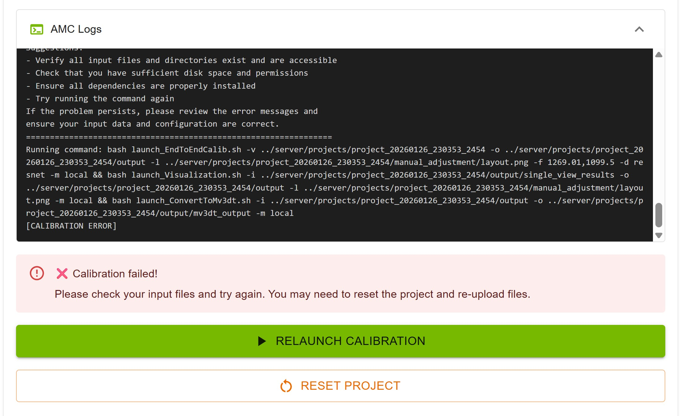

### VGGT Calibration (Optional)

VGGT (Vision-Geometry Graph Transformer) is an optional **multi-camera** calibration method. It is **not tied to AMC reporting success**: you can run VGGT after AMC has produced the needed on-disk outputs (in practice, once **rectification** is finished for your cameras), even if AMC later fails—for example at multi-view **tracklet matching**.

> VGGT requires **VGGT support on the backend** (model and dependencies installed). It is **not offered for single-camera** projects.

**When Available**
- **Multi-camera only** (two or more videos)
- Backend has VGGT installed and the UI shows the **Calibration Control (VGGT)** section
- AMC does **not** need state **COMPLETED**; **VGGT** state **READY** is enough (the server enables this when required AMC output directories exist, including rectified single-view results)
- AMC may still show **ERROR** if the classical pipeline failed after rectification—VGGT can remain runnable in that case

**How to Run VGGT**

1. After AMC has run far enough to create outputs (or after a failed AMC run that left outputs on disk), scroll to **Calibration Control (VGGT)**
2. Confirm **VGGT** state is **READY**
3. Click **Run VGGT Calibration**
4. Progress indicators and live logs appear (similar to AMC)

**VGGT Features**
- **Alternative Calibration Method**: Alternative calibration using a vision-geometry graph transformer on rectified inputs
- **Duration**: Typically 2–3 minutes
- **Independent of AMC success**: Separate from the AMC **Start Calibration** run; can be started multiple times
- **Optional**: You can use AMC-only results when AMC completes successfully; VGGT is an additional path when configured

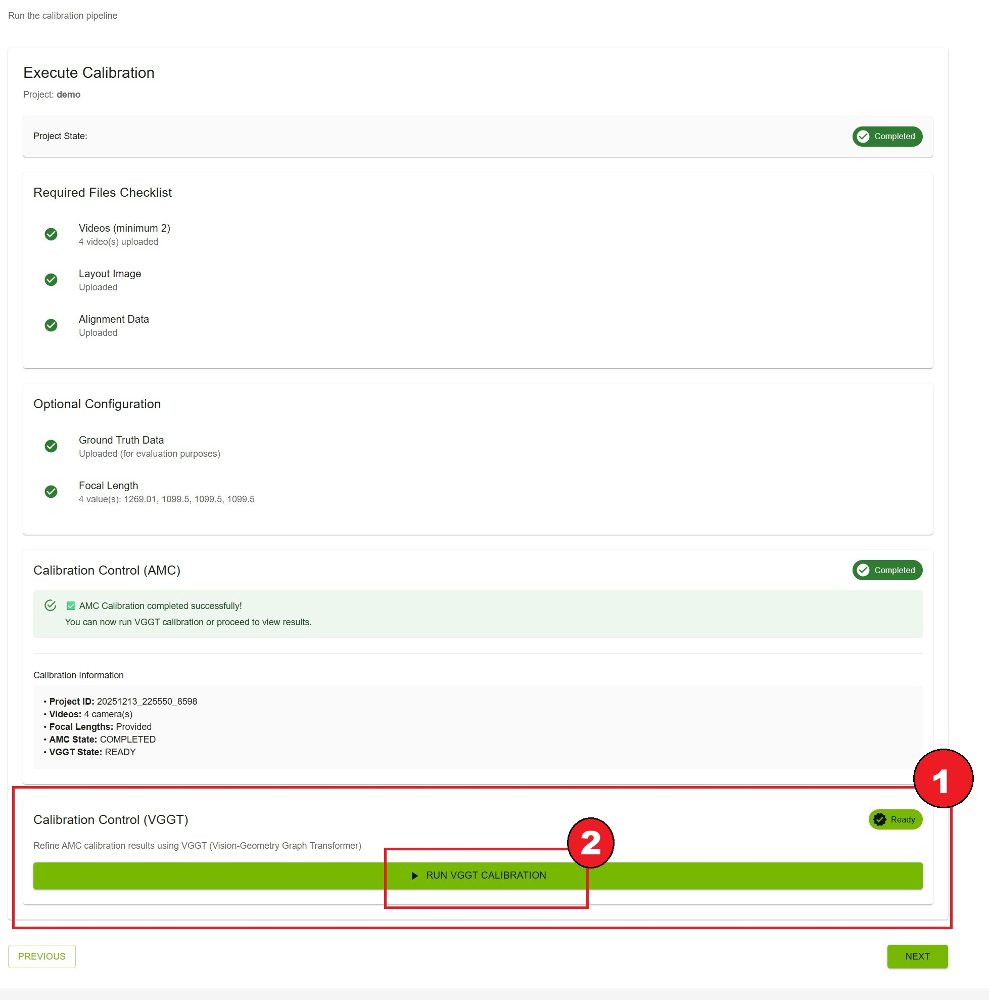

**VGGT Completion**

When VGGT finishes successfully:
- **Success Alert**: "✅ VGGT calibration completed successfully!"
- **Message**: "Refined calibration results are available."
- **VGGT State**: **COMPLETED**
- **Overall project state**: **COMPLETED** (even if AMC previously failed)
- **Results**: Open the **Results** step and use the **VGGT** tab for VGGT calibration results

> If AMC failed (for example during tracklet matching) but **VGGT** finishes successfully, treat the run as **calibration completed successfully** for the project: overall state is **COMPLETED** and you can proceed to **Results** using VGGT output.

**VGGT Not Available**

If VGGT is not installed on the backend:
- **Info Alert**: "VGGT Calibration Not Available"
- **Message**: "VGGT (Vision-Geometry Graph Transformer) is not installed on this system."
- **Action**: Rely on AMC results when AMC completes successfully, or fix AMC inputs and re-run AMC

### Calibration Information

At the bottom of the page, you'll see a summary of calibration information:
- **Project ID**: Unique identifier
- **Videos**: Number of cameras
- **Focal Lengths**: Provided or Not provided
- **AMC State**: Current AMC state
- **VGGT State**: Current VGGT state

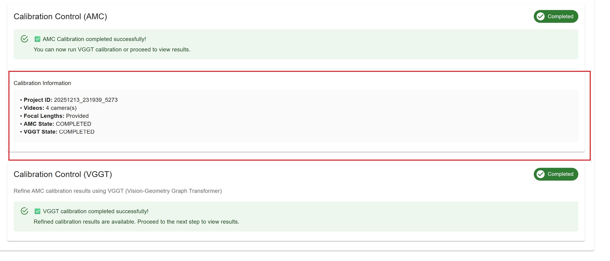

### Resetting the Project

If you need to start over:

1. Click **Reset Project** button (available in ERROR state)
2. Confirm the action
3. Project state returns to "INIT"
4. All calibration results are cleared
5. Files remain uploaded

> **Warning:** Resetting clears all calibration results. Export results before resetting if needed.

### Best Practices

**Before Calibration**
- Double-check all uploaded files
- Verify alignment points are accurate
- Review ROIs and tripwires
- Ensure stable network connection

**After Calibration**
- Verify results in the Results step
- Run VGGT if available (multi-camera) when **VGGT** state is **READY**, including after AMC failure post-rectification
- Export results before making changes
- Keep a backup of exported data

### Troubleshooting

**Verification Fails**
- Check that all required files are uploaded
- Ensure video files are not corrupted
- Verify alignment data has at least 4 point sets
- Try re-uploading files

**Calibration Takes Too Long**
- Normal duration: 5–15 minutes depending on video length
- Check server resources (CPU, GPU, memory)
- Verify network connection is stable
- Contact administrator if it exceeds 30 minutes

**Calibration Fails**
- Check video file formats and quality
- Verify alignment points are on the ground plane
- Ensure layout image matches physical space
- Review server logs for detailed errors

---

## Step 6: Results

View calibration results, evaluate accuracy, and export calibration data.

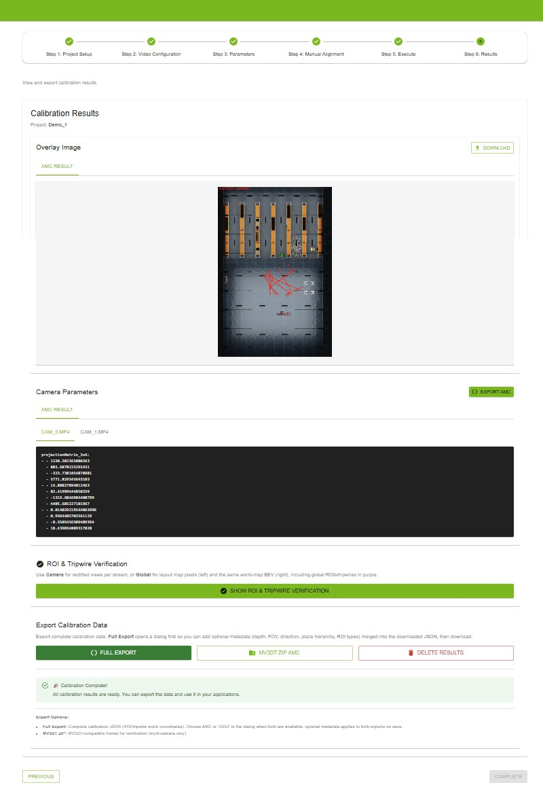

### Results Availability

The **Results** step is available when at least one calibration path has completed successfully:

- **AMC completed successfully**, or
- **VGGT completed successfully** (even if AMC failed earlier—for example during multi-view tracklet matching)

When VGGT alone succeeds, the overall project state is **COMPLETED** and you can open **Results** and use the **VGGT** tab for overlays, parameters, and exports. AMC tabs remain available only when AMC produced usable outputs.

**If No Results Are Available Yet**
- **Running**: "Calibration is still running — Please wait for calibration to complete."
- **Error**: "Calibration failed — Please check your input files and try again." (if neither AMC nor VGGT has completed)
- **Init/Ready**: "Please run calibration in the Execute step"

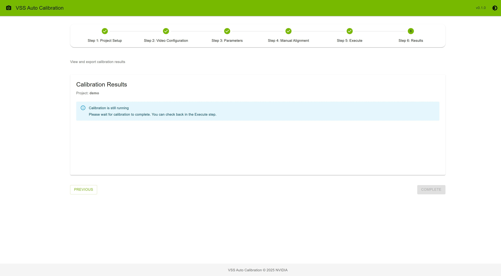

### Overlay Image

The overlay image shows the calibration results projected onto the layout map.

**Features**
- **View**: Displays cameras' fields of view on the layout
- **Download**: Save the overlay image to your computer
- **Result Type Tabs**: Switch between AMC and VGGT results (if available)
  - **AMC Result** tab: Shows AMC calibration overlay
  - **VGGT Result** tab: Shows VGGT calibration overlay (if available); disabled if VGGT was not run

**How to View**
1. The overlay image loads automatically
2. Use the tabs to switch between AMC and VGGT results
3. Click **Download** button to save the image

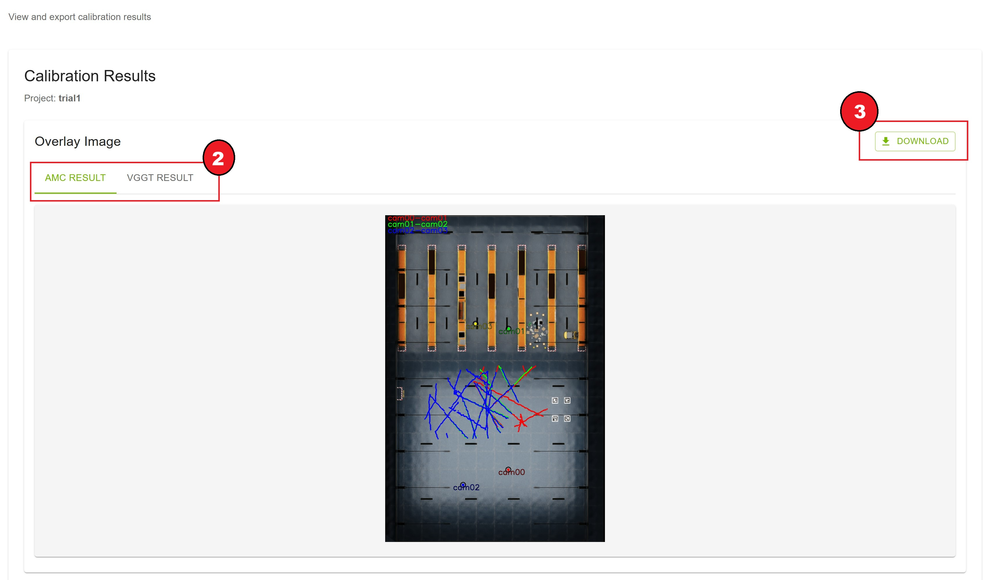

### Evaluation Metrics

If ground truth data was uploaded, evaluation metrics are available.

**Metrics Display**
- **Layout Visualization**: 3D points plotted on layout showing accuracy
- **Statistics Card**: L2 distance statistics in meters
  - Average L2 distance
  - Standard deviation
  - Maximum distance
  - Minimum distance
- **Result Type Tabs**: Switch between AMC and VGGT evaluation


**Interpreting Metrics**
- **Lower Average**: Better calibration accuracy
- **Lower Std Dev**: More consistent calibration
- **Compare AMC vs VGGT**: VGGT typically shows improvement

> Evaluation metrics are only available if ground truth data was uploaded in Step 2.

### Camera Parameters

View detailed calibration parameters for each camera.

**Features**
- **Camera Tabs**: Switch between cameras (Camera 0, Camera 1, etc.)
- **Result Type Tabs**: Switch between AMC and VGGT parameters
- **YAML Format**: Parameters displayed in YAML format
- **Export Button**: Export all camera parameters

**How to View**
1. Click on a camera tab (e.g., "Camera 0")
2. Parameters load and display in a code block
3. Switch between AMC and VGGT tabs to compare
4. Click **Export AMC** or **Export VGGT** to download all parameters


**Parameter Contents**

The YAML file contains:
- **Camera Projection Matrix (3×4)**: Camera projection matrix
- **Additional Metadata**: Project ID, timestamp, etc.

### Export Calibration Data

Export complete calibration data in various formats.

**Export Options**

1. **Full Export** — One control on the Results page; opens a dialog for optional metadata and download. Complete calibration JSON with ROI/tripwire **world coordinates**. **Choose AMC or VGGT inside the dialog** when both calibrations completed (toggle: **Download / edit AMC export** vs **Download / edit VGGT export**); otherwise the available result type is used automatically. **AMC** uses the AMC projection matrix; saved/downloaded as `{project_name}_exported.json`. **VGGT** uses the VGGT projection matrix (multi-camera, when VGGT completed); saved/downloaded as `{project_name}_exported_vggt.json`.
2. **MV3DT ZIP AMC** — MV3DT-compatible format for verification; ZIP archive; filename: `{project_name}_mv3dt.zip`
3. **MV3DT ZIP VGGT** *(if available)* — MV3DT-compatible format with VGGT results; ZIP archive; filename: `{project_name}_vggt_mv3dt.zip`
4. **Delete Results** — removes all calibration results; project returns to READY state; allows re-running calibration


**How to Export**

- **Full Export**: Click **Full Export**, choose **AMC** or **VGGT** in the dialog when both are available, optionally edit metadata or open the manual JSON editor by clicking **Full Control**, then click **Download JSON**. The file downloads to your browser's download folder.

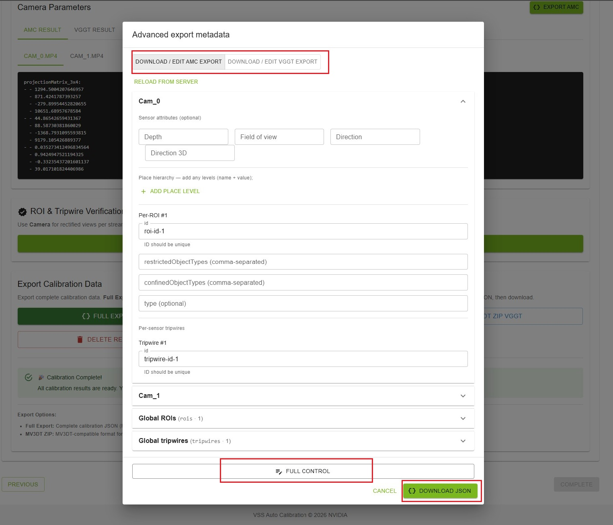

> This is an advanced user feature. Edit the JSON only if you understand the calibration schema; any changes should be made carefully to avoid invalid or incorrect calibration output.

- **Other exports (MV3DT ZIP)**:

  1. Click the desired export button
  2. Wait for processing (may take a few seconds)
  3. File downloads automatically to your browser's download folder
  4. Success message confirms export

> **Export Options Explained:**
> - **Full Export**: Complete calibration with ROI/tripwire world coordinates; pick AMC or VGGT in the dialog when both exist
> - **MV3DT ZIP**: MV3DT-compatible format for verification (separate AMC and VGGT buttons)

### ROI & Tripwire Verification

Verify per-camera and **global** ROIs and tripwires: how they appear on each rectified stream, on the layout map (pixel space), and on the **world map** (BEV) after calibration projection.

**Features**
- **Side-by-side layout**: Left panel (camera or layout map) and **World map (layout + projection)** on the right
- **Annotation target**: **Camera** (per-stream rectified view) or **Global ROIs / tripwires** (layout `layout.png` pixels; requires layout from Step 2)
- **Result type tabs** (right panel): **AMC** or **VGGT** world-map projection when both calibrations completed
- **Global features on world map**: Global ROIs and tripwires projected into world coordinates and drawn in **purple** on the BEV
- **Global features on camera view**: The same global ROIs/tripwires **re-projected** onto the selected camera when visible in that field of view—also **purple**
- **Sensor assignment checkboxes** (camera target): Include or exclude the selected camera from each global ROI/tripwire `sensors` list in the export JSON

**How to Use**

1. Click **Show ROI & Tripwire Verification**
2. Choose **Camera** or **Global ROIs / tripwires** in the annotation target toggle
3. **Camera** target: pick a stream from **Select Camera**; review the left rectified frame and the right world map; use **AMC** / **VGGT** tabs on the world map as needed
4. **Global** target: left panel shows global shapes on **layout.png** (pixel coordinates); right panel shows their **world-map** projection in purple
5. Under the camera view, use checkboxes labeled **Global ROI:** / **Global tripwire:** to include or exclude that camera in each ROIs/Tripwires `sensors` list (only global items projected to that camera are listed)
6. Use world-map zoom controls for detail; click **Close** when finished


**Left Panel — Camera target**
- Rectified video frame for the selected camera
- **Per-camera** annotations: ROIs (green polygons), tripwire lines (red), tripwire directions (yellow arrows)
- **Global** ROIs (purple regions) and global tripwires (purple lines) when they project into this camera's view
- **Global sensor checkboxes**: For each global ROI/tripwire that applies to this camera, check to keep the camera in that feature's `sensors` list in the export JSON; uncheck to exclude it

**Left Panel — Global target**
- **Layout map (pixel coordinates)**: Same global ROIs and tripwires drawn in Parameters on `layout.png` (green / red / yellow in layout space)
- Compare with the right panel to confirm world projection matches the layout drawing

**Right Panel — World map (layout + projection)**
- Bird's-eye / world-coordinate map with all projected annotations for the active **AMC** or **VGGT** result
- **Per-camera** ROIs and tripwires for all streams, plus **global** ROIs and tripwires in **purple**
- Zoom: 50% to 500%; pan by dragging when zoomed

**Zoom Controls**
- **Zoom In** (🔍+): Increase zoom level
- **Zoom Out** (🔍-): Decrease zoom level
- **Reset** (↻): Return to 100% zoom
- **Current Zoom**: Displayed as percentage


### Deleting Results

If you need to re-run calibration with different parameters:

1. Click **Delete Results** button
2. Confirm deletion in the dialog
3. All calibration results are removed
4. Project state returns to "READY"
5. Files (videos, layout, alignment) remain uploaded

> **Warning:** Deleting results cannot be undone. Export important data before deletion.

### Completion Message

At the bottom of the page, a success message confirms calibration is complete.

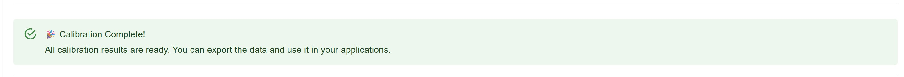

**Message**
- **Title**: "🎉 Calibration Complete!"
- **Text**: "All calibration results are ready. You can export the data and use it in your applications."

### How to Interpret Calibration Outputs

Upon completion, the UI presents overlay images and metric numbers depending on whether ground truth data was provided.

**Case 1: Ground Truth Data Exists**

If ground truth data was uploaded, the tool calculates the **L2 distance** as the primary evaluation metric — the Euclidean distance between the 3D ground truth object location and the estimated location determined by triangulation.

Statistics displayed:
- **Average**: Mean L2 distance across all points
- **Standard Deviation**: Measure of consistency
- **Maximum**: Worst-case error
- **Minimum**: Best-case error

Since a lower L2 distance indicates better accuracy, compare these metrics between AMC and VGGT results to select the superior calibration.

Additionally, calibration results from the two methods can be compared visually using the overlay visualization. Object trajectories reconstructed using the camera matrices are shown as colored lines; ground truth trajectories are displayed in white. A close alignment of the colored trajectories with the white lines signifies accurate camera parameters.

> When comparing AMC and VGGT results: look for lower L2 distance values (better accuracy), compare overlay images for trajectory alignment, and check consistency of colored lines with white ground truth lines.

**Case 2: No Ground Truth Data**

When ground truth data is unavailable, calibration results can be compared qualitatively using overlay images, which display:
- **Reconstructed object trajectories**: Shown as colored lines
- **Estimated camera locations**: Shown as colored dots with corresponding camera IDs

**Qualitative Evaluation Tips:**
- Camera positions should match expected physical locations
- Object trajectories should follow logical paths on the floor map
- FOV (Field of View) boundaries should align with physical constraints
- Compare AMC and VGGT overlays to identify which better matches the layout

### Best Practices

**Reviewing Results**
- Check overlay image for proper camera coverage
- Verify evaluation metrics if ground truth is available
- Compare AMC and VGGT results if both available
- Review camera parameters for reasonableness

**Exporting Data**
- Export both AMC and VGGT results for comparison
- Keep MV3DT ZIP for verification purposes
- Store exports with descriptive names and dates
- Maintain backups of important calibration data

**Verification**
- Always verify ROI/tripwire projections
- Check all cameras, not just one
- Use zoom to inspect details
- Compare AMC vs VGGT projections

**Before Deleting**
- Export all needed data first
- Verify exports are complete and valid
- Document any issues or observations
- Consider keeping project for reference

### Next Steps

After completing calibration:
- Use exported data in your surveillance application
- Integrate calibration parameters with your tracking system
- Set up ROIs and tripwires in your production environment
- Monitor and validate calibration accuracy in real-world scenarios


# Assumptions

AutoMagicCalib makes several assumptions about input data structure. Please ensure your data follows these requirements before you deploy the service or record footage.

## Tracklet-Based Calibration: Input Video Requirements

AutoMagicCalib (AMC) estimates camera parameters by detecting and tracking **people** in your footage, then matching those trajectories (**tracklets**) across camera views. Calibration quality depends heavily on input video content.

> **Note:** These requirements apply to the **tracklet-based AMC pipeline** (the default calibration path). This is not applicable to the optional VGGT model-based calibration path.

**Video content (required for AMC)**

- **Moving people**: People must be clearly visible and moving throughout the clip. AMC relies on PeopleNet detection and 3D tracking of people in the scene.
- **Scene coverage**: Trajectories should span as much of each camera's field of view as possible. More unique walkers and broader coverage produce more usable tracklets.
- **Recommended headcount**: Plan for **many** moving people in the scene. As a practical guideline, aim for **at least 10 unique individuals** walking through the monitored area during the recording window (more is better for multi-camera overlap).

**Video duration**

- **Recommended**: **five minutes or longer** per camera. There is no strict minimum, but given the size of the space to calibrate and normal walking speed, longer clips let the tracker build stable trajectories across the field of view; short clips often fail during multi-view **tracklet matching**.

**Resolution and format**

- **Resolution**: **1920 × 1080**
- **Format** (file upload): MP4

**Multi-camera specifics**

- **Camera count**: Two or more time-synchronized videos or RTSP streams (one stream for single-camera calibration).
- **Time synchronization**: All cameras must cover the **same time window**. Use clips recorded in sync or post-processed to be in sync. For RTSP, use one combined **Start capture** for every stream—staggered or later-added streams break calibration.
- **FOV order**: List cameras in **order of overlapping field of view** (`cam_00` overlaps `cam_01`, `cam_01` overlaps `cam_02`, and so on).
- **FOV overlap**: For the best calibration quality, more overlap between consecutive camera pairs is better. Aim for **at least 30% FOV overlap**; insufficient overlap reduces matched tracklets and often causes multi-view calibration to fail.

**Tracklet thresholds (why the above matters)**

AMC filters and matches tracklets before multi-view calibration. Default pipeline settings include:

- **Minimum tracklet length**: 90 frames (approximately three seconds at 30 fps)—short or jittery tracks are discarded.
- **Minimum matched tracklets** (multi-camera): six cross-camera tracklet correspondences per camera pair (three in robust two-view fallback).

If your videos lack enough moving people or are too short, calibration may fail at detection, tracking, or **tracklet matching**. You may need to adjust the configuration parameters through the UI or capture better videos. See [Custom Dataset](#custom-dataset) for capture best practices and [Troubleshooting](#troubleshooting) if tracklet matching fails.

## Lens Distortion Output (`distortion.yaml`)

AMC can accept videos that contain **lens distortion**. When rectification is enabled (distortion model set to something other than `pinhole` in the rectification settings), the pipeline:

1. Estimates per-camera distortion parameters (primarily **k1**)
2. **Rectifies** video frames internally so that subsequent calibration (tracking, tracklet matching, bundle adjustment) runs on undistorted imagery
3. Writes estimated parameters to disk for downstream use

**Important for downstream applications**

Rectified videos (`rectified.mp4`) are produced under each camera's single-view output folder on the server, but they are **not** automatically substituted for your original camera feeds in downstream applications. Exported calibration JSON and MV3DT ZIP files describe cameras in the **rectified (undistorted) image space**.

To stay consistent with AMC calibration results, downstream applications must either:

- Apply the saved `distortion.yaml` parameters to undistort live or recorded frames before using AMC projection matrices, **or**
- Manually replace input videos with the per-camera `rectified.mp4` files from the calibration output (not wired automatically by the microservice)

**Output location**

Per camera (example paths on the calibration server):

```text
<project_output>/single_view_results/cam_00/distortion.yaml
<project_output>/single_view_results/cam_00/geocalib_distortion.yaml   # when GeoCalib estimates distortion
<project_output>/single_view_results/cam_00/rectified.mp4
```

**`distortion.yaml` format**

This is the parameter file AMC rectification writes for application use. It contains the distortion coefficient in AMC/OpenCV pixel-centered convention (focal length treated as 1, origin at image center):

```yaml
k1: -1.2345678e-06
```

**`geocalib_distortion.yaml` format** (when distortion estimation runs)

GeoCalib writes a richer record that includes the distortion model name and both coordinate conventions:

```yaml
model: simple_radial        # or radial, simple_divisional (must match rectification config)
k1: -1.2345678e-06          # AMC/OpenCV convention: radial factor = 1 + k1 * r_pixel^2
k1_geocalib: -4.5678901e-03 # GeoCalib internal normalized coordinates
focal_length: 1269.0        # focal length used for k1 conversion
source: geocalib
k2: ...                     # present only when model is radial
```

**Distortion model**

AMC rectification uses a **Brown–Conrady radial** model (inverse mapping for undistortion). For the default `simple_radial` model, only **k1** is non-zero:

- Undistorted normalized radius: `r_u = r_d * (1 + k1 * r_d^2 + k2 * r_d^4 + k3 * r_d^6)` (iterative inverse solve)
- Pixel coordinates use the image center as the principal point; `k1` in `distortion.yaml` is already scaled to full-resolution pixel units

Supported model names (set in rectification config, must match between GeoCalib and rectification):

- `pinhole` — no distortion; rectification skipped
- `simple_radial` — single k1 term (most common)
- `radial` — k1 and k2 terms
- `simple_divisional` — division model variant

**Applying distortion correction downstream**

Use `k1` from `distortion.yaml` with OpenCV's undistortion APIs. Example (Python, per frame):

```python
import cv2
import numpy as np
import yaml

with open("distortion.yaml") as f:
    k1 = float(yaml.safe_load(f)["k1"])

h, w = frame.shape[:2]
camera_matrix = np.array([[1, 0, w / 2], [0, 1, h / 2], [0, 0, 1]], dtype=np.float64)
dist_coeffs = np.array([k1, 0, 0, 0], dtype=np.float64)
rectified = cv2.undistort(frame, camera_matrix, dist_coeffs)
```

Ensure the same image resolution (1920 × 1080) and that you undistort **before** projecting detections with AMC camera matrices. If rectification was disabled (`pinhole` / `general.skip: true`), no `distortion.yaml` is needed and raw video matches calibration space.

See also [Custom Dataset](#custom-dataset) (lens distortion guidance) and the AutoMagicCalib `rectification_config.yaml` in the source repository for tuning search ranges and model selection.

# Custom Dataset

For a custom dataset, you should prepare the following items:

- **Input videos or RTSP streams** — Camera video files **or** time-synchronized RTSP streams
- **A floor map** — Layout/map image of the surveillance area (PNG)
- **Alignment data** — `alignment_data.json` (upload or create in the UI; see [Alignment Data](#alignment-data-alignment_datajson))
- **Layout Pixels Per Meter** — Number of pixels per meter in the layout floor map. Update this value under [Configuring Settings](#configuring-settings).
- **Ground truth data (optional)** — For calibration evaluation

## Input Requirements

**Video input (file upload or RTSP)**

- **Formats** (file upload): MP4
- **Resolution**: **1920 × 1080** is required for uploaded videos (matches the workflow and evaluation pipeline)
- **Camera count**: One video or stream for **single-camera** calibration; **two or more** for multi-camera
- **Time synchronization**: All multi-camera videos or RTSP streams must cover the **same time window**—use one combined RTSP **Start capture** for every stream, or upload clips that were recorded in sync. Staggered or later-added streams break calibration.
- **Order**: List or upload streams in **order of overlapping field of view (FOV)** (first = first camera in the overlap chain), whether using files or RTSP URLs.

**Single-camera datasets**

A valid single-camera project needs:

- One synchronized video (or one RTSP URL)
- One layout/map image
- `alignment_data.json` with at least **4** point sets; each set has **two** `[x, y]` pairs (camera + layout/BEV)—see [Alignment Data](#alignment-data-alignment_datajson)

**Multi-camera datasets**

- Two or more time-synchronized videos or RTSP streams
- One layout/map image
- `alignment_data.json` with at least **4** point sets; each set has one point per camera plus the layout (see [Alignment Data](#alignment-data-alignment_datajson))

Users should pay close attention to upload and stream order, as this order implicitly determines camera pairing. For optimal results, consecutive camera pairs should have a significant amount of overlapping Field of View (FOV).

## Alignment Data (alignment_data.json)

Alignment data maps corresponding points between camera views and the layout (bird's eye view). Prepare or create this file before running calibration.

**Requirements**

- Minimum **4** complete point sets
- Coordinates are pixel positions on the original camera frames and layout image

**Multi-camera** — three `[x, y]` pairs per set (camera 0, camera 1, layout):

```json
[
  [[x0_cam0, y0_cam0], [x0_cam1, y0_cam1], [x0_layout, y0_layout]],
  [[x1_cam0, y1_cam0], [x1_cam1, y1_cam1], [x1_layout, y1_layout]]
]
```

**Single-camera** — two `[x, y]` pairs per set (camera, layout):

```json
[
  [[x0_cam, y0_cam], [x0_layout, y0_layout]],
  [[x1_cam, y1_cam], [x1_layout, y1_layout]]
]
```

For projects with more than two cameras, each point set includes one pair per camera plus the layout point (same pattern as multi-camera above, extended to all views).

You can upload `alignment_data.json` on the Manual Alignment step or create it interactively in the UI.

## Guidelines for Input Videos to Achieve Optimal Calibration Results

To ensure the most accurate camera calibration, careful consideration should be given to how the input videos provided. The following points detail how to maximize the quality of the calibration outcome.

### 1. Minimizing Lens Distortion

The current calibration methodology performs best when input videos are "linear," meaning they exhibit no lens distortion. While the tool can handle minor distortion, optimal results are achieved when lens distortion is zero.

### 2. Maximizing Camera Overlap

Accurate calibration requires a significant degree of overlap between the fields of view of the different cameras. It is essential to maximize the overlap between cameras as much as possible.

### 3. Leveraging Unique Scene Features

The presence of diverse and unique objects in the input videos contributes significantly to calibration accuracy. Our automatic calibration tool specifically utilizes people moving within the field of view, so videos with many moving people are ideal. The trajectories of these moving subjects should cover the Field of View (FOV) as broadly as possible.

Additionally, large, unique objects can enhance accuracy. For instance, in a setting like a warehouse with multiple cameras, views can become challenging due to repetitive elements (e.g., similar racks). In such environments, large, distinct objects, like forklifts, are beneficial for better calibration accuracy.

## Ground Truth Data Format

If you want to evaluate the camera calibration results using ground truth data, you should have a ZIP file containing the following data files:

- `calibration.json`
- `ground_truth.json`

### calibration.json

This file has camera parameters including intrinsic and extrinsic parameters. The JSON schema definition for calibration is as follows:

```json
{
   "sensors": [
       {
           "id": "Camera",
           "intrinsicMatrix": [
               [1269.00511584492, -3.730349362740526e-14, 959.9999999999999],
               [0.0, 1269.0051158449194, 539.9999999999999],
               [0.0, 0.0, 0.9999999999999998]
           ],
           "extrinsicMatrix": [
               [0.9999941499743863, 0.0020258073539418126, 0.00275610623331978, 7.506433779240641],
               [0.00329149786382878, -0.3506837842628175, -0.9364881470135763, 1.2002890745303207],
               [-0.0009306228113685242, 0.936491740251709, -0.3506884006942753, 11.111379874347342]
           ],
           "attributes": [
               {"name": "frameWidth", "value": 1920},
               {"name": "frameHeight", "value": 1080}
           ],
           "cameraMatrix": [
               [1268.1042942335746, 901.6028305375089, -333.16335175660936, 20192.627546980937],
               [3.6743913098523424, 60.686023462551134, -1377.7799858632666, 7523.318108219307],
               [-0.0009306228113685238, 0.9364917402517088, -0.35068840069427526, 11.111379874347342]
           ]
       },
       {
           "id": "Camera_01",
           "intrinsicMatrix": [
               [1099.498973963849, -4.707345624410664e-14, 960.0],
               [0.0, 1099.4989739638488, 539.9999999999998],
               [0.0, 0.0, 1.0]
           ],
           "extrinsicMatrix": [
               [-0.9999609312669344, -0.008839453589732555, 5.147844000033541e-11, -7.521032053009582],
               [-0.004417374837733223, 0.4997143960386968, -0.866178970647073, -0.1501353870483639],
               [0.007656548785712605, -0.8661451301323095, -0.49973392001021566, 10.265551144735602]
           ],
           "attributes": [
               {"name": "frameWidth", "value": 1920},
               {"name": "frameHeight", "value": 1080}
           ],
           "cameraMatrix": [
               [-1092.1057310976453, -841.2182950793291, -479.7445631532065, 1585.5620735129166],
               [-0.7223627574165982, 81.71709544806465, -1222.2192063010361, 5378.3239141418835],
               [0.0076565487857126035, -0.8661451301323094, -0.4997339200102156, 10.2655511447356]
           ]
       }
   ]
}
```

**Parameter Descriptions:**

| Parameter | Description |
|---|---|
| `id` | Unique string identifier for the sensor (e.g., Camera, Camera_01, Camera_02, …). **Must match exactly** the camera keys used under `2d bounding box visible` in `ground_truth.json` for that sensor—mismatched IDs will break evaluation. |
| `intrinsicMatrix` | 3×3 camera intrinsic parameter matrix. Follows the same definition in [OpenCV documentation](https://docs.opencv.org/4.x/d9/d0c/group__calib3d.html). |
| `extrinsicMatrix` | 3×4 camera extrinsic parameter matrix. Follows the same definition in [OpenCV documentation](https://docs.opencv.org/4.x/d9/d0c/group__calib3d.html). |
| `cameraMatrix` | 3×4 combined camera projection matrix. Follows the same definition in [OpenCV documentation](https://docs.opencv.org/4.x/d9/d0c/group__calib3d.html). |
| `attributes` | Array of name-value pairs for additional sensor attributes. `frameHeight`: image height resolution, `frameWidth`: image width resolution. |

### ground_truth.json

This file has object information including 3D locations and bounding boxes. The JSON schema definition for ground truth object data is as follows:

```json
{
    "0": [
        {
            "object id": 0,
            "object type": "person",
            "object name": "male_adult_police_04",
            "3d location": [-7.82265567779541, 4.5983476638793945, -9.851457150045206e-11],
            "2d bounding box visible": {
                "Camera": [912, 362, 955, 507],
                "Camera_01": [960, 664, 1062, 941]
            }
        },
        {
            "object id": 2,
            "object type": "person",
            "object name": "female_adult_police_01",
            "3d location": [-17.455900192260742, 15.370429992675781, 0.02103900909423828],
            "2d bounding box visible": {
                "Camera": [447, 245, 470, 276]
            }
        },
        {
            "object id": 4,
            "object type": "person",
            "object name": "female_adult_police_03",
            "3d location": [-13.054417610168457, 2.3046987056732178, 0.02103901281952858],
            "2d bounding box visible": {
                "Camera": [391, 418, 443, 576],
                "Camera_01": [1668, 481, 1805, 688],
                "Camera_02": [1084, 398, 1125, 530]
            }
        }
    ],
    "1": [
        {
            "object id": 0,
            "object type": "person",
            "object name": "male_adult_police_04",
            "3d location": [-7.822440147399902, 4.597992420196533, -1.1969732149896828e-10],
            "2d bounding box visible": {
                "Camera": [912, 362, 955, 507],
                "Camera_01": [960, 664, 1062, 609]
            }
        }
    ]
}
```

**Parameter Descriptions:**

| Parameter | Description |
|---|---|
| frame index | Video frame index (0, 1, …) — the top-level keys |
| `object id` | Object index (integer value) |
| `object type` | Object class (person, fork lift, etc.) |
| `object name` | Unique object name |
| `3d location` | Object's 3D location in meters [x, y, z] |
| `2d bounding box visible` | 2D bounding boxes in each camera view [x_min, y_min, x_max, y_max] |


# Troubleshooting

This section provides solutions to common issues and error messages.

## Cannot Access the UI

**Symptom**: Browser shows "Unable to connect" or "Connection refused"

**Possible Causes**: Backend server not running; incorrect URL or port; network connectivity issues; firewall blocking access

**Solutions**:

1. **Verify server is running**
   ```bash
   docker ps | grep auto-calib
   # Or from compose directory:
   docker compose ps
   ```
2. **Verify URL and port** — check browser address bar; try `http://localhost:<AUTO_MAGIC_CALIB_UI_PORT>` from the server machine
3. **Check network connectivity**
   ```bash
   ping <server-ip>
   nc -vz <server-ip> <port>
   ```
4. **Check firewall settings** — ensure the UI port is allowed

## Port Already in Use

**Symptom**: Docker container fails to start with "port is already allocated" error

**Solution**:

1. Check what's using the port:
   ```bash
   sudo lsof -i :5000
   sudo lsof -i :8000
   ```
2. Change ports in `compose/.env` (`AUTO_MAGIC_CALIB_MS_PORT`, `AUTO_MAGIC_CALIB_UI_PORT`) and restart:
   ```bash
   docker compose down
   docker compose up -d
   ```
3. Or stop the conflicting process/container

## API_URL_NOT_PROVIDED Error

**Symptom**: UI loads but shows "API_URL_NOT_PROVIDED" error

**Cause**: Docker Compose started without proper `HOST_IP` environment variable

**Solution**:

1. Stop services: `docker compose down`
2. Verify `HOST_IP=<your_host_ip>` is set in `compose/.env`
3. Restart: `docker compose up -d`

## Verification Fails

**Symptom**: "Verify Project" button shows error

**Solutions**:

1. **Check requirements checklist**
   - ✓ At least **1** video or RTSP clip for **single-camera**; **2 or more** for **multi-camera**
   - ✓ Layout image uploaded
   - ✓ Alignment data uploaded or created
2. **Verify alignment data**
   - Minimum 4 complete point sets
   - **Multi-camera**: each set must include points for every camera view plus the layout (BEV) point
   - **Single-camera**: each set must include **camera + layout** point pairs (two `[x, y]` pairs per set)
3. **Check video files** — ensure videos are not corrupted; re-upload if needed
4. **Check server logs**: `docker compose logs | grep -i error`

## Calibration Fails or Takes Too Long

**Symptom**: Calibration fails, runs too long (>30 minutes), or results look wrong

**Solutions**:

1. **Check input files** — video quality, layout image scale/orientation, alignment on ground plane
2. **Check video synchronization** — same time window for all cameras; for RTSP, one combined capture for all streams
3. **Review calibration parameters** (Settings on Parameters step) — especially **Layout Pixels Per Meter** (`layout_px_per_m`) under Evaluation Configuration; wrong scale causes misaligned BEV/overlays
4. **Check server resources**: `top`, `nvidia-smi`
5. **Try VGGT** (multi-camera) if AMC failed after rectification and **VGGT** state is **READY**
6. **Reset project** and retry after fixing inputs

## RTSP Capture Issues

**Symptom**: RTSP capture card missing, capture fails, or ingested clips are out of sync

**Solutions**:

1. **Verify VIOS configuration** — confirm VIOS is running; set `VIOS_BASE_URL` in deployment `.env` if using VSS/VIOS deployment
2. **Use source RTSP URLs** — for VIOS pre-registered streams, use the **source URL** (e.g., NVStreamer URL), not the VIOS-proxied URL
3. **Capture timing** — configure **all** streams, then run **one** **Start capture**; minimum **60** seconds; wait for **COMPLETED** or **CANCELLED** before **Ingest to project**
4. **Check server logs**: `docker compose logs | grep -i -E 'rtsp|vios|capture|ingest'`

## VGGT Calibration Issues

**Symptom**: VGGT section unavailable, fails, or does not appear on Results

**Solutions**:

1. **Confirm project type** — VGGT is **multi-camera only** (two or more videos); not supported for single-camera
2. **Verify model installation** — download `vggt_1B_commercial.pt` and place in `$MODEL_DIR/vggt/`
3. **Run at the right time** — run **Start Calibration** (AMC) first so rectification outputs exist; confirm **VGGT** state is **READY**
4. **View VGGT results** — when VGGT completes, project state becomes **COMPLETED** even if AMC failed—open **Results** and use the **VGGT** tab
5. **Check server logs**: `docker compose logs | grep -i vggt`

## Results and Export Issues

**No results available** — Results is available when AMC **or** VGGT completes successfully. If AMC failed but VGGT finished, use the **VGGT** tab on Results.

**Export fails** — check browser download settings, popup blocker, disk space; try a different browser; check `docker compose logs | grep -i export`

**ROI verification not working or BEV looks wrong**

1. Verify calibration completed (AMC and/or VGGT); click **Show ROI & Tripwire Verification** (a prior **Full Export** download is not required)
2. Check **Layout Pixels Per Meter** (`layout_px_per_m`) in Settings on the Parameters step
3. Compare layout pixels (Global target) with world-map projection; switch AMC/VGGT tabs if one result looks better
4. Revisit alignment points and time-synchronized inputs

## Performance Issues

**UI slow or canvas laggy** — refresh browser, close other tabs, enable hardware acceleration, reduce zoom level, use latest Chrome.


# License

## Repository Licenses
This repository contains materials released under different licenses:
- The scripts and code are licensed under the Apache License 2.0.
- The assets are licensed under the Creative Commons Attribution 4.0 International (CC-BY-4.0) license.

## Proprietary Container Notices (AutoMagicCalib and AutoMagicCalibUI)
The scripts in this repository interact with and pull the proprietary AutoMagicCalib and AutoMagicCalibUI containers. The use of these containers, and any software, data, or intellectual property contained within them, is governed by a separate set of licenses and third-party notices.

The applicable End User License Agreement (EULA), 3rd-party notice, and reference information for the containers can be found in:
- [AutoMagicCalib page in NGC Catalog](https://catalog.ngc.nvidia.com/orgs/nvidia/containers/auto-magic-calib?version=3.2.1)
- [AutoMagicCalibUI page in NGC Catalog](https://catalog.ngc.nvidia.com/orgs/nvidia/containers/auto-magic-calib-ui?version=3.2.1)
